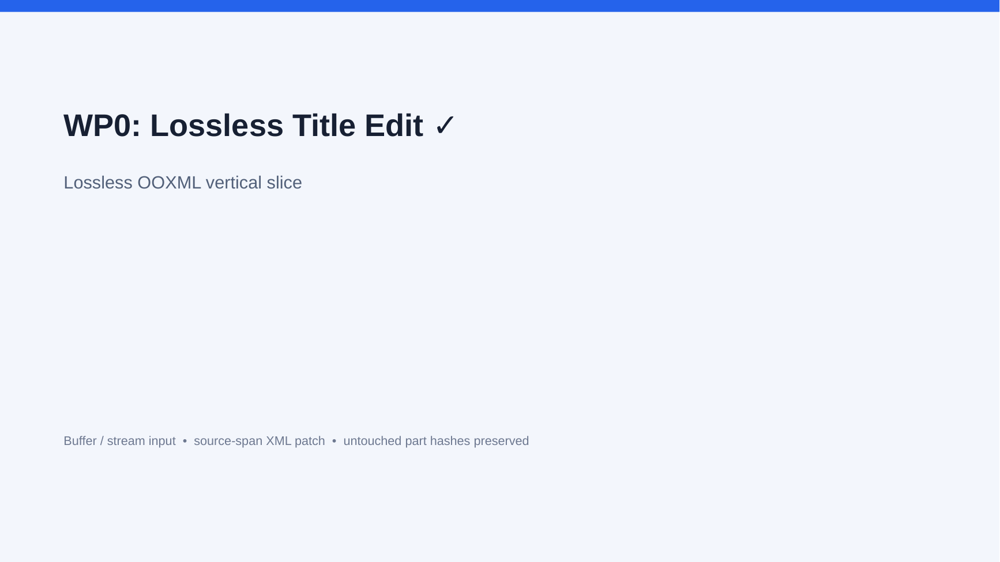
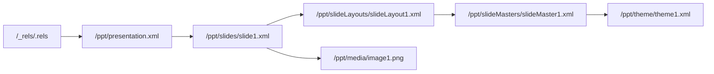
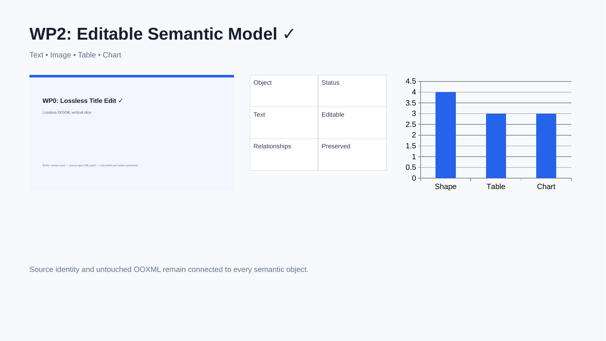
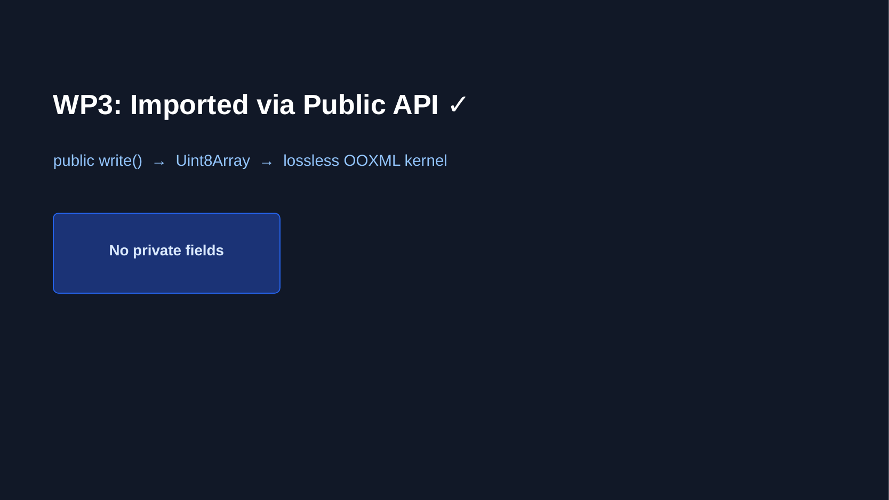
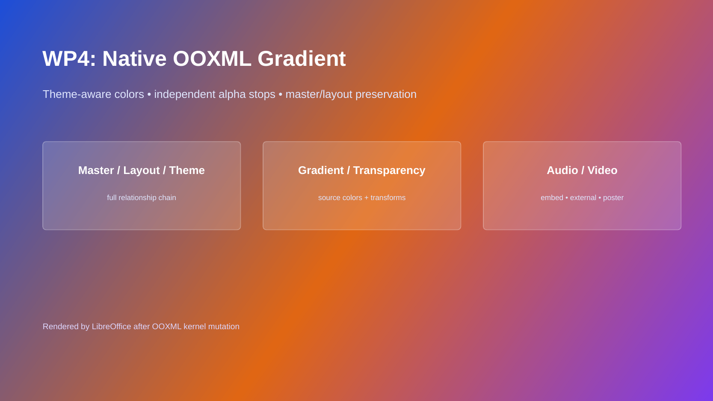
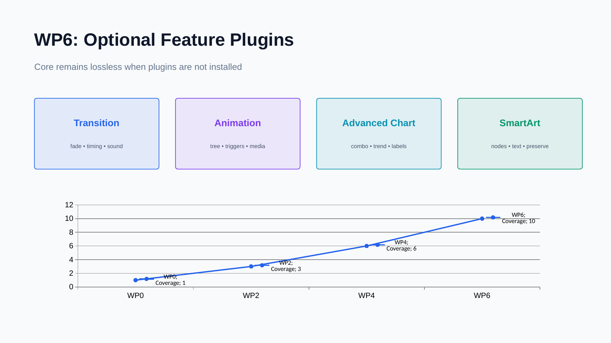

# PPTX 双向编辑库实施进度

最后更新：2026-08-04

## WP0：基线与技术验证

状态：完成

### 本阶段 change

- 建立 pnpm/TypeScript strict/Vitest monorepo。
- 新增 `@pptx/lossless-xml`：保留源跨度、属性顺序、空白和未知节点；仅重写目标区间；拒绝 DTD/ENTITY。
- 新增 `@pptx/opc`：读取 content types、内部/外部 relationships、规范化 part URI、建立 package graph，并实施 ZIP 资源预算。
- 新增基础 validator diagnostic 模型。
- 新增 `@pptx/sdk` 首条竖切：从 Buffer、Uint8Array、ArrayBuffer、文件或 stream 打开，读取/修改第一页标题并保存。
- 无 mutation 时原字节返回；有 mutation 时未触及 part 的 payload SHA-256 保持一致。

### 新增功能演示

下面的文件由真实 PPTX 经过 `PptxDocument` 修改标题后，用 LibreOffice headless 打开并导出。页面可正常渲染，证明输出未触发结构修复。



### 验证结果

- TypeScript strict typecheck：通过。
- Vitest：3 个测试文件、8 个测试全部通过。
- 无修改 round-trip：字节级相同。
- 标题 mutation isolation：通过。
- 未知 XML 节点保留：通过。
- LibreOffice 打开/导出：通过。

### 相关设计记录

- [ADR 0001：无损 OOXML 内核](./architecture/0001-lossless-ooxml-kernel.md)
- [ADR 0002：Codec ownership](./architecture/0002-codec-ownership.md)
- [ADR 0003：兼容 profile](./architecture/0003-compatibility-profiles.md)
- [WP0 依赖评估](./architecture/wp0-dependency-evaluation.md)

## WP1：OPC 与 Lossless XML

状态：完成

### 本阶段 change

- package graph 新增 outgoing/incoming 双向引用视图、part URI 与 `rId` 分配器。
- relationship updater 支持新增、局部更新、删除、internal/external target 解析；删除 part 时同步清理内部入边和自身 `.rels`。
- content type updater 改为 source-span patch，新增/删除 override 时继续保留未知节点、命名空间和原始默认项。
- lossless XML 新增 element replace/remove/append、attribute patch 与仅供 diff/测试使用的 canonical 输出。
- validator 新增 root office document 基数、重复/非法 relationship id、悬空 target、external portability diagnostics。
- 安全测试覆盖 entry 数、单 part 大小、总解压预算、压缩比、ZIP traversal、DTD/ENTITY。

### Package graph 直观示意



新增或删除 `Media` 时，relationship 与 `[Content_Types].xml` 会作为同一次受控 mutation 同步更新；未知 content type 扩展节点不会被重建或删除。

### 验证结果

- TypeScript strict typecheck：通过。
- Vitest：4 个测试文件、13 个测试全部通过。
- package graph 入边/出边：通过。
- relationship/content type 同步：通过。
- unknown content-type node preservation：通过。
- ZIP/XML 安全预算：通过。

## WP2：基础语义模型

状态：完成

### 本阶段 change

- 新增独立 `@pptx/model`，SDK 不再直接承担 OOXML 解析职责。
- 按 `p:sldId/@r:id` 精确保持幻灯片顺序，修复数值 `id` 与 relationship id 混淆的多页隐患。
- 新增 Shape/Text/Image/Table/Chart 语义对象；每个对象保留源 part 与 shape id，可回到最小 XML 区间修改。
- 文本、表格单元格、shape transform、嵌入图片 payload 和 chart XML 可编辑；常规 chart series 可读取。
- 新增 `addSlide()`、`duplicateSlide()`、`moveSlide()`、`deleteSlide()`，同步维护 slide id、relationship、content type 和 `.rels`。
- 新增 EMU、point、inch、OOXML angle 单位转换，以及可保留来源的 color/inheritance 类型。
- 修正已存在 part 改变 content type 时 override 未同步的问题。

### 新增功能演示

下面是 PptxGenJS 4.0.1 生成的真实文件。新 model 同时识别文本、图片、表格和图表，修改标题、复制并排序幻灯片；LibreOffice 成功打开并导出 3 页 PDF。



### API 示例

```ts
const document = await PptxDocument.open('input.pptx');
document.slides[0].title.text = 'Updated';
document.slides[0].shapes[0].setTransform({ x: inches(2) });
document.duplicateSlide(0);
document.moveSlide(2, 1);
await document.writeFile('output.pptx');
```

### 验证结果

- TypeScript strict typecheck：通过。
- Vitest：5 个测试文件、15 个测试全部通过。
- 常规对象 decode/edit/save：通过。
- slide add/duplicate/move/delete 与引用同步：通过。
- 真实文本/图片/表格/图表文件：LibreOffice 无修复打开并导出 3 页。
- presentation 未知扩展节点保留：通过。

## WP3：PptxGenJS Adapter

状态：完成

### 本阶段 change

- 新增 `@pptx/pptxgenjs-adapter`，并把 `pptxgenjs:^4.0.1` 限定为该包的直接依赖。
- `importPptxGenJS()` 只调用公开 `write({ outputType: 'uint8array' })`，生成结果立即进入同一 OOXML 内核。
- adapter 支持透传资源预算和 AbortSignal；异常输出产生明确的 `PptxGenJSAdapterError`。
- conformance test 使用 PptxGenJS 4.0.1 真实生成文件，导入后修改标题、复制 slide、保存并重新读取。
- 新增依赖边界回归测试，确保 core/model/opc/sdk/validator 不会意外引入 PptxGenJS。
- 新增迁移指南，区分“PptxGenJS 新建后加工”和“直接编辑已有 PPTX”两条路径。

### 新增功能演示

下面的标题先由 PptxGenJS 创建，再通过 adapter 导入并由 OOXML 内核改写；保存后由 LibreOffice 打开和导出。整个流程不读取 PptxGenJS 私有字段。



### 验证结果

- TypeScript strict typecheck：通过。
- Vitest：6 个测试文件、17 个测试全部通过。
- PptxGenJS 4.0.1 public output conformance：通过。
- adapter 导入→编辑→复制→重新打开：通过。
- 非 adapter 包依赖边界：通过。
- 迁移指南：[docs/migration/pptxgenjs.md](./migration/pptxgenjs.md)。

## WP4：v1 高价值 Codec

状态：完成

### 本阶段 change

- 新增 `@pptx/codecs` 与 ownership registry；同优先级 codec 声明相同元素/关系/part 时明确报冲突。
- Master/Layout/Theme codec 可读取、创建、复制、删除和重新关联三类 part，解析 placeholder 的 `type + idx` 继承链，并提供 `materializeInheritedStyle()`。
- Theme 保留 scheme color 表达，支持局部修改 color scheme；读取 major/minor font scheme，不因修改其他字段固化主题色。
- Gradient/Transparency codec 支持 linear/path、任意 stop、角度、scaled、rotate-with-shape、flip、fill rectangle，以及 srgb/scrgb/scheme/system/preset color。
- `alpha`、`alphaMod`、`alphaOff`、`alphaModFix` 和其他 color transforms 按原顺序 round-trip；`SlideModel.background` 与 shape `gradientFill` 可直接编辑。
- Media codec 支持文件、Buffer、ArrayBuffer、stream、外链 URL、poster、内容哈希去重、Audio/Video 关系、复制引用和删除引用计数。
- 媒体 click action 使用 Office 原生表达；autoplay/loop/hide/volume 偏好通过 opaque extension round-trip。当前 `addAudio()` / `addVideo()` 不自动生成原生 timing tree，相关对接保留到后续 media lifecycle/timing 小项。
- SDK 写入时汇总渐变、媒体和 external relationship 的 compatibility diagnostics。

### 新增功能演示

下面的三 stop 渐变由 `SlideModel.background` 写成原生 OOXML：中间 stop 使用 theme color，末端带独立 alpha。PptxGenJS 原有 master/layout/theme 关系保持不变，LibreOffice 可直接渲染。



### API 示例

```ts
document.slides[0].background = {
  kind: 'linear-gradient',
  angle: 35,
  stops: [
    { offset: 0, color: '#1D4ED8' },
    { offset: 0.52, color: { source: { kind: 'scheme', value: 'accent2' }, alpha: 0.82, transforms: [] } },
    { offset: 1, color: '#7C3AED', alpha: 0.68 },
  ],
};

await document.addAudio(0, audioBuffer, { contentType: 'audio/mpeg', play: 'click' });
```

### 验证结果

- TypeScript strict typecheck：通过。
- Vitest：7 个测试文件、22 个测试全部通过。
- real master/layout/theme chain：1 / 1 / 1，读取通过。
- gradient/color/alpha round-trip：通过。
- master/layout/theme create/copy/delete/relink：通过。
- media embed/external/poster/dedup/ref-count：通过。
- ZIP integrity 与 LibreOffice 打开/导出：通过。
- 兼容矩阵：[docs/compatibility/v1-codecs.md](./compatibility/v1-codecs.md)。

## WP5：SDK、验证与 0.1.0 发布准备

状态：完成

### 本阶段 change

- SDK 公共 API、类型声明、错误与 compatibility diagnostics 汇总完成；全部 workspace package 统一为 `0.1.0`。
- 新增 `@pptx/testkit`：part fingerprint、package diff、mutation isolation 断言、fixture 与 LibreOffice render helper。
- 新增可全局运行的 `pptx-inspect`：doctor、package inspect/validate/diff、slides list/set-title、raw part read。
- CLI 使用稳定 JSON success/error envelope，离线且无需认证；写入要求显式 `--out`，支持 `--dry-run`，不提供 raw write/delete。
- 新增 repo companion skill `.codex/skills/pptx-inspect`，已通过 skill validator。
- 新增 250 轮 deterministic XML fuzz、20 轮 package round-trip fuzz 和 1,000-part 性能 smoke test。
- 新增 Node 20/22 × Linux/macOS/Windows 公共 CI、LibreOffice headless job、PowerPoint COM 与 Keynote AppleScript 私有 runner。
- 新增 API、安全、跨客户端、迁移、examples、CHANGELOG 和 0.1.0 release gate 文档。

### CLI 直观输出

```text
$ pptx-inspect --json doctor
{"ok":true,"command":"doctor","data":{"version":"0.1.0","node":{"supported":true},"auth":{"required":false},"mode":"offline","optional":{"libreoffice":true}}}

$ pptx-inspect --json package inspect output.pptx
{"ok":true,"command":"package.inspect","data":{"partCount":20,"relationshipCount":18,...}}
```

### 验证结果

- Full strict check：10 个测试文件通过，28 个测试通过，1 个 performance test 默认跳过。
- 独立 performance run：1,000-part package 在 606ms 完成 smoke test（预算 5s）。
- `pptx-inspect` 已链接到 `/usr/local/bin`，从 `/tmp` 执行 help、doctor 和真实 PPTX inspection：通过。
- LibreOffice CI 脚本生成、修改、打开并导出 PDF：通过。
- 0.1.0 release checklist：[docs/release/0.1.0.md](./release/0.1.0.md)。

## WP6：扩展插件

状态：完成

### 本阶段 change

- 新增四个独立 `0.1.0` 插件包；core/sdk 对插件保持零反向依赖，未安装时所有对应 XML/parts 继续无损透传。
- Transition：读写 effect/speed/duration/click/auto advance，管理 sound relationship；Morph 扩展 preserve + diagnostic，禁止生成不安全的伪 Morph XML。
- Animation/Timing：decode timing tree，新增 appear/fade/wipe/fly/motion，支持 trigger/delay/duration/repeat/text range，shape id retarget 与悬空 target 校验。
- Timing 插件安装时把 Media codec 的 autoplay/loop/volume 偏好转换为原生 `cMediaNode` 时间树。
- Advanced Charts：组合/现代图表识别、axis/series、trendline、error bar、data label、cache value、embedded workbook 一致性 diagnostic，以及显式 image fallback。
- SmartArt：解析 data/layout/quick-style/colors/drawing part set；支持文本替换、节点/连接增删，保留 style 与 fallback drawing，并在需要 PowerPoint 重新布局时诊断。
- Lossless XML writer 新增安全展开 self-closing element 的 child append，修复 SmartArt connection list 的真实边界用例。

### 新增功能演示

下面的真实文件同时安装四个插件，写入 fade transition、标题动画、媒体 timing 和 chart data labels；ZIP 完整性检查与 LibreOffice 打开/导出均通过。



### 验证结果

- TypeScript strict typecheck：通过。
- Vitest：14 个测试文件、34 个测试全部通过；1 个独立 performance test 默认跳过。
- plugin ownership registry：7 个内建/可选 codec 无冲突注册。
- 真实 slide XML 包含 `p:transition`、`p:timing`、`p:audio`、`p:animEffect`。
- ZIP integrity 与 LibreOffice headless open/export：通过，diagnostics 为空。
- 插件使用文档：[docs/plugins.md](./plugins.md)。

## PptxGenJS 全功能对等：Raster source loader

状态：完成

### 本阶段 change

- 新增 PNG/JPEG/GIF signature 与 raw pixel dimensions inspector；格式检测不信任扩展名、Blob/HTTP MIME 或文件名。
- 新增统一 raster source resolver，覆盖 Node path、HTTP/HTTPS URL、browser-relative URL、strict canonical base64 data URI、`Uint8Array`、`ArrayBuffer`、`Blob`/`File`、Web stream 与 async byte iterable，并支持 AbortSignal。
- 新增 `PptxDocument.addImage(slideIndex, source, options?)`，在所有异步加载、signature 检测与 MIME assertion 完成后才进入原有 atomic picture mutation。
- 保留 `SlideModel.addImage(bytes, options)` 作为 strict 同步底层 API，并保持 1-inch 默认 transform；intrinsic pixel dimensions 暂不自动决定布局尺寸。
- 新增 PptxGenJS 4.0.1 path/data 高层 loader 最终语义对等测试；contain/cover/crop 与 `srcRect` 进展见下一节。

### 验证结果

- Raster source resolver：78 项测试通过；SDK focused suites：216 项测试通过。
- Actual npm tarball 的 Node/browser/declaration/CLI smoke 通过，连续两次 dist build SHA 一致，browser bundle 无 static Node import。
- 4 页、32 shapes、12 images gallery 覆盖全部公开来源；原件和 LibreOffice round-trip 均为 PowerPoint 2010 validation 0 errors / 0 warnings，2400×1350 render 无 overflow，并已逐页视觉检查。
- LibreOffice 保留 12/12 payload SHA、content type、name、non-empty alt text、顺序与 internal relationship；把 12 个重复 payload targets 去重为 3 个，transform 最大量化 432 EMU，并重写 12/12 picture markup。

## PptxGenJS 全功能对等：Raster image sizing 与 `srcRect`

状态：完成

### 本阶段 change

- 新增 low-level `ImageSourceRectangle` 与 direct `a:srcRect` create/read/edit/repair/clear；percent unit 中 `1` 表示 1%，量化到 0.001%，支持 contain 所需负边，getter detached/deep-frozen，同值赋值 exact no-op，失败与外层 transaction 均完整回滚。
- 新增 pure `calculateRasterImageSizing()`，覆盖 intrinsic-aware `contain`、`cover` 与 source-pixel `crop`；frame 使用 EMU，结果和嵌套 rectangle frozen，不读取 source、不修改 package。
- 新增 `PptxDocument.addImage(..., { sizing })`；`sizing` 与 top-level `width`/`height` 互斥，高层拒绝 direct `sourceRectangle`。Options/sizing 在异步 source I/O 前脱离 caller，placement 在 package mutation 前计算，invalid source/MIME/sizing 保持零变化。
- 锁定 PptxGenJS 4.0.1 的 contain/cover/equal-ratio/crop 6 个 public case，最终 transform 与 direct `srcRect` integer percentages 全部精确对等；native 对 ambiguous dimensions、truthy fallback、out-of-bounds crop 与 unsafe numeric state 保持严格拒绝。
- 后续 SVG lifecycle 与 image identity/effects 已完成；hyperlink/advanced placeholder style、单图片删除与 media GC 继续保留在后续列表。Picture placeholder population 已在 master/layout 专项完成。

### 验证结果

- PptxGenJS adapter：55/55 测试通过，其中 sizing conformance 为 6/6。
- Actual npm tarball 的 Node/browser/declaration/CLI smoke 通过；连续两次 clean build 的 38 个 dist 文件 SHA-256 manifest 完全一致，consumer 无 workspace 路径或 PptxGenJS runtime 依赖。
- 4 页、40 shapes、12 images sizing gallery 覆盖 landscape/portrait/square PNG/JPEG/GIF、contain/cover/equal ratio、full/center/edge/fractional crop、direct edit/clear、rotation/flips、special-character name 与 non-empty alt text。
- 原件和 LibreOffice round-trip 均可 strict reopen，PowerPoint 2010 validation 为 0 errors / 0 warnings，overflow 为 0，并已逐页视觉检查。LibreOffice 保留 12/12 payload SHA、content type、name、alt text、顺序与 internal relationship；重复媒体去重为 3 个并重写 12/12 picture markup。
- LibreOffice 最大 transform 量化为 360 EMU，最大 `srcRect` 量化为 0.007%，双 flip 等价规范化为 rotation +180°。原件 180 DPI 输出为 2400×1350；回存件规范化 slide width 后 direct raster 为 2401×1350，逐页检查使用 proportional 2400×1350 raster。

## PptxGenJS 全功能对等：SVG image lifecycle

状态：完成

### 本阶段 change

- 新增 strict `SvgImageContentType`、`AddSvgImageOptions` 与 `SlideModel.addSvgImage(svgBytes, fallbackPngBytes, options?)`，原子创建 canonical PNG fallback + Office SVG extension 双 part、双 internal relationship picture；六种 presentation format 均可 create/write/reopen。
- 新增 namespace-aware `ImageModel.isSvg`、`fallbackPartUri`、`svgPartUri` 与 paired `replaceSvgData()`；arbitrary prefix、LibreOffice `image/svg` normalization、duplicate/shared/noncanonical target 的双侧 clone-on-write、malformed state 与 outer transaction rollback 均已覆盖。SVG picture 的 `sourcePartUri` 明确指向 fallback，普通 `replaceData()` 明确拒绝 SVG extension candidate。
- 统一 `ImageSource` / `ImageContentType` / `ImageInfo` 与 `inspectImage()`、`inspectSvgImage()`、`calculateImageSizing()`；高层 `PptxDocument.addImage()` 覆盖 path、HTTP/HTTPS、browser-relative URL、strict data URI、bytes/ArrayBuffer、Blob/File、Web stream 与 async iterable 的 SVG，支持 optional MIME assertion、AbortSignal、contain/cover/crop 和 source-rectangle edit。
- 高层 fallback 优先级固定为 explicit signature-valid PNG、browser Canvas rasterization、built-in transparent PNG；release evidence 中所有 `.png` part 都有真实 PNG signature。同步底层 API 只复制 non-empty bytes，由调用方保证 payload 正确。需要 fallback-only client 保持完整视觉时，调用方必须显式提供高质量 PNG。
- PptxGenJS 4.0.1 data-contain、path-cover、data-crop 3/3 public conformance case 已匹配 picture order、transform、direct `srcRect`、extension URI/namespace、relationship roles、SVG payload 与 metadata；native 不复制其 path SVG 把 SVG bytes 写入 `.png` fallback 的缺陷。
- external SVG relationship、SVG DOM 局部编辑、script execution、external-resource fetching、任意 SVG rasterization fidelity、image hyperlink/advanced placeholder style、单图片删除与 media GC 保留在后续列表；image identity/effects、picture placeholder population 与 strict embedded media creation 已完成。

### 验证结果

- 全量 Vitest：49 个测试文件通过、1 个 performance 文件默认跳过；866 项测试通过、1 项默认跳过。独立 1,000-part performance gate 通过；TypeScript strict typecheck、全仓 build 与 `@jiayunxie/pptx` Node/browser/type build 通过。
- Actual npm tarball 的 Node/browser/declaration/CLI SVG smoke 通过；browser Blob/data URI 使用真实 Canvas PNG fallback，每图验证 2 个 internal targets。连续两次 clean build 的 38 个 dist 文件 SHA-256 manifest 完全一致。
- 5 页 gallery 为 13 shapes、8 SVG pictures、7 SVG parts、7 PNG fallbacks、16 image relationships，覆盖全部 source forms、explicit/default fallback、contain/cover/crop、live source-rectangle edit、rotation/flips、duplicate/replacement、特殊名称和 non-empty alt text。原件 strict reopen，PowerPoint 2010 validation 0 errors / 0 warnings，180 DPI overflow 0，已逐页视觉检查。
- LibreOffice save/reopen 保留 shape order、names、alt text、SVG payload hashes、relationship roles、extension URI/namespace 与 7+7 targets，没有新增 dedup；将 `image/svg+xml` 规范化为 `image/svg`。最大 position/size delta 360 EMU，最大 `srcRect` delta 0.003%，raw rotation delta 10,800,000 来自 flip/rotation 等价规范化；PowerPoint 2010 validation 仍为 0 errors / 0 warnings。
- LibreOffice 回存后可能选择 PNG fallback 渲染，而不是 retained SVG；结构与 SVG payload 未丢失，但 fallback-only 视觉质量由 PNG 决定。这一 client behavior 已写入公开文档，不误报为 SVG 视觉等同。

## PptxGenJS 全功能对等：Embedded media creation and stable lifecycle

状态：完成（创建、公开有效用例与 stable live lifecycle）；媒体专项 9/9

### 本阶段 change

- 新增 strict `PptxDocument.addAudio()` / `addVideo()` 创建链，覆盖 Node path、canonical base64 data URI、`Uint8Array`、`ArrayBuffer`、Blob/File、Web `ReadableStream`、async byte iterable 与 HTTP/HTTPS external relationship；HTTP/HTTPS 内容不抓取，poster URL 拒绝。
- 支持 `audio/mpeg`、`audio/mp4`、`audio/wav`、`audio/ogg`，`video/mp4`、`video/quicktime`、`video/webm`，以及 PNG/JPEG/GIF poster；省略 poster 时使用 built-in PNG。MIME 决策固定为 explicit assertion → data URI declaration → known `fileName`/path/`File.name` extension → domain default，并严格拒绝 assertion/declaration/known-extension 冲突。
- Data URI 只接受 supported MIME 与 canonical standard base64；Blob MIME 不作为事实。Options、in-memory byte sources 与 transcode input/result descriptor-safe、getter-free 并脱离 caller，所有异步 I/O、transcode、poster、MIME/extension、hash 与 XML definition 均在一个同步 package transaction 之前完成。
- 创建 canonical `a:audioFile` / `a:videoFile` picture、standard kind relationship、Microsoft media relationship、poster image relationship、click action、name/alt text、EMU transform 与 private playback extension。Live `MediaModel` 在创建结果、`document.media()`、`slide.media` 与 `slide.shapes` 中保持同一 identity，getter 始终读取当前 OOXML。
- 已支持 `name`、`altText`、detached frozen playback settings 与 transform 编辑；source 支持 embedded↔external replacement，poster 支持 PNG/JPEG/GIF replacement 与 built-in PNG reset。Duplicate 初始共享 targets，replacement 使用 SHA-256+MIME dedup 或 clone-on-write；共享 rId、对象/幻灯片删除、move、GC 与 rollback 均引用安全。
- PptxGenJS 4.0.1 public valid media conformance 为 4/4，覆盖 data/path、audio/video、cover、`extn`、`objectName`、transform 与重复路径。Import 兼容其 `a:videoFile` audio、`audio/mp3` 与 duplicate-audio relationship 缺陷；非 source 编辑保留 legacy roles，source replacement 才 canonicalize 当前 picture。
- Data URI、cover/poster、MIME/extension mapping、object name、alt-text 创建、strict embedded audio/video creation、stable live identity/editing 与完整 duplicate/move/delete isolation 已移入支持项。后续 native timing tree 已在下一节完成。

### 验证结果

- Focused media/codecs/model/SDK/PptxGenJS adapter/package suites 通过；全量 Vitest 为 914 项通过、1 项 performance 默认跳过，独立 performance gate、TypeScript strict typecheck、全仓 build 与 `@jiayunxie/pptx` build 通过。
- Actual npm tarball 的 Node/browser/declaration/installed-CLI lifecycle smoke 通过，覆盖 identity、metadata/settings/transform、embedded↔external、poster replacement/reset、duplicate COW、对象/幻灯片删除、move、GC 与 reopen。连续两次 clean build 的 44 个 dist 文件 SHA-256 manifest 完全一致。
- 4 页全格式 lifecycle gallery 含 6 audio、4 video、7 unique media payload、4 poster payload、11 个 `/ppt/media` parts、30 条 media-role relationships 与零 orphan；覆盖 MP3/M4A/WAV/OGG、MP4/MOV/WebM、PNG/JPEG/GIF/default poster、dedup/COW/move/delete。
- Gallery 原件 strict reopen，180 DPI render、overflow 与逐页视觉检查通过。PowerPoint 2010 全格式 profile 为 0 errors，只有 OGG 与 WebM 两条预期 warning；8-object 可移植子集为 0 errors / 0 warnings。External deck 产生 4 条预期 portability warnings。
- LibreOffice 26.8 save/reopen 保留 4 页顺序与 wide canvas，但删除全部 10 个 media pictures、30 条 media-role relationships 与 11 个 media/poster parts，回存四页为空白。文件仍可 strict reopen，validator 为 0 errors / 0 warnings，overflow 为零；该结果明确记录为 client degradation。

## PptxGenJS 全功能对等：Native PowerPoint media timing

状态：完成；实施与证据 7/7

### 本阶段 change

- Core `MediaCodec` 直接创建、读取、同步和清除 native `p:timing`，无需动画插件。支持 `play: click|auto`、`loop`、`hideWhenStopped` 与 `volume`；`px:playback` 保存精确偏好和 media/play/optional-pause timing ownership ID，native graph 表达 PowerPoint 播放行为。
- Read order 固定为合法 private preference → private 缺失时唯一/直接/完整的 native graph → empty settings。Native-only import 可 strict read/adopt；stale ownership 可修复；unsupported/ambiguous timing 保持 bytes 并拒绝危险编辑。
- Create、settings whole-replace、clear、legacy materialization、duplicate、delete 与 target cleanup 使用同一 OPC transaction。Media 与 ordinary animations 共用全页 timing ID allocator；普通动画、未知 timing branches、peer media 和非目标 shape 保持不变。
- Animation plugin 改为复用 `MediaCodec.materializePlayback()`，只幂等升级 legacy preference-only 文件；healthy、native-only 与 unsafe imports 不被重复生成。
- 新增 `MEDIA_TIMING_MISSING`、`MEDIA_TIMING_STALE`、`MEDIA_TIMING_UNSUPPORTED`、`MEDIA_TIMING_AMBIGUOUS`、`MEDIA_TIMING_DANGLING_TARGET`、`MEDIA_TIMING_KIND_MISMATCH` 精确诊断。

### 验证结果

- Public SDK、六种 presentation format、PptxGenJS 4.0.1 import/adoption 与 animation coexistence 专项已覆盖 create/read/edit/clear/materialize/duplicate/delete/reopen、唯一 ID、target isolation、ordinary-animation preservation 和 rollback。
- Actual 45-file npm tarball 的 Node、real-Chrome browser、declaration 与 installed CLI smoke 通过，`nativeMediaTiming: true`；打包声明包含 public API 依赖的 `media-timing-state.internal.d.ts`。连续两次 clean build 的 42 个 dist 文件 SHA-256 manifest 完全一致。
- 9 页真实媒体 gallery 由安装后的 tarball 创建，包含 12 个媒体对象、MP3/M4A/WAV/OGG、MP4/MOV/WebM、PNG/JPEG/GIF poster、10 个去重 `/ppt/media` parts 和零 orphan；覆盖 click/auto、loop、hideWhenStopped、volume 0/0.25/0.5/1、同页双媒体、普通动画共存、legacy materialization、native-only adoption 与 duplicate/edit/clear/delete。
- Gallery strict reopen 与 `pptx-inspect` doctor/inspect/validate/part-read/diff 均通过；PowerPoint 2010 profile 为 0 errors，仅 OGG/WebM 两条预期 warning。180 DPI 全页 render、overflow 与逐页视觉检查通过。
- LibreOffice 26.8 save/reopen 保留 9 页顺序与文案，但删除全部 media、poster、media relationships 与 timing；回存件仍可 strict reopen，0 errors / 0 warnings。该结果记录为 client degradation。
- 本机 PowerPoint 16.112 自动打开对 gallery、LibreOffice 回存件与最小控制文件均返回 `-9074`；没有将该环境的结果记为 PowerPoint 往返通过。

### 剩余媒体与全功能路线

- PptxGenJS 风格 external online link 已由 `addVideo(HTTP(S) URL)` 覆盖，保留 external video relationship、内嵌 poster 与 reopen 语义，并额外生成 native playback/timing。媒体后续为 provider-specific online metadata、remote-fetch embedding、trim/bookmarks、有限重复、narration/cross-slide audio、captions/subtitles、crop/rounding/shadow/hyperlink/advanced placeholder styles、内建转码引擎与更广泛 PowerPoint/Keynote/Google Slides 客户端认证；media placeholder population 已完成。
- Native timing、标准 native chart、direct slide/layout/master background、slide number、default text color 与 named master/layout/placeholder 专项均已完成。PptxGenJS 全功能对等仍未完成，后续路线从 advanced text 开始。

## PptxGenJS 全功能对等：Native chart creation and semantic editing

状态：完成；实施与证据 9/9

### 本阶段 change

- 新增 frozen `CHART_TYPES` 与 strict chart definition，覆盖 `area`、`bar`、`bar3D`、`bubble`、`doughnut`、`line`、`pie`、`radar`、`scatter`，以及兼容的 bar/area/line 主轴/次轴组合。
- `SlideModel.addChart()` / `PptxDocument.addChart()` 原子创建 chart part、internal relationship 和 deterministic embedded XLSX；同一 workbook plan 驱动 worksheet cells、A1 formulas 与 string/numeric caches，六种 presentation format 使用同一路径。
- `ChartModel.definition` 返回 detached deep-frozen 语义快照；`replaceDefinition()` 支持类型、组合、数据和 options 的整体替换，`replaceSeries()` 更新单组数据，`remove()` / `slide.deleteChart()` 按引用回收 chart/workbook/style/color 子图。
- 语义编辑同步更新 chart-owned XML、formulas、caches 与 workbook；option-only edit 保持 workbook bytes，等值 recognized state 为 exact no-op。共享 targets 在首次编辑时 relationship-aware clone-on-write，raw `setXml()` 继续作为显式 escape hatch。
- 支持 title、legend、chart/plot area、主/次轴、gridlines、data labels、data table、series fill/line/marker、colors，以及 grouping/gap/overlap/hole/angle/radar/scatter/bubble/3D 等类型选项。Diagnostics 覆盖 relationship、structure、cache、axis、workbook 缺失/分歧和 modern chart。
- PptxGenJS 4.0.1 public-output conformance 覆盖九种标准类型、bar+line 组合、数据 vectors、formula/cache/XLSX relationships 和代表性 options。Modern `cx:*`、external workbook 和 chart animation 保留原始 bytes，不宣称语义编辑。

### 验证结果

- Focused chart state/workbook/diagnostic/model/SDK/adapter/root-package/plugin suites、TypeScript strict typecheck、全量 Vitest、performance、全仓 build 与 package build 均通过。
- Actual npm tarball 的 Node、real-Chrome、declaration 与 installed CLI smoke 通过，顶层 `nativeCharts: true`。
- 11 页 gallery 包含 10 个 chart parts、10 个 XLSX、唯一 shape IDs 与零 orphan；strict reopen、`pptx-inspect` inspect/validate/slides/part-read、PowerPoint 2010 profile 0 errors / 0 warnings、180 DPI overflow 0 和逐页视觉检查全部通过。
- LibreOffice 26.8 显示八种 2D 类型与组合图；`bar3D` 只显示标题，独立 PptxGenJS 4.0.1 控制文件表现相同。回存后全部十个图表对象的 group types 与 cache 数据保留，内嵌 XLSX 被移除，公式改为客户端占位符；library 以 cache-only 状态重开，报告十条 `CHART_WORKBOOK_MISSING` warning，首次语义替换为目标图表重新生成 canonical XLSX。
- 本机 PowerPoint 16.112 对 native gallery 和独立 PptxGenJS control 均返回同一 `-9074`；本轮不声明 PowerPoint 往返通过。

### 剩余图表与全功能路线

- 图表后续：Office 2016 `cx:*` modern chart 创建/语义编辑、external workbook 编辑、chart animations、内建 trendline/error-bar 创建，以及更广泛 PowerPoint/Keynote/Google Slides 客户端认证。
- Slide number、default text color 与 master/layout/placeholder 已完成；后续顺序为 advanced text、advanced table/`tableToSlides`、output/runtime helpers 与 peer-range full-suite audit。

## PptxGenJS 全功能对等：Direct slide backgrounds

状态：完成；实施与证据 9/9

### 本阶段 change

- 新增 public `SimpleFill`、`SlideBackgroundImage` 与 `SlideBackground`，支持 direct inherited clear、legal noFill、sRGB/theme solid+transparency、linear/path gradient 和 PNG/JPEG/GIF image。
- `SlideModel.background` 只读取唯一 namespace-correct `p:sld/p:cSld/p:bg/p:bgPr`；unsupported/ambiguous `p:bgRef`、pattern/group fill、wrong namespace、multiple choice 或 unsafe image relationship 返回 `undefined` 且不修复 bytes。Equal value 和 absent clear 是 exact no-op。
- Non-image replacement 局部 patch owned fill choice；opaque direct background 由 explicit supported assignment canonicalize。`undefined` 删除 direct `p:bg` 恢复继承，`{ kind: 'none' }` 写合法 `a:noFill`。
- Image background 原子管理 fill、internal relationship 与 PNG/JPEG/GIF part。Duplicate 初始共享 target，首次不同写入 clone-on-write；shared relationship id/target isolation、replacement、clear、slide delete 与 rollback 都按 graph incoming 安全回收。
- 新增 `PptxDocument.setSlideBackgroundImage()`，复用 Node/browser raster source loader 与 signature-first MIME assertion；全部 async I/O 完成后才进入同步 transaction。六种 presentation format 均覆盖 create/read/edit/clear/duplicate/delete/reopen。
- PptxGenJS 4.0.1 合法 solid/transparency/PNG final state 达到语义与结构对等。其 `{ type: 'none' }` 实际继承，`{ type: 'none', color }` 会写空 `p:bgPr`；native explicit none 始终写合法 `a:noFill`，不复制无效输出。

### 验证结果

- Focused model/lifecycle 226/226、SDK six-format/source 296/296、PptxGenJS/validator/root 393/393；最终全量 Vitest 1156 passed、1 performance 默认 skipped，独立 performance 1/1、TypeScript typecheck 与全仓 build 通过。
- Packed Node、real-Chrome、declaration 与 installed CLI smoke 均报告 `slideBackgrounds: true`。Browser 覆盖 Blob/data URI、solid/gradient、writeBlob/reopen，得到 kinds `image,image,solid,linear-gradient`、relationship counts `1,1,0,0`、两个相同 PNG SHA-256 和 0 diagnostics/console/page/network errors。
- 两次 clean build 的 48 个 dist 文件 manifest 完全一致，SHA-256 为 `e42633dfd50e9f8731e780f6b911f691845c530f5c1a0b9e5f356f93a1a0f423`；第二构建 tarball 在无 workspace link 的全新 consumer 中完成 Node/types/browser/CLI 验证。
- 11 页 native gallery 覆盖 inherited/noFill/sRGB/scheme+transparency/linear/path/PNG/JPEG/GIF/duplicate/clear，含 41 parts、39 relationships 和 3 个 background media parts；7 页 PptxGenJS control 含 47 parts、51 relationships。两者 PowerPoint 2010 profile 均为 0 errors / 0 warnings，18 页逐页 render 与 overflow 0 全部通过。
- LibreOffice 26.8 回存保留 11 页顺序、solid/gradient/image kinds 和全部 image payload hashes；explicit noFill 被规范化为 inherited，linear/path `rotateWithShape` 变为 false，path gradient 新增 full fill rectangle。回存件 38 parts、36 relationships，validation 0/0。
- 本机 PowerPoint 16.112 自动打开返回 `-9074` 且未加载 presentation；进程已清理，本轮不声明 PowerPoint 往返通过。

### 剩余背景与全功能路线

- Background 后续：`p:bgRef` semantic editing、pattern/group fill、image crop/tile/effects 与更广泛客户端认证；direct layout/master background 编辑已完成。
- Slide number、default text color 与 master/layout/placeholder 已完成；后续顺序为 advanced text、advanced table/`tableToSlides`、output/runtime helpers 与 peer-range full-suite audit。

## PptxGenJS 全功能对等：Slide number

状态：完成；实施与证据 9/9

### 本阶段 change

- 新增 public `SlideNumber` / `SlideNumberOptions` / color/margin/text-style 类型。x/y/width/height 使用 EMU，margin/font size 使用 point，transparency 使用 percent；strict descriptor-safe input 在 package access 前完成完整校验，getter 返回 detached deep-frozen snapshot。
- `SlideModel.slideNumber`、`LayoutModel.slideNumber` 与 `MasterModel.slideNumber` 分别只投影和编辑 owner part 的唯一 direct `p:ph type="sldNum"`；master 同时管理 direct `p:hf@sldNum`。Equal assignment、absent clear 与 same start 是 parts/relationships/graph/journal exact no-op。
- 新增 `CreatePresentationOptions.firstSlideNumber` 与 live `PresentationModel.firstSlideNumber`，只接受 signed Int32 safe integer；`undefined` 删除 direct attribute 并恢复 OOXML 默认 1。Direct slide cache 为 start + zero-based index，layout/master cache 为 `‹#›`。
- Duplicate/move/delete 与 start edit 在 lifecycle transaction 内同步安全识别的 direct slide caches；unsupported/ambiguous state 保持原 bytes，任一失败完整 rollback。Slide-number placeholder 已从 title fallback 排除。
- 新增 shape-id collision、master disabled 与 noncanonical cache 三类 compatibility diagnostics。PptxGenJS 4.0.1 public default/full style、sRGB/scheme、alignment/justify、valign、margin、font/lang/bold/italic/transparency、named-master output 与 fixed-id collision 均有永久 conformance evidence；native 不复制其 fixed id 25、zero-size fallback、丢失 RTL/transparency、random cache 或 disabled master 缺陷。
- Create/read/edit/clear/no-op/canonicalize/rollback、stable identity、copy/relink、duplicate/move/delete、write/reopen、所有五种 compatibility profile 和 `pptx/pptm/potx/potm/ppsx/ppsm` 均已覆盖。

### 验证结果

- Focused suite 为 448/448；最终全量 Vitest 为 1194 passed、1 performance 默认 skipped；独立 performance 1/1、TypeScript strict typecheck 与全仓 build 通过。
- Actual 54-file tarball 含 51 个 `dist` 文件，installed Node、real-Chrome、browser conditional export、declaration 与 CLI 均报告 `slideNumbers: true`。Browser 覆盖 create/style/layout/master/duplicate/move/writeBlob/reopen，cache 为 `-2,-1`，owner counts `1,1,1,1`，0 diagnostics/console/page/network errors。
- 两次 package build 的 51-file manifest 完全一致，SHA-256 为 `3d77e6f56b8f299f2d580112fd0ebe77d0a98c38c07764259a3735064d5f9bea`；monorepo 两次 clean build 的 727-file dist manifest 也完全一致。
- 16 页 native gallery 覆盖 start/style/四种 alignment/三种 valign/scalar+TRBL margin/sRGB/theme+transparency/RTL/font/lang/layout/master/lifecycle/clear，含 48 parts、45 relationships，PowerPoint 2010 profile 0/0。16 页 PptxGenJS control 含 82 parts、95 relationships、0 errors 与 4 条预期 warning。
- 32 页均以 180 DPI 渲染、逐页视觉检查；native/control minimum ink margin 为 50px/81px，无 clipping/overflow。Native custom start 的 package cache 为 5..19，LibreOffice 26.8 视觉按自身页序显示 1..16。
- LibreOffice 回存保留 16 页标题顺序、15 个 direct owners、clear 状态、field type、alignment 与主要显式样式；移除 `firstSlideNum`，重写 direct cache、default font/language 与 layout/master placeholder。回存件 45 parts、42 relationships、0 errors 和 15 条 cache-normalization warning，可由 library 严格重开。
- 本机 PowerPoint 16.112 自动化启动应用，但没有形成 active presentation、PDF 或回存 PPTX；进程已清理，本轮不声明 PowerPoint 往返通过。

### 剩余页码与全功能路线

- Slide number direct owner 与 declarative named-layout integration 已完成；percentage position 与更广泛 PowerPoint/Keynote/Google Slides 认证并入 advanced/client 阶段。
- Default text color 与 master/layout/placeholder 已完成；后续顺序为 advanced text、advanced table/`tableToSlides`、output/runtime helpers 与 peer-range full-suite audit。

## PptxGenJS 全功能对等：Slide default text color

状态：完成；实施与证据 7/7

### 本阶段 change

- 新增 public `SlideModel.color: Readonly<RichTextColor> | undefined` transient state，strict 归一化六位 sRGB/theme color，input detached，getter frozen，equal assignment 是 package/journal exact no-op，`undefined` 清除。
- `addText()` / `addRichText()` 在 run 创建时捕获当前 default；local run color 优先，transparency-only run 继承 default。变更 default 不扫描或重染已有 shape/table，table/master/layout/placeholder 不继承。
- Transient default 不写入 OOXML，颜色在创建时物化到标准 run-level `a:solidFill`；reopen 后 run 颜色保持且 `slide.color === undefined`。
- Presentation lifecycle 明确处理 duplicate copy、move retain、delete cleanup、rollback 和 part-URI reuse，不泄漏 sibling 或已删除页面的 transient state。
- PptxGenJS 4.0.1 public-output conformance 覆盖 sRGB/theme、plain/rich inherited、override、transparency、temporal clear 和 table isolation；native 保留 strict setter 与 theme-aware `tx1` zero-input default，不复制非法字符串 delayed fallback。

### 验证结果

- 定向运行为 10 passed / 409 skipped；最终全量 Vitest 为 1205 passed / 1 skipped，独立 performance 1/1 为 998ms，TypeScript strict typecheck 与全仓 build 通过。
- Actual npm tarball 为 54 files / 51 dist files，installed Node、真实 Chrome、browser conditional export、declaration 与 CLI 均返回 `slideDefaultColor: true`。Dist manifest SHA-256 为 `467d87ffea6994355c357dbad3b1ea18afa8538b1bacb85b6de43de90ad16829`，tarball SHA-256 为 `6812000a83247fdf2d63eddf81ec6ffb43c721d478e4cdcbbf4c4a3ce2b65ad1`。
- Real-Chrome live default、override、transparency、duplicate identity、materialized state 与 reopen `undefined` 结果完全匹配，validation/console/page/network errors 为 0。
- Native gallery 为 11 slides、38 parts、35 relationships；PptxGenJS control 为 9 slides、52 parts、58 relationships。两者 PowerPoint 2010 profile 均为 0 errors / 0 warnings。20 页全部以 180 DPI 逐页检查，overflow 0，minimum margin 均为 106px。
- LibreOffice 26.8 回存保留页数、文字顺序、custom sRGB/theme/override/40% transparency，仅把 native `tx1` 规范化为等价 `dk1`；回存件仍为 0 errors / 0 warnings。
- 本机 PowerPoint 16.112 对 native/control 均返回 `-9074`，未加载 presentation 或产生 PPTX/PDF；本轮不声明 PowerPoint 往返通过。

### 剩余文本与全功能路线

- Slide default text color direct transient 语义与 master/layout/placeholder 已完成；table 默认颜色与完整 theme text cascade 并入 advanced text/table 专项。
- Advanced text 的 text shape fill、simple line、arrows、simple shadow、outer hyperlink、per-run rich-text hyperlink 与 preset geometry 已在后续专项完成。
- `AddTextOptions.rectRadius`、`isTextBox` 与 rich-text `breakLine` 已在后续专项完成；之后继续其余 advanced text、advanced table/`tableToSlides`、output/runtime helpers 与 peer-range full-suite audit。

## PptxGenJS 全功能对等：Named master/layout/placeholder

状态：完成；实施与证据 15/15

### 本阶段 change

- `addSlide({ masterName })` 现在严格选择 presentation 中唯一 attached layout name；默认选择、section 创建、duplicate/move/delete、六格式与 unknown/duplicate 拒绝共用同一标准 layout 关系链。PptxGenJS 的 `masterName` 拼写保留，但文档明确它选择 layout。
- 新增 stable live `SlideMasterModel` / `SlideLayoutModel`；`document.masters` / `layouts` 可读写 direct background 和 slide number，列出 shapes/placeholders，并添加 placeholder、text/rich text、shape、raster/SVG image 和 chart。Raw `masterLayoutTheme` create/copy/delete/relink 与 semantic wrapper cache 保持同步，deleted handle 与 URI reuse 不泄漏旧 identity。
- Layout/master background 共用 owner-aware direct read/edit/image lifecycle；none、sRGB/theme solid+transparency、linear/path gradient、PNG/JPEG/GIF image 支持 exact no-op、relationship isolation、clone-on-write、GC 和 rollback。`p:bgRef`、pattern/group fill 与 image crop/tile/effects 继续无损保留。
- `PLACEHOLDER_TYPES` / `PlaceholderType` / `PlaceholderIdentity` / `PlaceholderSelector` / `AddPlaceholderOptions` 公开 title、body、pic、chart、tbl、media 六个 domain。Named slide 创建仅物化 empty owner，layout prompt 与普通对象保留在继承层；name 或 type+index 可填充 text/shape、image/SVG、chart、table 与 audio/video，并严格检查 domain、歧义、重复 owner 和 geometry ownership。
- `defineSlideMaster()` 在真实 parent master 下异步创建 named layout，支持 direct background、transient scalar/TRBL margin、slide number，以及 ordered rect/line/plain-rich text/placeholder/image/chart objects。全部 source 与 chart workbook 先 prepare，再在一个同步 OPC transaction 中 commit，任一失败都不留部分 parts、relationships、XML、cache 或 transient state。
- `replaceSlideMaster()` 保留 target part URI、wrapper identity、master layout ID 和 incoming slide relationships，整体替换 owned background/content/relationships/slide number/margin，并支持 parent relink 与 canonical exact no-op。`deleteSlideMaster()` 对已使用 layout 要求 same-document replacement，retarget 后再按 graph incoming 回收 owned dependencies。
- PptxGenJS 4.0.1 public-output conformance 覆盖 default/multiple names、backgrounds、margins、slide number、六 object kinds、九 chart types/combo、六 placeholder types、empty owner 与六 domain population。新增 duplicate-layout、invalid relationship、ambiguous identity、missing owner 与 domain mismatch diagnostics；native 不复制 PptxGenJS fixed ID、truthy-zero、random cache、disabled master 或 delayed write mutation 缺陷。

### 验证结果

- Focused master/layout/placeholder suite 为 45 passed / 434 skipped；最终全量 Vitest 为 1256 passed / 1 skipped，独立 performance 为 1/1（578ms），TypeScript strict typecheck、全仓 build 与 package build 通过。
- Actual npm tarball 为 57 files / 54 dist files，installed Node、TypeScript consumer、CLI 与真实 Chrome 均返回 `masterLayouts: true`。两次 clean build 的 sorted dist-hash manifest 与 tarball byte-identical，SHA-256 分别为 `0a8e958ccde379ae071a7388dc4c29278ac5033a8641976324fcd5820339ad27` 和 `8362a3af38a4a7e8316a7e49e8cb3f4fb405753bd20cc935db609441819ca5e8`。
- Real Chrome 精确返回 stable wrapper identity、`DEFAULT` / `BROWSER-MASTER-LAYOUT` names、master solid/layout image background、TRBL margin、六 layout/slide placeholder names+identities+kinds、两个 selected layout targets、background/image/media payload hashes、bar chart definition、reopen margin `null` 和 0 validation/console/page/network errors。
- Native gallery 为 2 slides / 32 parts / 29 relationships / 2 layouts / 1 master，含 3 PNG、2 charts、2 workbooks、1 audio 且零 orphan，PowerPoint 2010 profile 为 0 errors / 0 warnings。PptxGenJS control 为 2 slides / 36 parts / 34 relationships。CLI inspect/validate/slides/part-read/diff 均完成，native 两页 shape counts 为 7/0。
- Native/control source 与 LibreOffice 回存件共 8 页均以 2400×1350、180 DPI 渲染并逐页检查；全幅背景的 minimum non-white margin 按预期为 0px。Fixture 的 background/image 为 1×1 黑色 PNG，native 第二页按测试意图重定向 blank default layout，因此黑/空白视觉不是继承丢失。
- LibreOffice 26.8 保留 2 slides / 2 layouts / 1 master，但改写 placeholder identities 和 slide-number caches，移除 audio 与两个 embedded workbooks，并重建 chart styles/colors；native 回存件为 28 parts / 25 relationships，实际 diagnostics 为 1 error / 3 warnings。这是 client degradation 记录，不声明完整 round-trip。
- 本机 PowerPoint 16.112 对 native/control 均返回同一 `-9074`，未产生 saved PPTX 或 PDF；本轮不声明 PowerPoint 往返通过。

### 剩余 master/layout 与全功能路线

- Named selection、semantic wrapper、direct background、slide-number integration、declarative definition、六类 placeholder population 和 replace/delete lifecycle 已完成。仍未完成完整 theme text cascade、percentage coordinates、advanced text/table/media/chart styles 与更广泛客户端认证。
- Advanced text 已完成 text shape fill、simple line、arrows、simple shadow、outer hyperlink、per-run rich-text hyperlink 与 preset geometry。
- `AddTextOptions.rectRadius`、`isTextBox` 与 rich-text `breakLine` 已在后续专项完成；后续总体顺序仍是 advanced text → advanced table/`tableToSlides` → output/runtime helpers → peer-range full-suite audit。

## PptxGenJS 全功能对等：Text shape fill creation

### 本阶段 change

- `AddTextOptions.fill` 复用既有 strict `ShapeFill` 与 simple-fill codec，支持 direct none 或 solid sRGB/theme color，以及量化到 `0.001%` 的 `0..100` transparency；omitted、runtime `undefined` 与 explicit none 保持 canonical direct `a:noFill`，explicit zero 保留 direct alpha `100000`。
- Plain/rich text、`addPlaceholder()`、title/body placeholder population、slide/layout/master wrappers 与 declarative `defineSlideMaster()` text/placeholder objects 共用同一 normalizer/renderer；fill 固定输出在 geometry 之后、line 之前。
- 创建结果立即通过 live `ShapeModel.fill` read/edit/clear；caller detachment、same-value exact no-op、stable identity、duplicate/move、outer transaction rollback、六格式 write/reopen、sibling isolation 与 layout-placeholder source isolation 已覆盖。Invalid nested object/color/range/accessor/symbol/unknown key 在 parts、relationships、XML、journal、shape order 与 runtime cache 变化前拒绝。
- PptxGenJS 4.0.1 public output 对 omitted text fill 写 direct no-fill，对 `{ type: 'none' }` 省略 direct fill，对 explicit zero transparency 省略 alpha。Native 保留 explicit none/zero direct intent；合法 sRGB/theme solid 与非零 transparency 的 final semantics 对等，不复制 permissive fallback 或 falsy collapse。

### 验证结果

- SDK/root public 与 lifecycle suites 为 188/188，PptxGenJS adapter 为 76/76，跨 package text-fill focused gate 为 5/5；plain/rich/placeholder/layout/master/declarative、duplicate/rollback/reopen 与六格式均通过。
- Actual npm tarball 为 57 files / 54 dist files；installed Node、TypeScript declarations、browser conditional export、真实 Chrome 与 installed CLI smoke 均返回 `textShapeFills: true`。Chrome immediate/reopen 的 plain/rich/placeholder state、layout 100% transparency 与 detached caller state 完全匹配，validation/console/page/network errors 均为 0。PowerPoint 2010 profile 为 0 errors / 0 warnings，raw slide part 包含预期的 sRGB/theme、alpha `75000`、alpha `100000` 与 direct no-fill。
- 最终全量 Vitest 为 67 passed / 1 skipped test files、1262 passed / 1 skipped tests；独立 performance 为 1/1（560ms）。TypeScript `--pretty false` typecheck、普通 project build、两套 package tsup build 与 declaration build 全部通过。

### 剩余文本与全功能路线

- Text outer fill 与 preset geometry 已从缺口移入支持项。Gradient/pattern/picture/group text-fill creation 仍待后续；outer simple line、arrows、simple shadow、outer/per-run hyperlink、`rectRadius`、`isTextBox` 与 rich-text `breakLine` 已在后续阶段完成，其余 shape-level styles 仍待逐项完成。
- 之后继续其余 advanced text，再进入 advanced table/`tableToSlides`、output/runtime helpers 与 peer-range full-suite audit。

## PptxGenJS 全功能对等：Text shape simple line creation

状态：完成；实施与证据 7/7

### 本阶段 change

- `AddTextOptions.line` 复用 strict `ShapeLine` 与 simple-line codec，仅接受 direct none 或带 required sRGB/theme color、可选 transparency/width/dash 的 solid line。Transparency 为 finite `0..100` 并量化到 `0.001%`；width 为 finite `0..1584pt` 并量化到 1 EMU；dash 为八种 preset token。Omitted width/dash 物化为 1pt/solid，zero width 与 explicit-zero transparency 保留 direct state，omitted/runtime `undefined`/explicit none 创建保持 canonical direct no-fill。
- Plain/rich text、`addPlaceholder()`、placeholder population、slide/layout/master wrappers 与 declarative `defineSlideMaster()` text/placeholder objects 共用同一 normalizer/renderer；line 固定输出在 geometry 与 shape fill 之后、text body 之前。
- 创建结果立即通过 live `ShapeModel.line` read/whole-replace/clear；caller detachment、same-value exact bytes/journal no-op、stable identity、duplicate/move、outer transaction rollback、六格式 write/reopen、sibling isolation 与 layout-placeholder source isolation 已覆盖。Invalid color/range/dash、PptxGenJS aliases、accessor/symbol/unknown key/class input 在任何 package mutation 前拒绝。
- PptxGenJS 4.0.1 public output 对 omitted/none/empty/missing-color text line 写 empty `a:ln`，依赖隐式 default width/dash，折叠 zero width/transparency，接受 nested deprecated `alpha` 并忽略 `lineDash`。Native 保留 explicit reversible no-fill、1pt/solid defaults 与 zero direct state；合法 sRGB/theme、非零 transparency、正 width 和八种 dash 的 final semantics 对等。

### 验证结果

- Model、SDK、root public/lifecycle 与 PptxGenJS adapter suites 分别为 189/189、182/182、9/9、77/77；跨 package text-line focused gate 为 5/5，plain/rich/placeholder/layout/master/declarative、duplicate/rollback/reopen 与六格式均通过。
- Actual npm tarball 为 57 files / 54 dist files；installed Node、TypeScript declarations、browser conditional export、真实 Chrome 与 installed CLI smoke 均返回 `textShapeLines: true`。Chrome immediate/detached/reopen state 完全匹配，console/page/network errors 均为 0；installed CLI PowerPoint 2010 profile 为 0 errors / 0 warnings。
- 最终全量 Vitest 为 1268 passed / 1 skipped tests；独立 performance 为 1/1（553ms）。两种 TypeScript build、两套 package tsup build 与 declaration build 全部通过。

### 剩余文本与全功能路线

- Text outer simple line、arrows、simple shadow、outer/per-run hyperlink 与 preset geometry 已从缺口移入支持项。Gradient/pattern/picture/group line fill、custom dash、cap/compound/alignment/join，以及其余 text geometry shortcut 仍待逐项完成。
- `AddTextOptions.rectRadius`、`isTextBox` 与 rich-text `breakLine` 已在后续专项完成；之后继续其余 advanced text，再进入 advanced table/`tableToSlides`、output/runtime helpers 与 peer-range full-suite audit。

## PptxGenJS 全功能对等：Text shape arrows creation

状态：完成；实施与证据 7/7

### 本阶段 change

- `AddTextOptions.arrows` 复用 strict `ShapeArrows` 与既有 endpoint codec，仅接受 optional `begin` / `end` 的 `none/arrow/diamond/oval/stealth/triangle`。Omitted、runtime `undefined` 与 empty arrows 不写 endpoints，explicit `none` 保留 direct endpoint；alias、empty/invalid token、unknown/inherited/accessor/symbol key 和非普通对象在 package mutation 前拒绝。
- Plain/rich text、`addPlaceholder()`、placeholder population、slide/layout/master wrappers 与 declarative `defineSlideMaster()` text/placeholder objects 共用同一 normalizer/renderer。Arrow-only native 创建保留 canonical direct no-fill；combined output 固定为 line fill/dash → `headEnd` → `tailEnd`。
- 创建结果立即通过 live `ShapeModel.arrows` read/whole-replace/clear；caller/snapshot detachment、same-value no-op、line/endpoint 独立 ownership、stable identity、duplicate/move、outer rollback、async declarative detachment、六格式 write/reopen、sibling 与 layout-placeholder source isolation 已覆盖。
- PptxGenJS 4.0.1 public output 对六种合法 begin/end、单端/双端、explicit none 与 solid line + arrows 达到相同 final endpoint semantics。其 omitted/arrow-only/`type:none` 不写 no-fill，empty 与 nested/top-level legacy aliases 被忽略，invalid token 可原样透传；native 保留 canonical no-fill 并严格拒绝 aliases 与非法 token。

### 验证结果

- Model、SDK、root public/lifecycle 与 PptxGenJS adapter suites 分别为 191/191、184/184、10/10、78/78；跨 package text-arrows focused gate 为 4/4，plain/rich/placeholder/layout/master/declarative、duplicate/rollback/reopen 与六格式均通过。
- Actual npm tarball 为 57 files / 54 dist files；installed Node、TypeScript declarations、browser conditional export、真实浏览器与 installed CLI smoke 均返回 `textShapeArrows: true`。浏览器 immediate/detached/reopen state 完全匹配且错误为 0；installed CLI PowerPoint 2010 profile 为 0 errors / 0 warnings，raw parts 包含 canonical no-fill、solid line、explicit endpoint none 与 line→head→tail 顺序。
- 最终全量 Vitest 为 67 passed / 1 skipped test files、1274 passed / 1 skipped tests；独立 performance 为 1/1（581ms）。两种 TypeScript build、两套 package tsup build 与 declaration build 全部通过。

### 剩余文本与全功能路线

- Text outer arrows、simple shadow、outer/per-run hyperlink、preset geometry、`rectRadius`、`isTextBox` 与 rich-text `breakLine` 已从缺口移入支持项。Arrow size、advanced line fill/custom dash/cap/compound/alignment/join 仍待逐项完成。
- 之后继续 advanced text，再进入 advanced table/`tableToSlides`、output/runtime helpers 与 peer-range full-suite audit。

## PptxGenJS 全功能对等：Text shape simple shadow creation

状态：完成；实施与证据 7/7

### 本阶段 change

- `AddTextOptions.shadow` 复用 strict `ShapeShadow` 与既有 simple-shadow codec，支持 outer/inner、sRGB/theme color、`0..1` opacity、`0..100pt` blur、`0 <= angle < 360°`、`0..200pt` distance 与 outer-only boolean `rotateWithShape`。Omitted fields 使用 black/0.75/8pt/270°/4pt/outer rotate false，explicit zero 保留；aliases、coercion、invalid ranges 与 unsafe object shape 在 package mutation 前拒绝。
- Plain/rich text、`addPlaceholder()`、placeholder population、slide/layout/master wrappers 与 declarative `defineSlideMaster()` text/placeholder objects 共用同一 normalizer/renderer。Effect list 固定在 line/endpoints 后；fill/line/arrows/effect ownership 相互独立。
- 创建结果立即通过 live `ShapeModel.shadow` read/whole-replace/clear；caller/nested color/snapshot detachment、deep freeze、same-value exact bytes/journal no-op、stable identity、duplicate/move、outer rollback、异步 declarative detachment、六格式 write/reopen、sibling effect 与 layout-placeholder source isolation 已覆盖。
- PptxGenJS 4.0.1 public output 对 omitted/`type:none` 不写 effect，合法 outer defaults/custom final semantics 与 native 对等。其 zero falsy fallback、ignored text rotate flag、type/color/number correction/coercion 与 malformed inner closing tag 不被复制；native 保留 zero、支持 theme/rotate true、写合法 inner XML并严格拒绝非法输入。

### 验证结果

- Model/codec、SDK/root 与 PptxGenJS adapter suites 分别为 234/234、197/197、79/79；跨 package text-shadow focused gate 为 6/6，plain/rich/placeholder/layout/master/declarative、duplicate/rollback/reopen、六格式与 effect ownership 均通过。
- Actual npm tarball 为 57 files / 54 dist files；installed Node、TypeScript declarations、browser conditional export、真实浏览器与 installed CLI smoke 均返回 `textShapeShadows: true`。浏览器 immediate/detached/reopen state 完全匹配，console/page/network errors 均为 0；installed CLI PowerPoint 2010 profile 为 0 errors / 0 warnings，raw parts 锁定 outer/inner、explicit zero、theme/rotate 与 line→endpoints→effect 顺序。
- 最终全量 Vitest 为 67 passed / 1 skipped test files、1280 passed / 1 skipped tests；独立 performance 为 1/1（607ms）。两种 TypeScript build、两套 package tsup build 与 declaration build 全部通过。

### 剩余文本与全功能路线

- Text simple shadow、image simple shadow、outer hyperlink、per-run rich-text hyperlink、preset geometry、`rectRadius`、`isTextBox` 与 rich-text `breakLine` 已从缺口移入支持项。仍待完成 advanced line/effect，以及 table/chart/media 等其他 owner 的 shadow/hyperlink/style 能力。
- 之后继续其余 advanced text，再进入 advanced table/`tableToSlides`、output/runtime helpers 与 peer-range full-suite audit。

## PptxGenJS 全功能对等：Text shape outer hyperlink creation

状态：完成；实施与证据 7/7

### 本阶段 change

- `AddTextOptions.hyperlink` 复用 strict `Hyperlink` 与 relationship-aware codec，支持 URL、当前 presentation 内部一基 slide target 与 optional tooltip。Plain/rich text、`addPlaceholder()`、placeholder population、slide/layout/master wrappers 和 declarative `defineSlideMaster()` text/placeholder objects 全覆盖；descriptor-safe input 立即 detached，非法、coercible 或 dangling target 在 package mutation 前零变更拒绝。
- 创建时 non-visual whole-shape click 与每个非空 text run 共用一个 relationship；空 paragraph/run 不伪造引用。Run 没有显式 underline 时默认 single，显式 `RichTextRunStyle.underline` 优先，包括 false。`ShapeModel.hyperlink` 仍只读取和编辑 whole-shape click；same-value、whole replacement、clear、shared relationship clone-on-write 与 GC 都保持 run-link ownership 独立。
- URL/internal target/tooltip 已覆盖 duplicate、move、target delete、rollback、六格式 write/reopen 与 stable identity。Duplicate self-link retarget duplicate；target deletion 清理 slide/layout/master 中 incoming shape/run click；external link 仅产生 validator 的 portability warning。
- PptxGenJS 4.0.1 plain outer 合法输出与 native 具有相同 shape/run relationship 语义，但 omitted tooltip 固定物化 `tooltip=""`；rich outer 错误写 `rIdundefined` 且无 relationship；rich per-run 只写 run links 并为每 run 分配独立 relationship。其非法 runtime 值可能宽松转换、重复、悬空或 console-only；native plain/rich outer 均生成一个合法共享 relationship，并严格零变更拒绝。

### 验证结果

- Model、SDK、root 与 PptxGenJS adapter suites 分别为 196/196、189/189、12/12、80/80；plain/rich/placeholder/layout/master/declarative、relationship ownership、duplicate/move/delete/rollback/write-reopen 与 PptxGenJS 4.0.1 divergence 均通过。
- 最终全量 Vitest 为 1290 passed / 1 skipped；独立 performance 为 1/1（584ms）。TypeScript、两套 package tsup build 与 declaration build 全部通过。
- Actual npm tarball 为 57 files；installed Node、TypeScript declarations、browser conditional export、真实 Chrome 与 installed CLI 均返回 `textShapeHyperlinks: true`。Chrome validation/console/page/network errors 均为 0；internal-only installed CLI PowerPoint 2010 profile 为 0 errors / 0 warnings，external deck 仅有预期的 `OPC_EXTERNAL_RELATIONSHIP`，package inspect、slides list 与 exact part read 均通过。

### 剩余文本与全功能路线

- Text outer hyperlink 与 per-run rich-text hyperlink 已从缺口移入支持项。
- Preset geometry、`rectRadius`、`isTextBox` 与 rich-text `breakLine` 已在后续专项完成；之后继续 advanced line/effect 等剩余 advanced text。
- 总体路线保持 advanced text → advanced table/`tableToSlides` → output/runtime helpers → peer-range full-suite audit。

## PptxGenJS 全功能对等：Per-run rich-text hyperlink

状态：完成；实施与证据 7/7

### 本阶段 change

- `RichTextRunStyle.hyperlink?: Hyperlink | false` 支持每个非空 run 的独立 URL/内部 slide relationship。显式值覆盖 outer default，省略在创建时继承 `AddTextOptions.hyperlink`，`false` 抑制 outer link；显式 underline 始终优先。
- Strict reader 只暴露合法 direct run click，保留 tooltip omitted/empty，接受 PptxGenJS external run 的 `action=""`，拒绝 orphan、dangling、wrong-type/mode/action、duplicate 与 wrong-namespace 状态。
- `ShapeModel.richText` whole replacement 支持 exact no-op、index-stable relationship ID reuse、unique target in-place update、shared clone-on-write、clear/GC、validation-before-mutation、transaction rollback 与 reopen。`ShapeModel.hyperlink` 继续只管理 whole-shape click。
- Slide/layout/master、rich placeholder prompt/population、declarative master objects、duplicate/move/delete/self-link、六种 presentation format 与 PptxGenJS 4.0.1 public output 均已覆盖；每个显式 run 即使目标相同也使用独立 relationship。

### 验证结果

- Model、SDK、root 与 PptxGenJS adapter suites 分别为 199/199、191/191、13/13、80/80；最终全量 Vitest 为 1303 passed / 1 skipped，独立 performance 为 1/1（624ms）。
- 两种 TypeScript build、两套 tsup、declaration build、fresh 57-file tarball、installed Node/types/browser/CLI 与真实 Google Chrome 全部通过并报告 `richTextRunHyperlinks: true`；Chrome validation/console/page/network errors 均为 0。
- External smoke deck 为 24 parts / 32 relationships / 3 slides，PowerPoint 2010 profile 为 0 errors 与 8 条预期 `OPC_EXTERNAL_RELATIONSHIP`；internal-only deck 为 20 parts / 19 relationships / 2 slides，0 errors / 0 warnings。两者的 package inspect、slides list 与 exact part read 均通过。

### 剩余文本与全功能路线

- Preset geometry、`rectRadius`、`isTextBox` 与 rich-text `breakLine` 已在后续专项完成；之后继续 advanced line/effect。
- 总体路线保持 advanced text → advanced table/`tableToSlides` → output/runtime helpers → peer-range full-suite audit。

## PptxGenJS 全功能对等：Text shape preset geometry

状态：完成；实施与证据 7/7

### 本阶段 change

- `AddTextOptions.shape?: PresetShapeType` 复用 frozen 178-token `PRESET_SHAPE_TYPES` 与 preset geometry primitive；omitted/runtime `undefined` 默认 canonical `rect`。Plain/rich text、`addPlaceholder()`、placeholder population、slide/layout/master wrappers 与 declarative `defineSlideMaster()` text/placeholder objects 共用同一 strict normalizer/renderer。
- 创建结果立即通过 live `ShapeModel.presetType` 读取和编辑；same-value 保留 exact bytes/journal 与 adjustments，换 token 只替换 direct geometry 并清空 stale adjustments。Geometry 与 fill、line、arrows、shadow、whole-shape/run hyperlink、transform、text body、placeholder identity 和 relationships 独立。
- Invalid falsy/unknown/coercible/accessor value、`folderCorner` 与 `custGeom` 在 package mutation 前拒绝。Native 支持正确 `foldedCorner`，并把 `shape: 'line'` geometry 与 `AddTextOptions.line` style 分离；custom geometry 继续由 `addCustomShape()` / `ShapeModel.customGeometry` 负责。
- PptxGenJS 4.0.1 public output 与 native 共有 177 个合法 preset tokens；其 runtime `ShapeType` 暴露 invalid `folderCorner` 与 `custGeom`、遗漏 `foldedCorner`，并具有 falsy fallback、unknown/number passthrough 与 line-without-line-option exception。Native 只对共同合法 final geometry 声明语义对等，不复制这些缺陷。

### 验证结果

- 全部 178 个 native tokens、177 个 PptxGenJS common tokens、默认 rect、plain/rich/placeholder/layout/master/declarative owners、live edit、duplicate/move/rollback、六格式 write/reopen、malformed-state zero-mutation 与 style ownership 均有永久测试。
- 最终全量 Vitest 为 68 passed / 1 skipped test files、1313 passed / 1 skipped tests；独立 performance 为 1/1（578ms）。两种 TypeScript check、两套 package tsup build 与 declaration build 全部通过。
- Actual npm tarball 为 57 files，SHA-256 为 `1412706458c883b9e4dfa3d87e6577ab86df57b78999a2796b2c6e69647be0f9`；installed Node/types/browser/CLI 与真实 Google Chrome 均报告 `textShapePresetGeometry: true`。Chrome validation/console/page/network errors 均为 0。
- 代表性 source deck 的 PowerPoint 2010 profile 为 0 errors / 0 warnings；live edit mutation isolation 只改变 `/ppt/slides/slide1.xml`，且只把 `ellipse` 替换为 `hexagon`。LibreOffice round-trip 保留全部 17 个 `(text, presetType)`；validator 为 0 errors 与 2 条 placeholder-owner warnings。原件/回存件两页均无 overflow，逐页视觉一致。

### 剩余文本与全功能路线

- Text preset geometry、`rectRadius`、`isTextBox` 与 rich-text `breakLine` 已从缺口移入支持项。Advanced line/effect、其余 advanced text/table、`tableToSlides`、output/runtime helpers 与 peer-range full-suite audit 仍待完成；不声明完整 PptxGenJS parity。

## PptxGenJS 全功能对等：Text shape rectangle radius

状态：完成；实施与证据 7/7

### 本阶段 change

- `AddTextOptions.rectRadius?: Emu` 为 `shape: 'roundRect'` 提供 strict creation shortcut。Finite `0..914400` EMU 按最近整数 EMU 归一化，并写入 `adj = round(rectRadius * 100000 / min(finalWidth, finalHeight))`；omitted/runtime `undefined` 保留 empty `a:avLst`，explicit zero 保留 `adj=0`。
- Plain/rich text、`addPlaceholder()`、placeholder population、slide/layout/master wrappers 与 declarative `defineSlideMaster()` text/placeholder objects 共用同一 normalizer/renderer。Placeholder population 使用最终 owner extent；创建后统一通过 `ShapeModel.adjustments` read/replace/clear，resize 不重算已有 guide。
- Input normalization 是 own-data-property、getter-free 与 zero-mutation。Wrong shape、negative/over-one-inch、NaN/infinity、string/boolean/object/symbol coercion、accessor/inherited/unknown key 在 package mutation 前拒绝；radius geometry 与 fill/line/arrows/shadow/hyperlink/transform/text/placeholder identity 独立。
- PptxGenJS 4.0.1 的合法正值与 native final guide 对等。Native 保留 explicit zero，且不复制 PptxGenJS 的 zero/NaN truthiness loss、numeric-string coercion、wrong-shape passthrough、负值/超范围 guide 或 `val Infinity` 缺陷。

### 验证结果

- Model/geometry、SDK/root、adapter 与跨包定向验证分别为 252/252、210/210、85/85、7/7；最终全量为 68 passed / 1 skipped test files、1320 passed / 1 skipped tests，独立 performance 为 1/1（724ms）。两种 TypeScript check、两套 tsup 与 declaration build 全部通过。
- Actual npm tarball 为 57 files，SHA-256 `b94ed5996c6d6b50f8a59bfa67342abb29b1ca450c251400335be8badfbd3e3a`。Installed Node/types/browser/CLI 与真实 Google Chrome 均报告 `textShapeRectRadius: true`；Chrome validation/console/page/network errors 均为 0。
- 三页 wide QA deck 的 PowerPoint 2010 profile 为 0 errors / 0 warnings；exact part read 覆盖 empty、0、12500、25000、50000、75000、100000 guides，单项 edit 只改变 `/ppt/slides/slide1.xml`，其余 23 parts byte-identical。三页无 overflow，并逐页检查 radius progression、formula/resize、rich text、layout/master/placeholder 与 edit state。
- LibreOffice 成功渲染、回存 PPTX 和导出 PDF；回存后 explicit 0、12500、25000、35000、50000、75000、100000 全部保留，omitted 默认被客户端物化为 `16667`。回存件 0 errors；4 条 placeholder-owner warnings 来自 LibreOffice 自动加入的默认 layout placeholders。

### 剩余文本与全功能路线

- Text rectangle radius、`AddTextOptions.isTextBox` 与 rich-text `breakLine` 已从缺口移入支持项。当前继续 advanced line/effect 与其余 advanced text。
- 总体路线保持 advanced text → advanced table/`tableToSlides` → output/runtime helpers → peer-range full-suite audit；不声明完整 PptxGenJS parity。

## PptxGenJS 全功能对等：Text shape `isTextBox`

状态：完成；实施与证据 5/5

### 本阶段 change

- `AddTextOptions.isTextBox?: boolean` 只控制 direct `p:cNvSpPr@txBox`。Omitted、own-data `undefined` 与 false 不写 attribute，true 写 canonical `txBox="1"`；inherited property 按 absent，accessor 不执行，defined value 只接受 primitive boolean，invalid runtime input 在 package mutation 前拒绝。
- Live `ShapeModel.isTextBox` 对 absence 返回 false，接受 `1/true/on` 与 `0/false/off`，malformed/ambiguous state 返回 `undefined`。Setter boolean-only，canonical same-value exact bytes/journal no-op，单一 alias 或 malformed token 可修复，歧义结构零 mutation 拒绝。
- Plain/rich text、`addPlaceholder()`、layout/master direct methods、declarative `defineSlideMaster()` text/placeholder objects、duplicate/rollback/reopen 与六种 presentation format 共用同一 state。Placeholder materialization 保留 layout source；population 先验证 call-site 值，但 source state 覆盖 call，并保持 source isolation。
- `isTextBox` 与 preset/custom geometry、adjustments/`rectRadius`、transform、text body、fill/line/arrows/shadow/hyperlink 和 placeholder identity 独立。PptxGenJS 4.0.1 合法 boolean final semantics 对等；native 不复制其 arbitrary truthy runtime behavior。

### 验证结果

- 最终全量为 69 passed / 1 skipped test files、1337 passed / 1 skipped tests，独立 performance 为 1/1（704ms）。两种 TypeScript check、两套 tsup 与 declaration build 全部通过。
- Actual npm tarball 为 57 files，SHA-256 为 `2c6afd9bdb1f4c076ff0d0eb8bc8e8711793ae46dc320b2978d08f5e3a44b41a`。Installed Node/browser conditional export/declarations/CLI 与真实 Google Chrome 均报告 `textShapeIsTextBox: true`；Chrome validation/console/page/network errors 均为 0。
- 两页 QA deck 的 PowerPoint 2010 profile 为 0 errors 与 1 条 fixture 外部 hyperlink portability warning。单项 edit 只改变 `/ppt/slides/slide1.xml`，目标 `<p:cNvSpPr/>` 仅增加 ` txBox="1"`，其余 21 parts byte-identical；两页 source 与 round-trip render 均为 0 overflow 并已逐页检查。
- LibreOffice 成功渲染与回存，但会删除所有 true `txBox` state，并重写 master/layout 与部分 placeholder 文本；独立 PptxGenJS 4.0.1 control 同样从 true 变 false。这是客户端保存边界，不添加偏离上游语义的 workaround，也不声明完整 round-trip 保留。

### 剩余文本与全功能路线

- Text `isTextBox` 与 rich-text `breakLine` 已从缺口移入支持项。之后继续 advanced line/effect 与其余 advanced text。
- 总体路线保持 advanced text → advanced table/`tableToSlides` → output/runtime helpers → peer-range full-suite audit；不声明完整 PptxGenJS parity。

## PptxGenJS 全功能对等：Rich-text `breakLine`

状态：完成；实施与证据 8/8

### 本阶段 change

- 新增 strict `RichTextRun.breakLine?: boolean` transient input syntax。Non-final true 在该 run 后拆分 paragraph；middle/trailing/empty/consecutive flags 保留规范段落与中间空段，final flag 被消费但不产生尾部空段。Omitted/undefined/false 不拆分，非 primitive boolean 在任何 package mutation 前拒绝。
- Shared rich-text normalizer 先完整校验，再拆分并把原 paragraph 的 align、RTL、margin、indent、bullet、level、spacing 与 tab stops 复制到每个 segment。`softBreakBefore` 保持附着于 run，即使该 run 成为 split paragraph 的第一项；canonical normalized run、renderer 与 getter 均不保留 private marker。
- Slide/layout/master、placeholder prompt/population、declarative master、live create/edit、duplicate/move/rollback/reopen 与六格式共用同一 canonical boundary。Run-local URL/internal-slide hyperlink 在 split 后按最终 paragraph/run indexes 分配、复用与回收 relationship；outer shape state 与 owner source 保持隔离。
- `breakLine` 不扩展 outer `AddTextOptions`，也不把 run text CR/LF 解释为快捷方式。PptxGenJS 4.0.1 legal boolean paragraph/property/hyperlink final semantics 对等；native 不复制 upstream truthy/falsy coercion，也保留 upstream 会抑制的 first-run `softBreakBefore` direct intent。

### 验证结果

- 最终全量为 69 passed / 1 skipped test files、1350 passed / 1 skipped tests；独立 performance gate 1/1。两种 TypeScript check、Node/browser tsup 与 declaration build 全部通过。首轮唯一 5 秒 preset-geometry timeout 定向复跑为 4419ms，并在无并发重跑的完整套件中通过。
- Actual npm tarball 为 57 files，SHA-256 `d06b84c0c3b8ff8e610c87c55b0fe9b67de6b41e59b5ec7fad62b206fdbe2699`。Installed Node/types/browser/CLI 与真实 Google Chrome 均报告 `richTextBreakLine: true`；Chrome validation/console/page/network errors 为 0。
- 四页 source deck 为 26 parts / 24 relationships，PowerPoint 2010 profile 0 errors / 0 warnings。单项 hyperlink edit 只改变 `/ppt/slides/slide1.xml` 与 `/ppt/slides/_rels/slide1.xml.rels`，其他 24 parts byte-identical；target 从 slide 2 精确改为 slide 3，canonical paragraphs、empty paragraph、first-run `<a:br/>`、paragraph properties 与 marker absence 均通过 exact-part 检查。
- 五页 source 与 LibreOffice visual decks 均为 0 overflow，逐页检查无裁切、意外换行或 layout 问题。LibreOffice 保留 visible paragraphs、empty line、soft break 与 internal hyperlink，但会合并同段相邻 runs、省略 empty tooltip、把 master content 下推到 layouts、重命名 placeholders，并丢弃 master placeholder prompt；回存件的 placeholder-owner warnings 属于该客户端重写边界，不声明 owner identity 完整往返。

### 剩余文本与全功能路线

- Rich-text `breakLine` 已从缺口移入支持项。仍待 advanced line/effect、完整 theme text cascade、percentage coordinates，以及其他 text/image/table/chart/media style surfaces。
- 总体路线继续 advanced text → advanced table/`tableToSlides` → output/runtime helpers → peer-range full-suite audit；不声明完整 PptxGenJS parity。

## PptxGenJS 全功能对等：Presentation runtime `version`

状态：完成；实施与证据 4/4

### 本阶段 change

- 新增 browser-safe compile-time `PPTX_VERSION = '0.1.0'`、literal type `PptxVersion` 与 getter-only `PptxDocument.version`。Create/open/write/reopen 与六种 presentation format 始终返回当前 native runtime 版本，不读取 `package.json`、OOXML `AppVersion`、输入文件 producer 或 PowerPoint compatibility metadata，也不产生 package mutation。
- `@pptx/sdk` 与 `@jiayunxie/pptx` root 都导出 constant/type；三份 manifest 由 drift test 锁定。CLI `--version` 与 JSON doctor 删除重复 literal，直接复用同一常量。
- PptxGenJS 4.0.1 public instance 返回自己的 `'4.0.1'`，native 0.1.0 返回自己的 `'0.1.0'`。Conformance 验证公开可用、readonly typing 与 write 后稳定性，不错误要求两个库的版本字符串相等。

### 验证结果

- 最终全量为 70 passed / 1 skipped test files、1354 passed / 1 skipped tests；独立 performance gate 1/1（617ms）。两种 TypeScript check、Node/browser tsup 与 declaration build 全部通过。
- Actual npm tarball 为 58 files，SHA-256 `ce300d3c5da10a8fbdb9910b10497d02af496532b99329e18a314c9604e6f9a8`。Installed Node、generated declarations、browser conditional export、CLI `--version`/doctor 与真实 Google Chrome create/writeBlob/reopen 均报告 `presentationVersion: true`；Chrome validation/console/page/network errors 为 0。
- Packed declarations 精确包含 `PPTX_VERSION: "0.1.0"`、`PptxVersion` 与 getter-only `version`；installed TypeScript consumer 锁定 literal assignment 和 readonly negative。Packed runtime 还把 constant、created、reopened、manifest、CLI 五个状态统一为 `0.1.0`。

### 剩余 runtime/output 与全功能路线

- Version 已从 runtime-helper 缺口移入支持项；`OutputType` runtime catalog 已在后续专项完成，仍待六种实际 `write({ outputType })` 返回语义、Node readable stream、compression policy 与其余 runtime constants。
- Advanced text/table、`tableToSlides`、其他 style/lifecycle surfaces 与最终 peer/client audit 仍待完成；不声明完整 PptxGenJS parity。

## PptxGenJS 全功能对等：Presentation `presLayout`

状态：完成；实施与证据 4/4

### 本阶段 change

- 新增 `PresentationLayoutName`、readonly `PresentationLayout` 与 getter-only `PptxDocument.presLayout`。Getter 只从现有 `slideSize` / `p:sldSz` 投影 canonical `{ name, width, height }`，宽高统一为 EMU，不引入 registry、cache、instance field 或自定义 OOXML。
- 10×7.5、10×5.625、10×6.25 inch 精确映射为 `screen4x3`、`screen16x9`、`screen16x10`；wide 与任意其他合法尺寸映射为 `custom`。读取返回 detached plain object，修改旧快照不影响 document；slideSize edit、rollback、malformed input、write/reopen 与 mutation isolation 已覆盖。
- PptxGenJS 4.0.1 public constructor/layout/defineLayout/presLayout/write 对照覆盖默认、四种内建与自定义尺寸。Native 复用相同 EMU final state，但不暴露未声明 `_sizeW` / `_sizeH` 或 mutable alias；custom registry name 不进入 PPTX，native reopen 使用 canonical `custom`。

### 验证结果

- 最终全量为 71 passed / 1 skipped test files、1363 passed / 1 skipped tests；独立 performance gate 1/1（1.01s）。两种 TypeScript check、Node/browser tsup 与 declaration build 全部通过。全量并行曾让创建 178 种 preset geometry 的 catalog test 越过默认 5 秒；该单项保持全部断言并使用显式 10 秒预算后，原始全量命令稳定通过。
- Actual npm tarball 为 59 files，SHA-256 `a07a11156840071f0945289c0a48fdd9741549d2003ca21006e6efab28104b3d`。Installed Node、generated declarations、browser conditional export、TypeScript consumer 与 CLI package inspection 均报告 `presentationLayouts: true`。
- 真实 Google Chrome create/edit/writeBlob/reopen 返回标准、自定义与 wide canonical state，`presentationLayouts: true`；Chrome validation/console/page/network errors 为 0。Packed declarations 锁定四值 name union、readonly fields 与 getter-only document property。

### 剩余 runtime/output 与全功能路线

- Version 与 `presLayout` 已完成；`OutputType` runtime catalog 已在后续专项完成，仍待六种实际 `write({ outputType })` 返回语义、Node readable stream、compression policy 与其余 runtime constants。
- Advanced text/table、`tableToSlides`、其他 style/lifecycle surfaces 与最终 peer/client audit 仍待完成；不声明完整 PptxGenJS parity。

## PptxGenJS 全功能对等：Presentation `AlignH`

状态：完成；实施与证据 5/5

### 本阶段 change

- 新增 frozen readonly `TEXT_ALIGNMENTS` tuple，稳定顺序为 `left`、`center`、`right`、`justify`；`TextAlignment` 直接由 tuple 派生，避免 runtime catalog 与 TypeScript union 漂移。Model、SDK 与 aggregate root 复用同一对象和类型导出。
- PptxGenJS 4.0.1 public `AlignH` 的四个 keys/values 与顺序已对照。Native 延续 root catalog 设计，不新增 `PptxDocument.AlignH`、enum-shaped mutable object 或 alias；不修改 normalizer、OOXML writer/reader 或既有 plain/rich text 与 table/table-cell 行为。
- Catalog 的 exact values、顺序、冻结状态、导出 identity、类型正反例、create/edit/write/reopen 和 package mutation isolation 已覆盖；四值继续映射为 `l`、`ctr`、`r`、`just`。

### 验证结果

- 最终全量为 72 passed / 1 skipped test files、1368 passed / 1 skipped tests；独立 performance gate 1/1（1.17s）。两种 TypeScript check、Node/browser tsup 与 declaration build 全部通过。图表 catalog 单项保持全部断言并采用显式 15 秒稳定预算。
- Actual npm tarball 为 59 files，SHA-256 `46a88495acbffb2f81eb99f290bd15928974ddad86f507941c1ea5bfb65eaa90`。Installed Node、generated declarations、browser conditional export、TypeScript consumer 与 CLI package inspection 均报告 `horizontalAlignments: true`。
- 真实 Google Chrome exact values、frozen catalog、create/writeBlob/reopen 均通过，`horizontalAlignments: true`；Chrome validation/console/page/network errors 为 0。验证生成物已移至 `/tmp/pptx-alignh-artifacts.A10wta`，未进入仓库。

### 剩余 runtime/output 与全功能路线

- 该检查点总体 PptxGenJS 对等进度约 96%；`AlignV` 已在下一专项完成。
- `AlignV` 完成后，`OutputType` runtime catalog 已在后续专项完成；仍待六种实际 `write({ outputType })` 返回语义、stream、compression、其他 runtime helpers、advanced text/table、`tableToSlides` 与最终 peer/client audit，当前不声明完整 PptxGenJS parity。

## PptxGenJS 全功能对等：Presentation `AlignV`

状态：完成；实施与证据 5/5

### 本阶段 change

- 新增 frozen readonly `TEXT_VERTICAL_ALIGNMENTS` tuple，稳定顺序为 `top`、`middle`、`bottom`；`TextBoxVerticalAlignment` 直接由 tuple 派生，避免 runtime catalog 与 TypeScript union 漂移。Model、SDK 与 aggregate root 复用同一对象和类型导出。
- PptxGenJS 4.0.1 public `AlignV` 的三个 keys/values 与顺序已对照。Native 延续 root catalog 设计，不新增 `PptxDocument.AlignV`、enum-shaped mutable object 或 alias；不修改 normalizer、错误、默认值、OOXML writer/reader 或既有 text box、slide-number 与 table/table-cell 行为。
- Catalog 的 exact values、顺序、冻结状态、导出 identity、类型正反例、text/table create/edit/write/reopen 和 package mutation isolation 已覆盖；三个 token 也可直接用于 slide number，并继续映射为 `t`、`ctr`、`b`。

### 验证结果

- 最终无重叠 clean full Vitest 为 72 passed / 1 skipped test files、1373 passed / 1 skipped tests；独立 performance gate 1/1（939ms）。两种 TypeScript check、Node/browser tsup 与 declaration build 全部通过。权威 clean JSON 为 `/tmp/pptx-alignv-vitest-clean.json`。
- Actual npm tarball 为 59 files，SHA-256 `aaaa5e0ceb053a472af49732784e0ea5babb00968734ec5093cd4f80afc34095`。Installed Node、generated declarations、browser conditional export、TypeScript consumer 与 CLI package inspection 均报告 `verticalAlignments: true`。
- 真实 Google Chrome exact values、frozen catalog、text/table create/writeBlob/reopen 均通过，`verticalAlignments: true`；Chrome validation/console/page/network errors 为 0。验证生成物位于 `/tmp/pptx-alignv-artifacts.16yH5h`，未进入仓库。

### 剩余 runtime/output 与全功能路线

- 该检查点总体 PptxGenJS 对等进度约 97%；`OutputType` runtime catalog 已在下一专项完成。
- 六种实际 write 返回语义也已在后续专项完成；仍待 stream/compression、scheme-color 与其他 runtime helpers、advanced text/table、`tableToSlides` 与最终 peer/client audit，当前不声明完整 PptxGenJS parity。

## PptxGenJS 全功能对等：Presentation `OutputType` runtime catalog

状态：完成；实施与证据 5/5

### 本阶段 change

- 新增 SDK-owned frozen readonly `OUTPUT_TYPES` tuple，稳定顺序为 `arraybuffer`、`base64`、`binarystring`、`blob`、`nodebuffer`、`uint8array`；`OutputType` 直接由 tuple 派生。Aggregate root 复用同一对象和类型导出。
- PptxGenJS 4.0.1 public `OutputType` 的六个 keys/values 与顺序已对照。Native 延续 root catalog 设计，不新增 `PptxDocument.OutputType`、enum-shaped mutable object 或 alias；`STREAM` 不属于该 public enum，保留给独立 stream API。
- Catalog exact values、顺序、冻结状态、SDK/root identity、类型正反例、actual package 和 mutation isolation 已覆盖。本项不修改 `WriteOptions`、`write(): Uint8Array`、`writeBlob()`、`writeFile()`、`download()`、diagnostics、bytes、MIME 或错误。

### 验证结果

- 最终无重叠全量为 73 passed / 1 skipped test files、1378 passed / 1 skipped tests；独立 performance gate 1/1（1.10s）。两种 TypeScript check、Node/browser tsup 与 declaration build 全部通过。
- Actual npm tarball 为 60 files，SHA-256 `31a38643c8c851ae24a381a68cd225972b76dbf7b37758c16efd2fe27248df0d`。Installed Node、generated declarations、browser conditional export、TypeScript consumer 与 CLI package inspection 均报告 `outputTypes: true`。
- 真实 Google Chrome exact values、frozen catalog 与 mutation isolation 均通过，`outputTypes: true`；页面、bundle 与两条 blob 请求均为 HTTP 200，console/page/network errors 为 0。验证生成物位于 `/tmp/pptx-output-types-artifacts.VYmnts`，未进入仓库。

### 剩余 runtime/output 与全功能路线

- 总体 PptxGenJS 对等进度仍约 97%；六值 `write({ outputType })` 精确返回语义已在下一专项完成。

## PptxGenJS 全功能对等：`write({ outputType })` 返回语义

状态：完成；实施与证据 5/5

### 本阶段 change

- `WriteBaseOptions` 分离 validation options；泛型 `WriteOptions<TOutputType = 'uint8array'>` 新增 `outputType`，`WriteOutput<T>` 精确映射 literal token。默认、空对象与仅 validation options 继续返回 `Uint8Array`。
- `arraybuffer` 返回 standalone `ArrayBuffer`，`base64` 返回 raw base64 string，`binarystring` 返回 byte-per-code-unit string，`blob` 返回 `application/zip` Blob，`nodebuffer` 在 Node 返回 Buffer，`uint8array` 返回 plain Uint8Array。Browser `nodebuffer` 以稳定错误明确拒绝。
- 转换统一发生在 SDK 层 canonical ZIP bytes 之后，不修改 OPC/ZIP writer、diagnostics、package mutation journal 或 output bytes。`writeBlob()` 保持 presentation MIME；`writeFile()` 与 `download()` 合约不变。
- SDK 与 aggregate root 公开 `WriteBaseOptions`、`WriteOptions`、`WriteOutput`；browser-safe declaration 不引入 `node:buffer`，Node Buffer 以其 `Uint8Array` 结构类型公开。

### 验证结果

- 最终无重叠 clean full Vitest 为 74 passed / 1 skipped test files、1383 passed / 1 skipped tests；独立 performance gate 1/1（966ms）。两种 TypeScript check、Node/browser tsup 与 declaration build 全部通过。权威 clean JSON 为 `/tmp/pptx-write-output-types-vitest-clean.json`。
- Actual npm tarball 为 61 files，SHA-256 `26bbc7eb7c33eb194388576db2c2eaab33c80d0d99b19ed7a9b4a7375c3f9f37`。Installed Node、generated declarations、browser conditional export、TypeScript consumer 与 CLI package inspection 均报告 `writeOutputTypes: true`。
- 六种 Node 输出与五种 portable browser 输出均与默认 bytes byte-identical，并可由 `PptxDocument.open()` 重开。真实 Google Chrome 的 `nodebuffer` 错误、两种 Blob MIME、failure/mutation isolation 全部通过，validation/console/page/network errors 为 0。验证生成物位于 `/tmp/pptx-write-output-types-artifacts.oA4tq0`，未进入仓库。

### 剩余 runtime/output 与全功能路线

- 总体 PptxGenJS 对等进度约 97%；Node readable stream 已在下一专项完成。

## PptxGenJS 全功能对等：Node readable stream

状态：完成；实施与证据 5/5

### 本阶段 change

- 新增 `PptxDocument.stream(options?: WriteBaseOptions): Promise<PptxNodeReadableStream>`。Node runtime 返回真实 non-object-mode `Readable`，支持 pipe、async iteration、data/end/close/error、pause/resume/read/destroy；aggregate root 自动复用同一类型与方法。
- Canonical ZIP bytes 以最大 64 KiB 的 ordered views 交付；async iteration、events 与 pipe 三条路径均 byte-identical、可重开。Stream Promise resolve 时捕获文稿状态，destroy/消费不修改 package、diagnostics 或 mutation journal。
- Browser 在 validation、diagnostics replacement、OPC write 和 dynamic import 前以稳定错误拒绝。`node:stream` 只在 Node 调用路径动态加载；公开 declaration 不引用 `node:stream`、`node:buffer`、`NodeJS` 或 Buffer。
- 当前 OPC/ZIP writer 仍先生成完整 `Uint8Array`，因此本项提供 downstream backpressure 而不宣称 constant-memory ZIP generation 或 earlier time-to-first-byte。PptxGenJS 4.0.1 同名方法实际返回 Buffer；native `nodebuffer` selector 覆盖该结果，`stream()` 提供真实 readable。

### 验证结果

- 最终无重叠 clean full Vitest 为 75 passed / 1 skipped test files、1390 passed / 1 skipped tests；独立 performance gate 1/1（682ms）。两种 TypeScript check、Node/browser tsup 与 declaration build 全部通过。权威 clean JSON 为 `/tmp/pptx-node-readable-stream-vitest-clean.json`。
- Actual npm tarball 为 61 files，SHA-256 `37b1d6bec7b5a144d577c57b61c0777f2aad8515015e9cbee05abd55f8e067d2`。Installed Node、generated declarations、browser conditional export、TypeScript consumer 与 CLI inspection 均报告 `nodeReadableStream: true`；两 chunks、chunk limit、async/pipe equality、reopen 与 mutation isolation 全部通过。
- 真实 Google Chrome exact rejection、failure isolation 与 later write/reopen 均通过，`nodeReadableStream: true`；validation/console/page/network errors 为 0。完整验证生成物位于 `/tmp/pptx-node-readable-stream-artifacts.QxZoqx`，未进入仓库。

### 剩余 runtime/output 与全功能路线

- 总体 PptxGenJS 对等进度约 97%；compression policy 已在下一专项完成。

## PptxGenJS 全功能对等：Presentation compression policy

状态：完成；实施与证据 6/6

### 本阶段 change

- `WriteBaseOptions` 与 OPC `PackageWriteOptions` 新增严格 `compression?: boolean`。新建或已修改文稿在 omitted/`undefined`/`false` 时使用 ZIP STORE，`true` 使用 DEFLATE level 6；六种 `write({ outputType })`、`stream()`、`writeFile()`、`writeBlob()` 与 `download()` 共用同一策略。
- Opened unchanged package 在 compression omitted/`undefined` 时继续返回 exact original bytes，保留源压缩、entry metadata 与无关字节。显式 `false`/`true` 关闭 fast path 并强制 STORE/DEFLATE 重打包。
- 非 primitive boolean 在 validation replacement 与 OPC write 前以稳定 `TypeError` 拒绝，diagnostics、package mutation journal 与后续合法写出不受影响。
- PptxGenJS 4.0.1 的合法 primitive-boolean 意图已对等。Native 不复制其 explicit `outputType` 路径忽略 compression 或 truthy 非 boolean coercion，保证 selector 与 output representation 正交。

### 验证结果

- 最终无重叠 full Vitest 为 1400 passed / 1 skipped tests；独立 performance gate 1/1（749.5ms）。两种 TypeScript check、Node/browser tsup 与 declaration build 全部通过。
- Actual npm tarball 为 61 files，SHA-256 `4bbaa25b83a0d20dd3d2239708c628afec79bcff19c69faca6fe67b03e3bd990`。Installed Node、generated declarations、browser conditional export、TypeScript consumer 与 CLI inspection 均报告 `compressionPolicy: true`。
- Packed Node 的代表性 STORE/DEFLATE 输出为 149,598/9,347 bytes；六种 output、stream、file 与 Blob byte equality、reopen、unchanged-original、explicit regeneration、invalid failure isolation 与 mutation isolation 全部通过。
- 真实 Google Chrome 的 STORE/DEFLATE 输出为 84,062/9,270 bytes；Blob equality、非法值 early rejection、later write、download method 8 与 download reopen 全部通过，`compressionPolicy: true`，console/page/network errors 为 0。完整证据位于 `/tmp/pptx-compression-policy-artifacts.oo7sDX`，未进入仓库。

### 剩余 runtime/output 与全功能路线

- 总体 PptxGenJS 对等进度仍约 97%；下一小项为 `SchemeColor` runtime helper。
- 之后仍待其他 runtime helpers、advanced text/table、`tableToSlides` 与最终 peer/client audit；当前不声明完整 PptxGenJS parity。

## PptxGenJS 全功能对等：Presentation `SchemeColor`

状态：完成；实施与证据 6/6

### 本阶段 change

- 新增 model-owned frozen `SCHEME_COLORS`，按 `text1→tx1`、`text2→tx2`、`background1→bg1`、`background2→bg2`、`accent1..accent6` 的稳定顺序公开十项 mapping；`SchemeColor` 直接由 values 派生，model、SDK 与 aggregate root 共享同一对象。
- Native 对等 PptxGenJS 4.0.1 的 public keys/values/order 与合法主题色输出，但不增加 `PptxDocument.SchemeColor`、prototype getter、mutable enum-shaped alias 或 catalog 副本。现有 color API 的更广 DrawingML token 范围不收窄。
- Source、adapter、packed Node、browser conditional export 与真实 Chrome 覆盖 exact entries、freeze/shared identity、TypeScript closure、package mutation isolation，以及 `tx1` text / `accent1` fill 的 create/write/reopen。
- Core 实现为 `1d40f17`，实际包/Chrome 门禁为 `4da3187`；文档作为独立小项 review、commit、push。

### 验证结果

- Focused 为 3 files / 123 tests；最终 clean full Vitest 为 77 passed / 1 skipped test files、1404 passed / 1 skipped tests。独立 performance gate 1/1（736ms），两种 TypeScript check、Node/browser tsup 与 declaration build 全部通过。
- Actual npm tarball 为 62 files，SHA-256 `5d7096b0347d605c105dff15bb357781c4dcaa1cb7c3eff69f89ea6baa70e742`。Installed Node、generated declarations、browser conditional export、TypeScript consumer 与 CLI 均通过，Node 顶层与 `api` 状态报告 `schemeColors: true`。
- 真实 Google Chrome 返回 `schemeColors: true`；十项 entries、frozen、mutation isolation、`tx1` text、`accent1` fill 与 validation errors 0 全部匹配，console/page/network errors 为 0。完整证据位于 `/tmp/pptx-scheme-color-artifacts.AOU1Qb`，未进入仓库。

## PptxGenJS 全功能对等：Table-level direct vertical alignment

状态：完成；实施与证据 6/6

### 本阶段 change

- 新增 live `TableModel.verticalAlignment: TextBoxVerticalAlignment | undefined`。Getter 只在 exact direct table path 上的一个或多个 physical cells 全部具有同一合法 direct `tcPr@anchor` 时返回 `top`、`middle` 或 `bottom`；mixed、absent、empty、malformed 或 ambiguous state 返回 `undefined`，且读取不修改 package。
- Setter 接受同一三值或 `undefined`，在单一 transaction 内覆盖或清除全部 physical cells，包括 merge continuations；合法同值与全 absent clear 是 exact bytes/journal no-op，late-cell unsafe state 以 `ModelParseError` 零 partial mutation 拒绝。文本、边框、填充、margin、方向、fit、grid、rows、transform、复制隔离、rollback 与 write/reopen 均保持。
- DrawingML 只保留 final physical-cell direct state，不存在 synthetic table default 或 `mixed` sentinel；调用方需要 mixed 明细时读取 `rows[].cells[].verticalAlignment`。PptxGenJS 4.0.1 只提供创建 options，native existing-deck bulk edit 是相同 OOXML state 上的 lossless extension。
- Core 实现为 `6c5a8ce`，实际包/Chrome 门禁为 `1ba05e3`；文档作为独立小项 review、commit、push。

### 验证结果

- Focused 为 4 files / 521 tests；最终 clean full Vitest 为 78 passed / 1 skipped test files、1411 passed / 1 skipped tests。独立 performance gate 1/1（885ms），两种 TypeScript check、Node/browser tsup 与 declaration build 全部通过。
- Actual npm tarball 为 62 files，SHA-256 `6ce48d8bb73d59148754f14dc379b9cd11ba34d358dd8e7ebba7b72cf8208f1e`。Installed Node、generated declarations、browser conditional export、TypeScript consumer 与 CLI validate/slides/part-read 全部通过；最终 slide XML 恰有四个 direct `tcPr@anchor="t"`，无 `ctr`、`b` 或 `bodyPr@anchor` false positive。
- Packed Node、browser conditional export 与真实 Google Chrome 的 uniform/read-isolation/no-op/mixed/overwrite/clear/reopen/invalid-failure-isolation state 全部匹配，均报告 `tableVerticalAlignment: true`；Chrome validation/console/page/network errors 为 0。完整证据位于 `/tmp/pptx-table-vertical-alignment-artifacts.1kZjyy`，未进入仓库。

### 剩余 advanced API 与全功能路线

- 该检查点总体 PptxGenJS 对等进度约 97%；table-level direct text direction 已在下一专项完成。

## PptxGenJS 全功能对等：Table-level direct text direction

状态：完成；实施与证据 6/6

### 本阶段 change

- 新增 live `TableModel.textDirection: TableCellTextDirection | undefined`。Getter 只在 exact direct table path 上的全部 physical cells 都具有同一合法 direct `tcPr@vert` 时返回 `horz`、`vert`、`vert270` 或 `wordArtVert`；absent、mixed、empty、malformed 或 ambiguous state 返回 `undefined`，不会把 absence 合成为 `horz`，读取也不修改 package。
- Setter 接受同一四值或 `undefined`，在单一 transaction 内覆盖或清除全部 physical cells，包括 merge continuations；`horz` 写显式 `vert="horz"`，只有 `undefined` 清除属性。合法同值与全 absent clear 是 exact bytes/journal no-op，late-cell unsafe state 以 `ModelParseError` 零 partial mutation 拒绝。文本、边框、填充、margin、对齐、fit、grid、rows、transform、复制隔离、rollback 与 write/reopen 均保持。
- DrawingML 只保留 final physical-cell direct state，不存在 synthetic table default 或 `mixed` sentinel；调用方需要 mixed 明细时读取 `rows[].cells[].textDirection`。PptxGenJS 4.0.1 创建期把 resolved `horz` 折叠为 absence，因此其输出导入后的 table getter 是 `undefined`；explicit native `horz` 与 existing-deck bulk edit 是相同 OOXML state 上的 lossless extension。
- Core 实现为 `2ba4ef5`，实际包/Chrome 门禁为 `d258525`；文档作为独立小项 review、commit、push。

### 验证结果

- Focused 为 5 files / 529 tests；最终 clean full Vitest 为 79 passed / 1 skipped test files、1419 passed / 1 skipped tests。独立 performance gate 1/1（1118ms）。
- Actual npm tarball 为 62 files，SHA-256 `5f427a8ff77cf64f6dda593ec02fdbe405c44d22481f0357bf05fa39b63ec92d`。Installed Node、generated declarations、browser conditional export、TypeScript consumer 与 CLI 均通过，Node 顶层与 `api` 状态报告 `tableTextDirection: true`。
- Packed Node、browser conditional export 与真实 Google Chrome 的 uniform/read-isolation/no-op/mixed/overwrite/clear/reopen/invalid-failure-isolation state 全部匹配，均报告 `tableTextDirection: true`；Chrome validation/console/page/network errors 为 0。完整证据位于 `/tmp/pptx-table-text-direction-artifacts.BksCOP`，未进入仓库。

### 剩余 advanced API 与全功能路线

- 该检查点总体 PptxGenJS 对等进度约 97%；table-level direct horizontal alignment 已在下一专项完成。

## PptxGenJS 全功能对等：Table-level direct horizontal alignment

状态：完成；实施与证据 7/7

### 本阶段 change

- 新增 live `TableModel.horizontalAlignment: TextAlignment | undefined`。Getter 只在 exact direct table path 上的全部 physical cells 都具有同一安全合法、唯一单段落 direct `pPr@algn` 时返回 `left`、`center`、`right` 或 `justify`；absent、mixed、empty、multi-paragraph、malformed 或 ambiguous state 返回 `undefined`，不会把 absence 合成为 `left`，读取也不修改 package。
- Setter 接受同一四值或 `undefined`，在单一 transaction 内覆盖或清除全部 physical cells，包括 merge continuations；`left` 写显式 `algn="l"`，只有 `undefined` 清除属性。缺少 `pPr` 时合法值可安全创建；合法同值与全 absent clear 是 exact bytes/journal no-op，late-cell unsafe state 以 `ModelParseError` 零 partial package mutation 拒绝。文本、边框、填充、margin、方向、垂直对齐、fit、grid、rows、transform、复制隔离、rollback 与 write/reopen 均保持。
- DrawingML 只保留 final physical-cell direct state，不存在 synthetic table default 或 `mixed` sentinel；调用方需要 mixed 明细时读取 `rows[].cells[].horizontalAlignment`。PptxGenJS 4.0.1 的四个合法创建值按最终 direct state 导入，omitted 为 `undefined`，table/cell override 混合态投影为 `undefined`；native existing-deck bulk edit 是相同 OOXML state 上的 lossless extension。
- 设计为 `48ee395`，实施计划为 `72e8af3`，core API 与 PptxGenJS conformance 为 `cfd09ce`，实际包/Chrome 门禁为 `79185e5`；文档作为独立小项 review、commit、push。

### 验证结果

- Focused 为 6 files / 537 tests；最终 clean full Vitest 为 80 passed / 1 skipped test files、1427 passed / 1 skipped tests。独立 performance gate 1/1（1.34s），两种 TypeScript check、Node/browser tsup 与 declaration build 全部通过。
- Actual npm tarball 为 62 files，SHA-256 `03b376861aeb799fa21a99dd105871b8943e29bd4fe51c875a508ff295b9f9c0`。Installed Node、generated declarations、browser conditional export、TypeScript consumer 与 CLI 均通过，Node 顶层与 `api` 状态报告 `tableHorizontalAlignment: true`；CLI 最终 slide XML 恰有四个 direct `pPr@algn="r"`，无 `tcPr@algn` 或 `bodyPr@algn` false positive。
- Packed Node、browser conditional export 与真实 Google Chrome 的 uniform/read-isolation/no-op/mixed/justify-overwrite/explicit-left/clear/right-reopen/invalid-failure-isolation state 全部匹配，均报告 `tableHorizontalAlignment: true`；Chrome validation/console/page/network errors 为 0。完整证据位于 `/tmp/pptx-table-horizontal-alignment-artifacts.oe2f5A`，未进入仓库。

### 剩余 advanced API 与全功能路线

- 该阶段总体 PptxGenJS 对等进度约 97%；PptxGenJS 4.0.1 声明的六类 presentation runtime catalogs，以及 table-level direct vertical alignment、text direction、horizontal alignment 与 margins 已支持。
- Table-level direct margins、fill、borders、table-cell hyperlink creation/read/edit/clear、rich/multi-paragraph cell text/style 与 merge/colspan/rowspan 已在后续专项完成；当前剩余 row/column CRUD、auto-page/repeated headers、content measurement/layout recomputation、`tableToSlides` 与最终 peer/client audit，尚不声明完整 PptxGenJS parity。

## PptxGenJS 全功能对等：Table-level direct margins

状态：完成；实施与证据 8/8

### 本阶段 change

- 新增 live `TableModel.margins: TextBoxMargins | undefined`。Getter 只在 exact direct table path 上的全部 physical cells（包括 merge continuation）都具有相同非空、安全 complete 或 partial `tcPr@marL/marR/marT/marB` side set/value 时返回 detached snapshot；all-absent、mixed keys/values、empty、malformed、repeated 或 ambiguous state 返回 `undefined`，不会从 canonical defaults、table style 或 creation metadata 合成值。
- Setter 接受 point scalar、TRBL tuple、partial named object、`{}` 或 `undefined`，在单一 transaction 内 whole-replace 全部 physical cells。Scalar/TRBL 写四边，partial 清除 omitted sides，`{}`/`undefined` 清除四边；合法同数值与 all-absent clear 是 exact bytes/journal no-op，late-cell unsafe state 以 `ModelParseError` 零 package partial mutation 拒绝。`TableCell.margins` 与 `setCellMargins()` 的既有语义保持不变。
- PptxGenJS 4.0.1 只保留 final direct cell state：omitted creation 导入为 explicit canonical `{ top: 3.6, right: 7.2, bottom: 3.6, left: 7.2 }`，uniform table margin 可投影，cell override 混合态返回 `undefined`。其 legacy 首项 `<1` inches / `>=1` points 边界只按最终 EMU 对等，native 继续 point-only，不复制输入单位歧义。
- 设计为 `2cc9c7d`，实施计划为 `334c43a`，core API 与 PptxGenJS conformance 为 `0390d81`，实际包/Chrome 门禁为 `4d29a28`；文档作为独立小项 review、commit、push。

### 验证结果

- Focused 为 7 files / 547 tests；最终 clean full Vitest 为 81 passed / 1 skipped test files、1437 passed / 1 skipped tests。独立 performance gate 1/1（1.65s），两种 TypeScript check、Node/browser tsup 与 declaration build 全部通过。
- Actual npm tarball 为 62 files，SHA-256 `428f47de86cebb89ae19a59b4b5500f3c67c116f63107253e2bf997b04008e37`。Installed Node、generated declarations、browser conditional export、TypeScript consumer 与 CLI validate/slides/part-read 全部通过；Node 顶层与 `api` 状态报告 `tableMargins: true`，CLI 最终四个 direct `tcPr` 都恰有 `marL="50800" marR="25400" marT="12700" marB="38100"`。
- Packed Node、browser conditional export 与真实 Google Chrome 的 uniform/read-isolation/no-op/mixed/scalar-overwrite/partial-whole-replacement/clear/tuple-reopen/invalid-failure-isolation state 全部匹配，均报告 `tableMargins: true`；Chrome validation/console/page/network errors 为 0。完整证据位于 `/tmp/pptx-table-margins-artifacts.gPmz7V`，未进入仓库。

### 剩余 advanced API 与全功能路线

- 该阶段总体 PptxGenJS 对等进度约 97%。Table-level direct fill、borders、table-cell hyperlink creation/read/edit/clear、rich/multi-paragraph cell text/style 与 merge/colspan/rowspan 已在后续专项完成；当前剩余 row/column CRUD、auto-page/repeated headers、content measurement/layout recomputation、`tableToSlides` 与最终 peer/client audit，尚不声明完整 PptxGenJS parity。

## PptxGenJS 全功能对等：Table-level direct fill

状态：完成；实施与证据 8/8

### 本阶段 change

- 新增 live `TableModel.fill: TableCellFill | undefined`。Getter 只在 exact direct table path 上的全部 physical cells（包括 merge continuation）都具有相同安全 direct none 或 solid fill 时返回 detached snapshot；all-absent、mixed、malformed、advanced 或 ambiguous state 返回 `undefined`，不从 table style、effective default 或 creation metadata 合成值。
- Setter 接受 strict direct none、solid sRGB/theme fill、可选 finite `0..100` transparency 或 `undefined`，在单一 transaction 内 whole-replace 全部 physical cells。Direct none、absence、omitted alpha 与 explicit-zero alpha 保持可区分；同值与 all-absent clear 是 exact bytes/journal no-op，late-cell unsafe state 以 `ModelParseError` 零 package partial mutation 拒绝。既有 `TableCell.fill` 与 `setCellFill()` 语义不变。
- PptxGenJS 4.0.1 合法 uniform table solid fill 可按 final direct state 投影，omitted fill 为 `undefined`，table fill 加不同 cell override 为 mixed `undefined`。PptxGenJS 把 `type: 'none'` 与 omitted 折叠为 absence，并把 transparency zero 折叠为 omitted alpha；native 保留 direct intent，existing-deck 共识/批量编辑是 lossless extension。
- 设计为 `55385eb`，实施计划为 `b498ade`，core API 与 PptxGenJS conformance 为 `75c7355`，实际包/Chrome 门禁为 `329b3f5`；文档作为独立小项 review、commit、push。

### 验证结果

- Focused 为 8 files / 557 tests；最终 clean full Vitest 为 1447 passed / 1 skipped tests。独立 performance gate 1/1（1.17s），两种 TypeScript check、Node/browser tsup 与 declaration build 全部通过。
- Actual npm tarball 为 62 files，SHA-256 `ae7f09233b2ff596c21ec0dab891d5069d810d64921bce9ba96cd08771c6cfdc`。Installed Node、generated declarations、TypeScript consumer、browser conditional export 与 CLI inspect/validate/slides/part-read 全部通过；Node 顶层与 `api` 状态报告 `tableFill: true` 与 `tableFillInspect: true`。
- `pptx-inspect` 宽到窄检查确认 18 parts、15 relationships、1 slide、1 table shape，四个 physical cells 各有且仅有一个 direct `a:noFill`，PowerPoint 2010 profile 为 0 errors / 0 warnings。Packed Node、browser conditional export 与真实 Google Chrome 的 uniform/read-isolation/no-op/mixed/none/explicit-zero-solid/clear/none-reopen/invalid-failure-isolation state 全部匹配，Chrome validation/console/page/network errors 为 0。完整证据位于 `/private/tmp/pptx-table-fill-artifacts.5MqrXK`，未进入仓库。

### 剩余 advanced API 与全功能路线

- 该阶段总体 PptxGenJS 对等进度约 97%。Table-level direct borders、table-cell hyperlink creation/read/edit/clear、rich/multi-paragraph cell text/style 与 merge/colspan/rowspan 已在后续专项完成；当前剩余 row/column CRUD、auto-page/repeated headers、content measurement/layout recomputation、`tableToSlides` 与最终 peer/client audit，尚不声明完整 PptxGenJS parity。

## PptxGenJS 全功能对等：Table-level direct borders

状态：完成；实施与证据 9/9

### 本阶段 change

- 新增 live `TableModel.borders: TableCellBorders | undefined`。Getter 只在 exact direct table path 上的全部 physical cells（包括 merge continuation）都具有相同非空、安全 complete 或 partial direct L/R/T/B vector 时返回 detached snapshot；all-absent、mixed、malformed、advanced、repeated 或 ambiguous state 返回 `undefined`，不会从 table style、shared edge、effective border、default 或 creation metadata 合成值。Mixed 明细保留在 `rows[].cells[].borders`。
- Setter 接受 scalar、精确 TRBL tuple、partial named object、`{}` 或 `undefined`，在单一 transaction 内 whole-replace 全部 physical cells。Scalar 写四边，TRBL/named 清除 omitted sides，empty/`undefined` 清除四边；direct none、absence、zero-width line、omitted style 与 explicit solid 保持可区分。合法同值与 all-absent clear 是 exact bytes/journal no-op，late-cell unsafe state 以 `ModelParseError` 零 package partial mutation 拒绝；既有 cell border API、diagonal/advanced state 与全部无关 table/cell bytes 保持。
- PptxGenJS 4.0.1 的 omitted border 导入为其物化的 uniform four-side direct none，合法 uniform scalar/TRBL 导入为共识，合法不同 cell override 导入为 mixed `undefined`。Native existing-deck bulk editing 是 final direct cell state 上的 lossless extension，不复制 PptxGenJS empty-object 默认灰线、omitted-type solid、TRBL-zero-to-1pt 与 short-tuple padding。
- 设计、实施计划、OPC 原子性修正、core API/PptxGenJS conformance 与 actual-package/Chrome proof commits 分别为 `8d6dfae`、`d4bf9c9`、`faca4ba`、`9195e57`、`f8a9d0d`；文档作为独立小项 review、commit、push。

### 验证结果

- Focused 为 9 files / 567 tests；最终 clean full Vitest 为 1457 passed / 1 skipped tests。独立 performance gate 1/1（1.20s），两种 TypeScript check、Node/browser tsup 与 declaration build 全部通过。
- Actual npm tarball 为 62 files，SHA-256 `47d9666c1dac8454524a87f7ca1898af0442c6faa7816e39cec34ff42dbf0d48`。Installed Node、generated declarations、TypeScript consumer、browser conditional export 与 CLI inspect/validate/slides/part-read 全部通过；Node 顶层与 `api` 状态报告 `tableBorders: true` 与 `tableBordersInspect: true`。
- `pptx-inspect` 宽到窄检查确认 18 parts、15 relationships、1 slide、1 table shape，四个 physical cells 各自恰有一组 direct `lnL/lnR/lnT/lnB` no-fill，PowerPoint 2010 profile 为 0 errors / 0 warnings。Packed Node、browser conditional export 与真实 Google Chrome 的 uniform/read-isolation/no-op/mixed/partial/none/clear/none-reopen/invalid-failure-isolation state 全部匹配，Chrome validation/console/page/network errors 为 0。完整证据位于 `/tmp/pptx-table-borders-artifacts.vyi1yo`，未进入仓库。

### 剩余 advanced API 与全功能路线

- 该阶段总体 PptxGenJS 对等进度约 97%。Table-level fit 不是 PptxGenJS 4.0.1 table API，现有 cell fit 已作为 native extension；table-cell hyperlink、rich/multi-paragraph cell text/style 与 merge/colspan/rowspan 已在后续专项完成。当前剩余 row/column CRUD、auto-page/repeated headers、content measurement/layout recomputation、`tableToSlides` 与最终 peer/client audit；尚不声明完整 PptxGenJS parity。

## PptxGenJS 全功能对等：Table-cell hyperlink creation

状态：完成；实施与证据 5/5

### 本阶段 change

- 新增 `AddTableCellOptions.hyperlink?: Hyperlink` 与 readonly `TableCell.hyperlink?: Hyperlink`，支持 strict external URL、当前 presentation 内部一基 slide target、tooltip omitted 与 explicit empty。链接属于 plain cell 的唯一 direct run；输入在 mutation 前 descriptor-safe normalization 并立即 detached，getter 返回 detached frozen snapshot。`setCellText()` 与现有 cell style editors 保留链接，internal relationship 按 target part identity 保存，因此 slide reorder 只更新 getter ordinal。
- 每个 linked cell 独占一个 relationship，即使多个 cells 指向相同 URL；没有 `AddTableOptions.hyperlink` default。创建前会验证完整 cell matrix 与全部 target，relationship 分配和 table 写入共用 transaction；duplicate、move、delete、rollback、六格式、write/reopen 与 self-link 生命周期已覆盖。Strict reader 只接受唯一 namespace-correct direct `txBody/p/r/rPr/t` path，不扫描 descendant，也不猜测 rich/multi-run/multi-paragraph、field、break、graphic-frame click 或 malformed relationship state。
- PptxGenJS 4.0.1 合法 plain table-cell URL/slide final state 可导入，包括 external run click 的 `invalidUrl="" action="" history="1"` 等额外兼容属性。其 omitted tooltip 会物化 empty，并向 caller hyperlink object 写 `_rId`；native 保留 omitted/empty 差异、不输出这些非必要属性，也从不修改 caller 输入。Table-cell hyperlink editing/clearing 已在下一专项完成；rich/multi-paragraph cell links 仍未支持。
- 设计、实施计划、core API/PptxGenJS conformance 与 actual-package/Chrome proof commits 分别为 `64aac21`、`fdbe711`、`542fb7e`、`c82f6a2`；文档作为独立小项 review、commit、push。

### 验证结果

- Feature proof 为 8 focused files / 619 tests、84 passed / 1 skipped full test files、1468 passed / 1 skipped full tests，独立 performance gate 1/1（1.21s）。最终文档门禁发现并以 `89c83b0` 修复跨时间边界 rollback 的 ZIP entry date 恢复后，full Vitest 为 1469 passed / 1 skipped，performance 1/1（1.25s）；TypeScript、Node/browser tsup 与 declarations 全部通过。
- Actual npm tarball 为 62 files，SHA-256 `99206cbbe07626560501a0ef2007daf9327d0c5d88decd8773c4ed6c81f940b9`。Installed Node、generated declarations、TypeScript consumer、browser conditional export、CLI 与 `pptx-inspect` 全部通过，Node 与真实 Google Chrome 均报告 `tableCellHyperlinks: true`。
- `pptx-inspect` 确认 20 parts、20 relationships、2 slides、4 cells 与 3 个独立 click。PowerPoint 2010 validation 为 0 errors，并只有 2 条预期 `OPC_EXTERNAL_RELATIONSHIP`；Chrome validation/console/page/network errors 均为 0。完整证据位于 `/tmp/pptx-table-cell-hyperlink-artifacts.nkRM1l`，未进入仓库。

### 剩余 advanced API 与全功能路线

- 该阶段总体 PptxGenJS 对等进度约 97%。Table-cell hyperlink editing/clearing、rich/multi-paragraph cell text/style 与 merge/colspan/rowspan 已在后续专项完成；当前剩余 row/column CRUD、auto-page/repeated headers、content measurement/layout recomputation、`tableToSlides` 与最终 peer/client audit，尚不声明完整 PptxGenJS parity。

## PptxGenJS 全功能对等：Table-cell hyperlink editing

状态：完成；实施与证据 5/5

### 本阶段 change

- 新增 `TableModel.setCellHyperlink(rowIndex, columnIndex, value)`，使用零基 physical cell indexes 与 strict `Hyperlink | undefined` whole-replacement 语义。支持 URL/内部 slide/tooltip omitted-empty-value 切换、添加与清除；readonly `TableCell.hyperlink` 继续返回 detached frozen snapshot，没有 table-level default 或 bulk editor。
- Equal current/requested value 是 exact part/relationship/journal no-op；tooltip-only edit 保留 relationship ID，unique target 变化原位更新，imported shared ID target 变化 clone-on-write，clear/replace 只 GC 最后引用。添加 click 时只在缺失时补 direct single underline；清除仅移除 `hlinkClick`，保留 underline 与其他 run properties。
- Unsafe/malformed/dangling/ambiguous relationship 或 rich/multi-run/multi-paragraph/field/break cell 结构在 mutation 前拒绝。Internal target identity、duplicate self-link、slide move/delete、target deletion、六格式、write/reopen、outer rollback 与失败注入均保持原子隔离；`setCellText()`、fill、margins 等现有 cell editor 与链接共存。
- PptxGenJS 4.0.1 没有 existing-deck table-cell hyperlink editor。Native 可导入并编辑其合法 final state，包括 `invalidUrl=""`、external empty `action` 与 `history="1"` 等兼容属性，但不复制 caller `_rId` mutation、宽松 coercion 或 dangling relationship 缺陷。
- 设计、实施计划、ZIP directory-date rollback、core API 与 actual-package/Chrome proof commits 分别为 `4fe0c43`、`0e566bd`、`dca33ba`、`99a6d3b`、`93b6b09`；文档作为独立小项 review、commit、push。

### 验证结果

- 最终 clean full Vitest 为 84 passed / 1 skipped test files、1476 passed / 1 skipped tests；独立 performance gate 1/1（核心测试 1.63s）。TypeScript packed declarations、Node/browser bundles、真实 tarball consumer、CLI 与 Inspector smoke 全部通过。
- Actual npm tarball 为 62 files，SHA-1 `301c3b15522b2abe3d3627bbaa03fc34cadd7b8b`，SHA-256 `2d06b955b48a25fc6f1e06accf2bd059045a7b3db04a6f3640c5bdca987ea816`。Installed Node 与真实 Google Chrome 均报告 `tableCellHyperlinkEditing: true`；Chrome final state、validation、console、page 与 network errors 全部精确为预期/0。
- `pptx-inspect` 确认最终证据文件为 22 parts、23 relationships、3 slides；首个表格页含 6 cells、2 clicks、2 matching relationships 与 6 preserved underlines。PowerPoint 2010 validation 为 0 errors，并只有 2 条预期 `OPC_EXTERNAL_RELATIONSHIP`。完整证据位于 `/tmp/pptx-table-cell-hyperlink-editing-UphgYg`，未进入仓库。

### 剩余 advanced API 与全功能路线

- 该阶段总体 PptxGenJS 对等进度约 97%。Rich/multi-paragraph table-cell text/style 与 merge/colspan/rowspan 已在后续专项完成；当前剩余 row/column CRUD、auto-page/repeated headers、content measurement/layout recomputation、`tableToSlides` 与最终 peer/client audit，尚不声明完整 PptxGenJS parity。

## PptxGenJS 全功能对等：Table-cell merge / colspan / rowspan

状态：完成；实施与证明 8/8，发布制品、真实浏览器与 PowerPoint 2010 最终门禁全部通过

### 本阶段 change

- `AddTableCellOptions.colspan` / `rowspan` 支持 strict logical-row 创建。首行跨度总和定义 physical width；后续 logical rows 跳过 active rowspan，完全覆盖行可写 `[]`。布局在 mutation 前展开为完整 physical matrix，anchor 保留原内容/样式/关系，continuation 使用 canonical merge OOXML；空洞、重叠、越界、非法数值和超过 1,000,000 physical cells 的输入均拒绝。
- 新增公开 `TableMergeRegion`、`TableCellMerge`、`TableModel.mergeRegions` 与 `TableCell.merge`。合法未合并表返回 `[]`；合法 merge regions 返回 row-major detached deep-frozen snapshot；不安全或歧义 direct topology 返回 `undefined`，不猜测、不修复。
- 新增 `TableModel.mergeCells()` / `unmergeCell()`，统一采用零基 physical coordinates。编辑只改 `rowSpan/gridSpan/vMerge/hMerge`，continuation 的隐藏内容、样式、relationships、opaque children 与未知 XML 保持；exact repeat/unmerged unmerge 为零变更，非完全相同 overlap、越界和 malformed topology 在 mutation 前拒绝。
- PptxGenJS 4.0.1 合法 horizontal、vertical、rectangular、offset span 的最终语义已对等。Native 严格拒绝其 lopsided non-span row、negative/fractional span 和 out-of-bounds rowspan 缺陷，不复制非法 OOXML；其余 PptxGenJS-specific input mutation 也不复制。
- 识别、创建、snapshot/editor、SDK/root 类型契约、adapter 对等、文档与 package proof commits 为 `688f9f6`、`3d93f07`、`db01937`、`b2f6846`、`5832399`、`7073eae`、`f174519`。

### 最终验证结果

- Focused gate 为 5/5 test files、594/594 tests（28.11s）；其中 model merge boundary 6/6、table creation 25/25、Model suite 239/239、SDK suite 217/217、PptxGenJS adapter suite 107/107。最终 full 为 86 passed / 1 skipped test files、1512 passed / 1 skipped tests（73.26s）；独立 1000-part performance gate 为 1/1（核心测试 709ms）。全仓 TypeScript project references、Node/browser 聚合 bundle 与 declaration build 通过。
- 两次构建的 59-file dist manifests 完全一致；两份 62-file actual tarball byte-identical，SHA-256 均为 `0c85afa9bed6a04faa5d3dab6934a3974cea731091dc673ab2ff6e92cb83343d`。Installed Node、NodeNext declarations、browser conditional export、CLI 与 Inspector 均报告 `tableCellMerges: true` / `tableCellMergesInspect: true`。
- Google Chrome 150.0.7871.188 的 create/read/frozen snapshot/unmerge/edit/remerge/reopen 全部为 true，validation/console/page/network errors 均为 0。最终 browser evidence deck 为 18 parts / 15 relationships、1 slide / 1 table、2×3 physical cells 与 1 个 2×2 region；四种 anchor/continuation merge token 全部存在，slide relationship 只有合法 layout owner，PowerPoint 2010 validation 为 0 errors / 0 warnings。完整证据位于 `/tmp/pptx-table-cell-merges-artifacts.B7ZhGQ`。

### 剩余 advanced API 与全功能路线

- 当前总体 PptxGenJS 对等进度仍约 98.9%；发布证明不重复计入能力覆盖率。下一小项固定为 row/column CRUD，之后依次为 auto-page/repeated headers → content measurement/layout recomputation → `tableToSlides` → 最终 peer/client audit；尚不声明完整 PptxGenJS parity。

## PptxGenJS 全功能对等：Physical table row/column CRUD

状态：完成；专项 8/8，actual package、真实浏览器、PowerPoint 2010 与最终全量/性能门禁全部通过

### 本阶段 change

- 新增公开 `InsertTableRowsOptions`、`InsertTableColumnsOptions` 与 `TableModel.insertRows()` / `deleteRows()` / `insertColumns()` / `deleteColumns()`。所有 index 都是零基 physical coordinate，insert 可 append，count 默认为 1；禁止删除最后一行/列，结果上限为 1,000,000 physical cells。
- Structural editor 使用 source-span splice，只修改 direct grid/row/cell 序列和确实变化的 size/merge/transform token。新 cell 是可由现有 plain/rich/hyperlink/style editor 立即编辑的 canonical empty state；survivor 的内容、样式、隐藏 continuation、relationship、opaque XML 与 source bytes 保留。
- Merge-aware insert 在 anchor 坐标前移区域、在区域内部扩展 span；delete 可收缩 2D/1D 区域、提升最上/最左 survivor 为新 anchor，并在 1×1 时解除合并。Column CRUD 始终同步 grid sum 与 transform width；row CRUD 仅在全部 direct height 为正时同步 transform height，存在 automatic row 时保留现有 height。
- 删除只在整张 slide 最后一个 XML reference 消失后回收 URL/internal/opaque hyperlink relationship；slide XML update 与 relationship GC 位于同一 OPC transaction。Options、sizes、indexes、direct ownership、namespace、merge topology 和 numeric bounds 均在第一处 observable mutation 前严格验证。
- PptxGenJS 4.0.1 没有 existing-deck table structural editor。真实 public `addTable()` plain/rich/linked/merged/sized 输出可以导入后执行四个 native 方法，并在 write/reopen 后保留 survivor state；malformed table output 仍为 preservation-only。

### 当前验证结果

- Row internal gates 为 25/25，column internal gates 为 31/31；公开 model focused 为 22 passed。SDK/root/PptxGenJS aggregate contracts 为 3/3，覆盖六种 presentation format、duplicate、canonical hidden-cell edit、validator、真实 PptxGenJS 4.0.1 rich/style/link/merge/size survivor 与 reopen。
- TypeScript project references、root build、Node/browser bundles 与 declaration build 通过。设计、计划、boundary、row splice、column splice、public API、aggregate contracts、文档与 package proof commits 依次为 `bc0bdec`、`ea91d8b`、`ee68731`、`d70c2af`、`099f345`、`89f9b1b`、`2250826`、`1ab602f`。
- 最终 focused 为 5 files / 611 tests（29.96s）；full 为 87 passed / 1 skipped test files、1535 passed / 1 skipped tests（64.27s）；独立 1000-part performance 为 1/1（核心 1204ms，test file 1207ms，total 2.52s）。
- 两次 clean build 的 59-file dist manifests 完全一致，manifest SHA-256 为 `51d0c19da69fbd81682933d4a5418ff58ef2a805b4164d624f150d1674924e41`。两份 62-file、660,178-byte actual tarball byte-identical，SHA-256 均为 `17d43a887a9871fd4910bcf33415d985b4d8f1968b4020670a64166c148aeaa4`；installed Node、NodeNext declarations、browser conditional export、CLI 与 Inspector 全部通过并报告 `tableStructureEditing: true`。
- Google Chrome 150.0.7871.188 的 create/rows inserted/columns inserted/new-cell edit/rows deleted/columns deleted/dimensions/merge/survivor/relationships/reopen 全部为 true，validation/console/page/network errors 均为 0。Node 与 browser evidence deck 都是 18 parts / 16 relationships、1 slide / 1 table、4×4 physical matrix；widths/heights 精确等于 transform，3×3 merge token 分布为 1 anchor / 2 top / 2 left / 4 interior，隐藏 inserted text、styled survivor、共用 `rId2` 的两个 click 与唯一 surviving external relationship 均存在，orphan hyperlinks 为 0。PowerPoint 2010 为 0 errors / 1 个预期 `OPC_EXTERNAL_RELATIONSHIP` portability warning；完整证据位于 `/tmp/pptx-table-structure-editing-proof.S1rVAZ`。

### 剩余 advanced API 与全功能路线

- 当前总体 PptxGenJS 对等进度约 99.1%，尚不声明完整 parity。CRUD 专项 8/8 已完成；能力路线随后依次为 auto-page/repeated headers → content measurement/layout recomputation → `tableToSlides` → 最终 peer/client audit。

## PptxGenJS 全功能对等：Table auto-page 与 repeated headers

状态：完成；专项 8/8

### 本阶段 change

- `AddTableOptions` 新增 strict `autoPage`、`autoPageRepeatHeader`、`autoPageHeaderRows`、`autoPageSlideStartY` 与 `slideMargin`。当前 deterministic structural pagination 要求每个 physical row 都有正 EMU `rowHeights`，source 与 continuation capacity 使用 exact EMU margin/startY 计算。
- Pure planner 按最小 rowspan block 分页，支持一个或多个 repeated header rows，不拆 merge，不允许 merge 跨 header/body 边界；每页生成 ordinary page-local table definition，保留 rich/multi-paragraph text、cell styles、hyperlinks、column widths、row heights 与 merge semantics。
- 新增 same-layout blank slide insertion primitive。Continuation slides 紧邻 source 连续创建，保持 exact section membership，不复用既有 following slide；internal-slide link 在插页前解析为 stable target identity。
- `SlideModel.newAutoPagedSlides` 是 getter-only frozen readonly runtime snapshot，不含 source。普通/no-overflow 成功调用清空，失败调用保持前值，删除生成页会过滤 detached identity，duplicate/write/reopen 后为空。
- Source table、generated slide parts、relationships、presentation order、sections、model caches 与 runtime result 共用一个 outer transaction；对每个注入边界都验证 byte/journal/cache/identity failure isolation 与可重试性。
- PptxGenJS 4.0.1 对照覆盖 repeated headers、multi-page splitting、source-in-the-middle 顺序及其 runtime 差异。Native 不复制 caller mutation、weight clamping、coercion 或 following-slide reuse。

### 最终验证结果

- 最终 focused gate 为 7 个文件（6 passed / 1 skipped）、39 passed / 629 skipped，Vitest 5.44s；full gate 为 89 个文件（88 passed / 1 skipped）、1579 passed / 1 skipped，Vitest 40.17s；独立 1000-part performance gate 为 1/1，核心测试 682ms、Vitest 1.89s。TypeScript typecheck、root build 与 `@jiayunxie/pptx` package build 分别为 1.40s、1.10s、7.00s。
- 两次 59-file dist manifest 完全一致，manifest SHA-256 为 `f5fd12f308fc360fb49edd0c4d35e4e43aaf5e3bd7ad1ed3c3caebe9d4a25a8e`；两份 62-file actual tarball byte-identical，SHA-256 均为 `3db5ca1dcf61b81ac6072639e342d8b5e1bbca9e35c2025476cc9f4d781432d3`。Installed Node、NodeNext declarations 与 browser conditional export 均报告 `tableAutoPage: true`，installed CLI/Inspector 另报告 `tableAutoPageInspect: true`。
- Google Chrome 150.0.7871.188 的 create/edit/move/delete/relationship/reopen 阶段全部为 true，validation/console/page/network errors 均为 0。Node 与 browser evidence deck 均为 26 parts / 32 relationships、5 slides / 2 tables，生成阶段把 7 行分为 4/4/3 三页并重复两行表头；三页保持同一 layout 与连续 section membership，header/body merge、rich style 与目标 slide identity 均保留。
- 最终 move/edit/delete 后两张 table slide 都是 4×3 physical cells、row height 457200、column width 914400、transform 2743200×1828800；source 的 4 个 click 对应 3 external + 1 internal relationship，continuation 的 5 个 click 对应 3 external + 2 internal relationships，且全部 page-local IDs 精确匹配。Node/browser deck SHA-256 分别为 `8665affbdbc2e96eecb7683770685d08cf6761ee4d12c4d72ee057cea9943cb7` 与 `a6a8b4458af12dd95635e6ea3443346910de07cbbd5a91ee68b5f86e8d82e862`；两者 PowerPoint 2010 validation 均为 0 errors / 6 个预期 `OPC_EXTERNAL_RELATIONSHIP` warnings。
- Commit chain 为 `0b63c07`、`a52708a`、`062e0b3`、`d30a4e6`、`3ce9cc7`、`d66f884`、`c377799`、`0ab580f`，证据保留在 `/tmp/pptx-table-auto-page-proof.IQxIFi`。

### 剩余 advanced API 与全功能路线

- 这是 explicit-row-height structural pagination 的历史 checkpoint：当时总体 PptxGenJS 对等进度约 99.3%，尚不声明完整 parity；当时剩余 automatic row measurement、`autoPageCharWeight` / `autoPageLineWeight`、text-row fragmentation、placeholder auto-page、content/layout recomputation 与 `tableToSlides`。
- 本专项 8/8 完成；其“下一项”描述保留为当时路线记录，相关 measurement/layout 工作已在下节完成。

## PptxGenJS 全功能对等：Table content measurement/layout recomputation

状态：完成；专项 11/11（100%）

### 本阶段 change

- `autoPage: true` 现在支持同时省略 `height` 与 `rowHeights` 的全 automatic 模式，以及零值 automatic / 正值 minimum 的混合向量；只提供 `height` 时仍均分为固定正行高。全正行高且没有 table/cell weight 时保持此前 fixed structural pagination，不重新测量内容。
- `AddTableOptions` 与 `AddTableCellOptions` 均公开 strict `autoPageCharWeight` / `autoPageLineWeight`，范围为有限数值 `[-1, 1]`，cell 覆盖 table，省略与显式 0 数值等价。Native 不复制 PptxGenJS 4.0.1 的 caller mutation、clamping 或 coercion。
- 所有 geometry 与 layout 输入仍使用 EMU；未声明字体大小时按 12pt。Character advance 使用 `2.3 + charWeight` 分母，natural line height 使用 `1.67 + lineWeight` modifier，并安全量化为 EMU。
- Deterministic measurement 按 Unicode cluster 处理 combining marks、variation selector、skin tone 与 ZWJ sequence，覆盖 whitespace、ASCII punctuation、Latin/数字、CJK/wide characters；同时计算 rich run font size/character spacing、soft break、cell margin、paragraph margin/indent/bullet/tab stop，以及 before/after/exact/multiple spacing。
- Colspan 使用跨列宽总和；rowspan content 约束完整 merge block。无 rowspan 的超高 measured text row 可按完整 line band 分片，保留 rich paragraph/run styles、soft break、spacing、URL/internal-slide hyperlink 与 page-local relationship。Fixed minimum overflow、merge/rowspan block overflow 或单个 band overflow 会严格拒绝。
- Placeholder auto-page 使用 owner X/Y/width/bottom：source 从 owner Y 开始，continuation 使用 `autoPageSlideStartY`，两者共享 X/width 与 bottom limit。每页 transform height 等于实际 row-height sum，不拉伸到 placeholder height；placeholder identity、layout、section、slide number cache 与 stable internal target 同步。
- `SlideModel.newAutoPagedSlides` 继续提供 frozen readonly continuation snapshot：成功调用 reset，失败保留前值，delete 过滤 detached identity，duplicate/write/reopen 清空。Measurement、fragmentation、placeholder materialization、relationships、order、sections、caches 与 runtime state 都位于同一 transaction。

### 最终验证结果

- Focused gate 为 8 个文件（7 passed / 1 skipped）、107 passed / 644 skipped，Vitest 8.59s；full gate 为 90 个文件（89 passed / 1 skipped）、1654 passed / 1 skipped，Vitest 40.16s；独立 1000-part performance gate 为 1/1，核心测试 604ms、Vitest 1.68s。TypeScript typecheck、root build 与 `@jiayunxie/pptx` package build 分别为 2.15s、1.66s、6.51s。
- 两次 59-file dist manifest 完全一致，manifest SHA-256 为 `c2e9acc7f14aebb32e425fc0abcc8f62677e5268ee883f941ccda74d74c1d5ab`；两份 62-file actual tarball byte-identical，SHA-256 均为 `1ce84a18208daa0b045ef45dfa4b79f4728daa5a3111c960caf823a1b334b4ac`。Installed Node 与 browser conditional export 的 `tableContentMeasurement` 状态全部为 true，installed CLI/Inspector 另报告 `tableContentMeasurementInspect: true`；Google Chrome 150.0.7871.188 的 console/page/network errors 为 0/0/0。
- Node 与 browser evidence deck 均为 42 parts / 57 relationships、12 slides / 11 tables，其中 9 张是分页表；fixed rows 均为 `[274320, 274320, 274320]`，Node automatic rows 为 `[549738, 183246]`，browser automatic rows 为 `[732984, 183246]`，minimum row 为 `320040`。9 张 section pages、repeated headers、每页 transform/row-height sum、layout 与 placeholder identity 均通过；18 个 clicks 拥有 18 个精确 page-local relationships，orphan links 为 0。
- Node/browser deck SHA-256 分别为 `b37d5204aab7cdb98d42e6b0e0eda7af782b660f15901440189fc434fefa214a` 与 `d734893e309809d5fa4cce1751db302fec9bf1b7c307c4b48fa8f705cfe8dfab`；两者 PowerPoint 2010 validation 均为 0 errors / 15 个预期 external-link warnings。完整证据位于 `/tmp/pptx-table-content-measurement-artifacts.zxJbXX`。
- Automatic measurement/layout 的 intent、layout sharing、cell measurement、row materialization、rich fragmentation、public integration、placeholder pagination、aggregate contract、package proof 与 final packed-proof commits 依次为 `4482555`、`7a262ae`、`95b98ce`、`78cb279`、`6633696`、`e64e232`、`d77f54b`、`2f7595a`、`e765011`、`6c63e0b`。

### 剩余 advanced API 与全功能路线

- 这是 measurement/layout workstream 完成时的历史 checkpoint：当时总体 PptxGenJS 对等进度约 99.7%，尚不声明 100% 或完整 parity。
- 当时剩余能力项只有 `tableToSlides`；该能力及其 actual-package/browser/validator/LibreOffice 全量发布证明已在下一节完成，当前只保留独立 client/peer 认证。

## PptxGenJS 全功能对等：HTML `tableToSlides`

状态：完成；专项 10/10（100%），actual-package/browser/PowerPoint-2010-validator/LibreOffice proof 与最终证据收口全部完成

### 本阶段 change

- 新增 strict browser-DOM `PptxDocument.tableToSlides()`：ID lookup 不插值 selector，按 `thead` → 全部 `tbody` → `tfoot` 顺序一次性脱离 `innerText`、span、offset width 与 computed cell CSS。
- 支持 sRGB foreground/background、font family/size/weight、horizontal/vertical alignment、padding、四边 border，以及 transparent→white、visible non-solid border→dash 的确定性映射；不保留 DOM/CSS 对象。
- 显式 `columnWidths` 优先；否则以 visible pixel proportions 和 header `data-pptx-width` / `data-pptx-min-width` 约束求 exact positive EMU vector。Native geometry 是 EMU，两个 HTML data attribute 保留 PptxGenJS-compatible inches。
- `autoPage` 默认 true，复用 automatic measurement、weights、rich fragmentation、repeated headers、named-layout margin、layout/section/slide-number ownership 与 page-local links。显式 false 只创建一张 ordinary automatic-row table，并拒绝分页专用 controls。
- 每张 HTML page 以 image → shape → table → text 顺序加入模板；additional table 自己产生的 continuation 不进入返回 snapshot。Plain/rich text 分流到对应 native creator。
- 图片源在 package mutation 前只解析一次；raster/SVG/fallback/placeholder sizing 复用 standalone loader。每页关系独立，精确 content type + bytes 复用 media part，replacement 保持 clone-on-write。
- DOM/CSS/layout/columns/images 全部 preflight；slide creation、HTML pagination、relations 与 additions 位于一个 outer transaction，任何失败整体回滚并清理 detached model identity。
- SDK/root 导出 `TableToSlidesAddImage`、`TableToSlidesAddShape`、`TableToSlidesAddTable`、`TableToSlidesAddText`、`TableToSlidesOptions`；六种 presentation format、generated declarations 与 PptxGenJS 4.0.1 legal/difference contracts 已验证。

### 最终验证结果

- Task 5 gate：table/SDK/model 3 files、577 tests 全部通过；Task 6 gate：prepared image/raster/SVG/table/SDK/model 6 files、680 tests 全部通过；Task 7 gate：SDK table/SDK root/package root/adapter 4 files、463 tests 全部通过。已锁定 PptxGenJS 4.0.1 合法 row/style/column/layout/addition 语义，以及 native 对 `void` return、caller mutation、ignored `autoPage:false`、truthy coercion、fixed-width-as-minimum 与 silent-invalid-number defects 的明确差异。
- Task 9 最终 focused gate 为 4 files / 463 tests，Vitest 57.92s；full gate 为 91 passed / 1 skipped files、1764 passed / 1 skipped tests，Vitest 102.00s；独立 performance gate 为 1/1，核心 1.145s、Vitest 3.10s。TypeScript、root build、package build 分别为 2.46s、2.48s、18.14s。
- 两次构建的 63-file dist manifest 完全一致，SHA-256 为 `280e78ad56ad3cb5891b80a729d2a899bfd42f3e77648517c1982df71a63bc3a`；两份 66-entry、712,812-byte actual tarball byte-identical，SHA-256 均为 `2fbd19e234d9e92591c0825acd6082bfda394ff871aa58d715c20d71f2e1d623`。Installed Node、NodeNext declarations、browser conditional export、CLI 与 Inspector 全部通过并报告 `tableToSlides: true` / `tableToSlidesInspect: true`。
- Google Chrome 150.0.7871.188 的 create/styles/widths/headers/layout/additions/relationships/edited/reopened 全部为 true，validation/console/page/network errors 为 0/0/0。Node evidence deck 为 93,142 bytes、29 parts / 41 relationships、5 slides / 4 generated pages，SHA-256 `923b84490d4e588d32d4a91cb55f2df37478d9b3e2b2ce5113285a2992b9f1e2`；Chrome deck 为 126,095 bytes、33 parts / 53 relationships、7 slides / 6 generated pages，SHA-256 `c60b0665cee91dfe114f7aebb537f2a13b933e7e0577d23c81486ac2eef6495a`。
- 两份 evidence deck 的 generated pages 均有两张表，main grid 固定为 `[1600200, 2286000, 1600200]`、main width 5,486,400 EMU、addition width 2,743,200 EMU；重复两层表头、fragment、rowspan/colspan、multi-`tbody`、`tfoot`、image/shape/table/text additions、每页 2 external + 1 internal slide + 1 image relationships、编辑与重开状态全部通过。PowerPoint 2010 profile 均为 0 errors，仅分别有 8/12 条预期 external-link warnings。
- 全部 12 页 evidence 以 2400×1350 渲染并逐页检查，overflow 为 0。LibreOffice 26.8 能打开、保存、重开和渲染两份文件；回存 Node/Chrome 文件仍为 0 errors，分别只有 24/34 条 external-link、placeholder-owner 与 slide-number-cache normalization warnings。本机 PowerPoint 16.112 自动化仍返回统一 `-9074` 且没有产生 PPTX/PDF，因此不把该环境记为 PowerPoint round-trip 通过。
- 实现与证明 commit chain 为 `b22a065`、`8b7cca2`、`434129c`、`ab57e13`、`0dfe5c3`、`63fb2f2`、`63ecd98`、`00ca3c7`、`4df0839`、`0242491`、`efec32b`；完整证据位于 `/tmp/pptx-table-to-slides-artifacts.2sH8Fw`。

### 对等结论与后续认证

- 旧人工 capability checklist 在本专项范围内达到 100%，`tableToSlides` 本身 10/10 完成；该数字是历史 checkpoint，不再代表整个 PptxGenJS 4.0.1 声明表面。
- 当前完成性结论以逐原子的 [PptxGenJS 全表面审计](./compatibility/pptxgenjs-surface-audit.md) 为准；客户端 corpus 仍是最终认证门禁。

## PptxGenJS 4.0.1 全表面完成性审计

状态：审计基础设施完成；首批 8 个原子已直接分类

### 当前可信矩阵

- 从锁定 `types/index.d.ts` 解析出 1,774 个可达公开能力原子，声明 SHA-256 为 `0726d015dbcb55ccfa75546cb2fd43fe13a0dfeb783d08572f1c62f59193bbe5`。
- 当前状态为 `supported = 7`、`defect-excluded = 1`、`unsupported = 0`、`unverified = 1,766`、`stale = 0`；证据闭合进度为 8/1,774（约 0.45%）。该百分比衡量逐原子认证，不等于已有实现功能只有 0.45%。
- 首批关闭 `version`、`presLayout`、`AlignH`、`AlignV`、`OutputType`、`SchemeColor`、`ShapeType`；真实 PptxGenJS 4.0.1 缺少声明中的实例 `PlaceholderType`，因此该声明原子以直接运行时对照归入 `defect-excluded`。
- 运行时入口 SHA-256 为 `873d182a8e2e1c0b5e522ef146117936b96b9b2024667bd4c1de59e2b031d27a`，稳定探针 SHA-256 为 `fe342796785d4b14e88757a0a28b56cb1cd76457de83e67b241a6a3d3bb06b64`。探针同时锁定 runtime `ShapeType.custGeom` 这一声明外目录项。
- 显式 `pnpm audit:pptxgenjs` 会在任何 `unsupported`、`unverified`、`stale`、证据失效或制品漂移时失败；当前按设计失败于 1,766 个 `unverified` 原子。

### 后续队列

1. shared coordinates、sizing、object metadata 与 hyperlink/action；
2. presentation/slide lifecycle 与完整 theme cascade；
3. text/shape advanced styles；
4. image lifecycle/styles；
5. media/chart advanced options；
6. table/master/layout/placeholder residuals；
7. packed package、browser、PPTX 与客户端 corpus 最终认证。

审计基础提交链为 `553d745`、`faa0c04`、`120578a`、`0b6094e`、`4133e9e`、`4a13301`。后续每个 gap family 继续独立设计、测试、复核、提交和同步，只有生成矩阵中的开放状态实际减少才计入进度。

## 0.1.0 初始验收

- `pnpm check`：TypeScript strict build 通过；14 个测试文件、34 项测试全部通过。
- 独立性能门禁：1,000-part package 在 596ms 打开，低于 5s 预算。
- LibreOffice：真实 PPTX 无头打开、另存并导出 PDF 通过。
- npm 制品：13 个可发布 package/plugin 均可打包，workspace 版本正确转换为 `0.1.0`，且不包含 `node_modules` 或测试构建产物。
- 依赖边界：只有 `@pptx/pptxgenjs-adapter` 直接依赖 `pptxgenjs:^4.0.1`；core、SDK 和插件保持边界。
- 计划审计：WP0–WP6 的代码、测试、文档、截图、CLI、CI 与可选插件交付物均已落库。

正式 npm 发布仍按 [0.1.0 release checklist](./release/0.1.0.md) 保持 gated：Windows PowerPoint corpus、macOS Keynote corpus 与受控 Google Slides 导入需要在专用环境完成。本机 PowerPoint 16.112 的统一 `-9074` 结果未被误记为通过。

## PptxGenJS 全表面：Image Identity & Visual Effects

状态：能力族 5/5 完成

- `ImageProps.altText`、`rounding`、`transparency` 归为 supported；`objectName` 通过 native `name`、`shadow` 通过 strict `ShapeShadow` 归为 deliberate-difference。
- Raster/SVG 的低层与高层创建 options 统一支持 name/alt text/rounding/transparency/shadow；live `ImageModel` 支持 direct read/edit、exact no-op、rollback、duplicate isolation 与 write/reopen。
- Owner-aware codec 只编辑唯一 namespace-correct `cNvPr`、rect/ellipse geometry、`alphaModFix` 和 direct inner/outer shadow。Malformed、ambiguous、wrong-namespace 或 unsafe ordering 在 mutation 前拒绝；关系、media part 与 payload bytes 保持。
- PptxGenJS 4.0.1 control、native model/SDK、统一 npm/Chrome lifecycle probe、PowerPoint 2010 write/validate 与 exact OOXML 共用一次能力族门禁。
- 权威矩阵更新为 1,707/1,774（96.22%）：supported 745、deliberate-difference 498、deprecated-alias 94、defect-excluded 370、unverified 67、unsupported/stale 0，diagnostics 0。

## PptxGenJS 全表面：Shape/Text Transform & Identity

状态：能力族 13/13 完成

- `TextPropsOptions.isTextBox` 与 `TextPropsOptions.shape` 归为 supported；shape/text 的 `flipH`、`flipV`、`objectName`、`rectRadius`、`rotate` 共 10 项归为 deliberate-difference；PptxGenJS 4.0.1 声明但运行时忽略的 `ShapeProps.shapeName` 归为 defect-excluded。
- Ordinary preset shape 与 text shape 共用 `BaseShapeModel.name` 和唯一的 namespace-safe `cNvPr@name` editor。永久 lifecycle gate 覆盖 exact no-op、非法输入隔离、rollback、XML escaping、显式空名称、duplicate isolation、write/reopen，以及 malformed、missing、duplicate、wrong-namespace owner 的零 mutation 拒绝；transform、geometry、adjustments、text、`isTextBox`、IDs、order 与 relationships 保持不变。
- Focused gate 为 3 个文件、5 passed / 408 skipped；full Vitest 为 93 passed / 1 skipped files、1,836 passed / 1 skipped tests。TypeScript project references、PptxGenJS runtime/control 29/29、surface-audit-lib 8/8、三个脚本语法检查与 `git diff --check` 全部通过。
- Fresh actual tarball 为 724,818 bytes，SHA-256 `e2cf46a7bfdc9d5aaeac24568d94d710a2c0bfc780b2eb210597ba11c04548e8`。Installed Node 与 Google Chrome 150.0.7871.188 的统一 probe 均报告 no-op、invalid isolation、rollback、source/duplicate/reopen stability、relationship stability、exact OOXML 与 diagnostics 全部通过；Chrome callback/driver 的 console/page/network errors 均为 0。
- Node/browser evidence deck 均为 21,044 bytes、20 parts、2 slides，每页 2 shapes、1 个 layout relationship 与 1 个 external hyperlink relationship。两份 deck 的 SHA-256 分别为 `feb8c7e0093a232decf6004f4ffb7173604253d5765affe3799ac7058751ab87` 与 `1a538f0a699f794fc57e62b7a61b9cc8705e0cdb53d09695bab15cd92860d0e0`；20/20 解压部件 byte-identical。两者 PowerPoint 2010 validation 均为 0 errors / 2 个预期 `OPC_EXTERNAL_RELATIONSHIP` warnings，source/duplicate 的 name、rotation、双 flip、off/ext、roundRect adjustments、`txBox`、text 与 hyperlink 均由 exact part reads 锁定。完整证据位于 `/tmp/pptx-shape-text-transform-identity-13-fresh.BGVVpk`。
- 权威矩阵更新为 1,720/1,774（96.96%）：supported 747、deliberate-difference 508、deprecated-alias 94、defect-excluded 371、unverified 54、unsupported/stale 0，diagnostics 0。剩余 54 项已压缩为 4 个能力族，下一族为 Core Content & Primitive Inputs（14 项）。

## PptxGenJS 全表面：Core Content & Primitive Inputs

状态：能力族 14/14 完成

- `TextProps.text`、plain table-cell string、plain `addText()` string、percentage coordinate 与 scalar margin 共 5 项归为 supported；`TableCell.options/text` 的结构差异、flat `TextProps[]`、recursive `TableCell[]`、hex/theme color input、implicit-inch number coordinate 与 tuple margin 等 9 项归为 deliberate-difference。
- 本族没有新增 text、table、color、coordinate 或 margin codec。Native 复用 `addText()` / `addRichText()`、typed table cells、discriminated sRGB/scheme colors、percentage 或显式 EMU/`inches()` coordinates，以及 scalar/文档化 TRBL margin；PptxGenJS 的 flat/recursive/permissive 输入只在 runtime control 中对照。
- 一个 aggregate PptxGenJS 4.0.1 control 和一个两页 shared lifecycle probe 批量覆盖 14 项，锁定 create、source isolation、exact no-op、invalid isolation、rollback、edit、reopen、relationship stability、owner-bound OOXML，以及 source/reopen 0 error / 0 warning。PptxGenJS `[1,2,3,4]` 实际产生 TRBL `4/2/3/1`，native 有意保持文档化 `1/2/3/4`。
- Focused gate 为 1 passed / 141 skipped；full Vitest 为 93 passed / 1 skipped files、1,837 passed / 1 skipped tests。TypeScript project references、surface audit 8/8、脚本语法、fresh audit 与 `git diff --check` 全部通过。
- Fresh actual tarball 为 724,878 bytes、66 entries，SHA-256 `e44030f6b4c0b2f55a5afa0ce14e5a92fda505ffb25cb946120bd7d9bc5afb01`。Installed Node、actual tarball probe、CLI doctor/inspect/validate/slides/part reads 与 npm lifecycle 全部通过；Node evidence deck 为 23,317 bytes、20 parts、17 relationships、2 slides、4 shapes、0 external relationships，SHA-256 `292eb8ecdb7e8c7309c5386a96458ae83b876ea15d9ca052f36f47ad5f9aeb78`，PowerPoint 2010 validation 为 0 errors / 0 warnings。
- Persistent Google Chrome 150.0.7871.188 在同一 extension session 通过 shared lifecycle probe，console warnings/errors 为 0；browser retained deck 为 23,317 bytes，SHA-256 `f7a32f31af68d9a51f6f1e39cc6ad32860ae0d2636f8147cf7a28ce59f4c5674`，20 parts / 17 relationships / 0 external，PowerPoint 2010 validation 为 0 errors / 0 warnings。Node/browser 的 20/20 解压部件 byte-identical。
- 权威矩阵更新为 1,734/1,774（97.75%）：supported 752、deliberate-difference 517、deprecated-alias 94、defect-excluded 371、unverified 40、unsupported/stale 0，diagnostics 0。剩余 40 项继续按能力族批量关闭；下一族优先 Hyperlink Owners（6 项）。

## PptxGenJS 全表面：Hyperlink Owners

- 一次关闭 6/6 个 hyperlink owner 原子：`HyperlinkProps.url/slide/tooltip`、`ShapeProps.hyperlink`、`ImageProps.hyperlink` 为 supported；`TextPropsOptions.hyperlink` 为 deliberate-difference。
- Raster 与 SVG 图片创建选项、`ImageModel.hyperlink` 和高层异步图片源均复用 shared strict hyperlink codec。内部页目标在媒体分配前校验，关系绑定保持在图片创建事务内；调用方 nested hyperlink 在首个 `await` 前脱离。
- Shared lifecycle 覆盖 URL/internal/self、omitted/empty tooltip、exact no-op、relationship reuse、URL↔slide、复制隔离、回滚、write/reopen、图片媒体/外观保持与 owner-bound OOXML，并锁定异步 source 期间 target move、target/owner delete+same-URI replacement 以及 invalid pre-I/O。PptxGenJS rich outer control 会生成 dangling `rIdundefined`；Native 有意输出合法 whole-shape/run ownership。
- Focused model/SDK/adapter 为 4/4，完整 Vitest 为 93 passed / 1 skipped files、1,841 passed / 1 skipped tests（97.03s），TypeScript 与 audit 8/8 通过。Fresh actual tarball 为 726,424 bytes、66 entries，SHA-256 `cf8ff70e932f11b2fe830d06d33cd4edae7a3fc50fbe127498a2ddd7757b22f1`；installed npm lifecycle 与 persistent browser shared probe 均通过。Node/browser evidence deck 均为 24,776 bytes、26 parts、31 relationships、4 slides、4 shapes，SHA-256 分别为 `bc774ec41fa69707a5403bfff3af3dc968de90c3cb9f52358aa65631bb284052` 与 `addb86cf1e7e0559d449b1eceba54e6289bcae34c2a7a1d9e0d5301fa9764588`，26/26 解压 parts byte-identical；PowerPoint 2010 为 0 errors / 1 条预期 external-link warning。
- 权威矩阵更新为 1,740/1,774（98.08%）：supported 757、deliberate-difference 518、deprecated-alias 94、defect-excluded 371、unverified 34、unsupported/stale 0，diagnostics 0。下一族为 Data/Path Inheritance（4 项）。

## PptxGenJS 全表面：Data/Path Inheritance

状态：能力族 4/4 完成

- `DataOrPathProps.data/path` 归为 deliberate-difference：PptxGenJS image/media 接受二选一字段并在同时提供时采用 data；Native 保持无歧义的单一 typed `ImageSource` / `MediaSource`。
- `TextPropsOptions.data/path` 归为 defect-excluded：PptxGenJS plain/rich text writer 都忽略字段，normalized slide XML byte-identical，sentinel 不进入任何 package part；Native 不新增 inert aliases。
- Aggregate adapter control 为 1/1，fresh runtime probe 为 14/14，native write/reopen 为 7/7，PowerPoint 2010 为 0 errors / 0 warnings。该族无产品实现变化，复用上一批 npm tarball、persistent Chrome、SDK 与 OOXML source-owner 证据。
- 权威矩阵更新为 1,744/1,774（98.31%）：supported 757、deliberate-difference 520、deprecated-alias 94、defect-excluded 373、unverified 30、unsupported/stale 0，diagnostics 0。下一族为 Placeholder Text Style（4 项）。

## PptxGenJS 全表面：Placeholder Text Style

状态：能力族 4/4 完成

- `PlaceholderProps.align`、`transparency`、`valign` 归为 supported；`margin` 归为 deliberate-difference，因为 Native 保持文档化 top/right/bottom/left 顺序，不复制 PptxGenJS 4.0.1 非对称 tuple mapping。
- 共享 lifecycle probe 一次覆盖 layout/master/direct/populated/duplicate owner、caller detachment、exact no-op、strict invalid isolation、rollback、relationship stability、write/reopen、精确 OOXML 5/5 与 pptx/pptm/ppsx/ppsm/potx/potm 六格式。
- Focused gates 为 7/7，PptxGenJS runtime aggregate 为 17/17，surface/runtime audit 为 29/29，TypeScript 通过；最终 single-worker full Vitest 为 93 passed / 1 skipped files、1,843 passed / 1 skipped tests（245.19s）。Actual npm tarball 为 726,640 bytes、66 entries，SHA-256 `6d3cd89e2e1fcc25ffcd47c7fc95462bdc8dbda8cd4f7c40e61224339347bc58`；installed npm 与持久 Chrome shared probe 均为 10/10 lifecycle true、0 diagnostics，Chrome error log 为 0。
- Node/browser evidence deck 均为 24,251 bytes、20 parts、2 slides，SHA-256 分别为 `595d39bdc3c727620bf689d1a2cefc5837cfafd61ae4cbc0f7737b99325afdf3` 与 `18c4d601e5026e95bb3bf50bdb596fab06c23503e1f6c50c2764a56ffc4f2393`。
- 权威矩阵更新为 1,748/1,774（98.53%）：supported 760、deliberate-difference 521、deprecated-alias 94、defect-excluded 373、unverified 26、unsupported/stale 0，diagnostics 0。下一族为 Shape Geometry Residual（3 项）。

## PptxGenJS 全表面：Shape Geometry Residual

状态：能力族 3/3 完成

- `ShapeProps.align` 归为 defect-excluded：PptxGenJS 4.0.1 `addShape()` 对 omitted、left、center、right、justify 均输出无 `txBody`/alignment 的同一 owner state；Native 不增加 inert alias。
- `angleRange` 与 `arcThicknessRatio` 归为 deliberate-difference。PptxGenJS shortcuts 的合法最终 `adj1`/`adj2`/`adj3` 由 Native strict ordered `ShapeAdjustment[]` 直接表达；不复制 truthy-zero、coercion、shortcut precedence 或 malformed formula passthrough。
- Aggregate 1/1 与既有 adjustment controls 2/2 通过；unified runtime 为 10/10，TypeScript 与 surface/runtime audit 29/29 通过，audit 两次生成 byte-stable。复用的 PowerPoint 2010 evidence 为 0 errors / 1 条预期 external-hyperlink warning。
- 权威矩阵更新为 1,751/1,774（98.70%）：supported 760、deliberate-difference 523、deprecated-alias 94、defect-excluded 374、unverified 23、unsupported/stale 0，diagnostics 0。剩余唯一能力族为 Chart Residual（23 项）。
