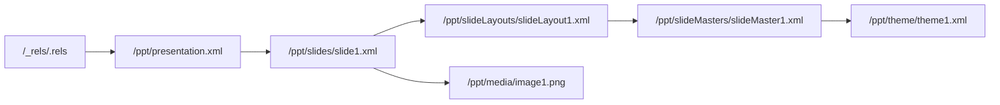

# PPTX 双向编辑库实施进度

最后更新：2026-08-01

## WP0：基线与技术验证

状态：完成

### 本阶段 change

- 建立 pnpm/TypeScript strict/Vitest monorepo。
- 新增 `@pptx/lossless-xml`：保留源跨度、属性顺序、空白和未知节点；仅重写目标区间；拒绝 DTD/ENTITY。
- 新增 `@pptx/opc`：读取 content types、内部/外部 relationships、规范化 part URI、建立 package graph，并实施 ZIP 资源预算。
- 新增基础 validator diagnostic 模型。
- 新增 `@pptx/sdk` 首条竖切：从 Buffer、Uint8Array、ArrayBuffer、文件或 stream 打开，读取/修改第一页标题并保存。
- 无 mutation 时原字节返回；有 mutation 时未触及 part 的 payload SHA-256 保持一致。

### 新增功能演示

下面的文件由真实 PPTX 经过 `PptxDocument` 修改标题后，用 LibreOffice headless 打开并导出。页面可正常渲染，证明输出未触发结构修复。


### 验证结果

- TypeScript strict typecheck：通过。
- Vitest：3 个测试文件、8 个测试全部通过。
- 无修改 round-trip：字节级相同。
- 标题 mutation isolation：通过。
- 未知 XML 节点保留：通过。
- LibreOffice 打开/导出：通过。

### 相关设计记录

- [ADR 0001：无损 OOXML 内核](./architecture/0001-lossless-ooxml-kernel.md)
- [ADR 0002：Codec ownership](./architecture/0002-codec-ownership.md)
- [ADR 0003：兼容 profile](./architecture/0003-compatibility-profiles.md)
- [WP0 依赖评估](./architecture/wp0-dependency-evaluation.md)

## WP1：OPC 与 Lossless XML

状态：完成

### 本阶段 change

- package graph 新增 outgoing/incoming 双向引用视图、part URI 与 `rId` 分配器。
- relationship updater 支持新增、局部更新、删除、internal/external target 解析；删除 part 时同步清理内部入边和自身 `.rels`。
- content type updater 改为 source-span patch，新增/删除 override 时继续保留未知节点、命名空间和原始默认项。
- lossless XML 新增 element replace/remove/append、attribute patch 与仅供 diff/测试使用的 canonical 输出。
- validator 新增 root office document 基数、重复/非法 relationship id、悬空 target、external portability diagnostics。
- 安全测试覆盖 entry 数、单 part 大小、总解压预算、压缩比、ZIP traversal、DTD/ENTITY。

### Package graph 直观示意



新增或删除 `Media` 时，relationship 与 `[Content_Types].xml` 会作为同一次受控 mutation 同步更新；未知 content type 扩展节点不会被重建或删除。

### 验证结果

- TypeScript strict typecheck：通过。
- Vitest：4 个测试文件、13 个测试全部通过。
- package graph 入边/出边：通过。
- relationship/content type 同步：通过。
- unknown content-type node preservation：通过。
- ZIP/XML 安全预算：通过。

## WP2：基础语义模型

状态：完成

### 本阶段 change

- 新增独立 `@pptx/model`，SDK 不再直接承担 OOXML 解析职责。
- 按 `p:sldId/@r:id` 精确保持幻灯片顺序，修复数值 `id` 与 relationship id 混淆的多页隐患。
- 新增 Shape/Text/Image/Table/Chart 语义对象；每个对象保留源 part 与 shape id，可回到最小 XML 区间修改。
- 文本、表格单元格、shape transform、嵌入图片 payload 和 chart XML 可编辑；常规 chart series 可读取。
- 新增 `addSlide()`、`duplicateSlide()`、`moveSlide()`、`deleteSlide()`，同步维护 slide id、relationship、content type 和 `.rels`。
- 新增 EMU、point、inch、OOXML angle 单位转换，以及可保留来源的 color/inheritance 类型。
- 修正已存在 part 改变 content type 时 override 未同步的问题。

### 新增功能演示

下面是 PptxGenJS 4.0.1 生成的真实文件。新 model 同时识别文本、图片、表格和图表，修改标题、复制并排序幻灯片；LibreOffice 成功打开并导出 3 页 PDF。


### API 示例

```ts
const document = await PptxDocument.open('input.pptx');
document.slides[0].title.text = 'Updated';
document.slides[0].shapes[0].setTransform({ x: inches(2) });
document.duplicateSlide(0);
document.moveSlide(2, 1);
await document.writeFile('output.pptx');
```

### 验证结果

- TypeScript strict typecheck：通过。
- Vitest：5 个测试文件、15 个测试全部通过。
- 常规对象 decode/edit/save：通过。
- slide add/duplicate/move/delete 与引用同步：通过。
- 真实文本/图片/表格/图表文件：LibreOffice 无修复打开并导出 3 页。
- presentation 未知扩展节点保留：通过。

## WP3：PptxGenJS Adapter

状态：完成

### 本阶段 change

- 新增 `@pptx/pptxgenjs-adapter`，并把 `pptxgenjs:^4.0.1` 限定为该包的直接依赖。
- `importPptxGenJS()` 只调用公开 `write({ outputType: 'uint8array' })`，生成结果立即进入同一 OOXML 内核。
- adapter 支持透传资源预算和 AbortSignal；异常输出产生明确的 `PptxGenJSAdapterError`。
- conformance test 使用 PptxGenJS 4.0.1 真实生成文件，导入后修改标题、复制 slide、保存并重新读取。
- 新增依赖边界回归测试，确保 core/model/opc/sdk/validator 不会意外引入 PptxGenJS。
- 新增迁移指南，区分“PptxGenJS 新建后加工”和“直接编辑已有 PPTX”两条路径。

### 新增功能演示

下面的标题先由 PptxGenJS 创建，再通过 adapter 导入并由 OOXML 内核改写；保存后由 LibreOffice 打开和导出。整个流程不读取 PptxGenJS 私有字段。


### 验证结果

- TypeScript strict typecheck：通过。
- Vitest：6 个测试文件、17 个测试全部通过。
- PptxGenJS 4.0.1 public output conformance：通过。
- adapter 导入→编辑→复制→重新打开：通过。
- 非 adapter 包依赖边界：通过。
- 迁移指南：[docs/migration/pptxgenjs.md](./migration/pptxgenjs.md)。

## WP4：v1 高价值 Codec

状态：完成

### 本阶段 change

- 新增 `@pptx/codecs` 与 ownership registry；同优先级 codec 声明相同元素/关系/part 时明确报冲突。
- Master/Layout/Theme codec 可读取、创建、复制、删除和重新关联三类 part，解析 placeholder 的 `type + idx` 继承链，并提供 `materializeInheritedStyle()`。
- Theme 保留 scheme color 表达，支持局部修改 color scheme；读取 major/minor font scheme，不因修改其他字段固化主题色。
- Gradient/Transparency codec 支持 linear/path、任意 stop、角度、scaled、rotate-with-shape、flip、fill rectangle，以及 srgb/scrgb/scheme/system/preset color。
- `alpha`、`alphaMod`、`alphaOff`、`alphaModFix` 和其他 color transforms 按原顺序 round-trip；`SlideModel.background` 与 shape `gradientFill` 可直接编辑。
- Media codec 支持文件、Buffer、ArrayBuffer、stream、外链 URL、poster、内容哈希去重、Audio/Video 关系、复制引用和删除引用计数。
- 媒体 click action 使用 Office 原生表达；autoplay/loop/hide/volume 偏好通过 opaque extension round-trip，并由 Timing codec 转为原生时间树。
- SDK 写入时汇总渐变、媒体和 external relationship 的 compatibility diagnostics。

### 新增功能演示

下面的三 stop 渐变由 `SlideModel.background` 写成原生 OOXML：中间 stop 使用 theme color，末端带独立 alpha。PptxGenJS 原有 master/layout/theme 关系保持不变，LibreOffice 可直接渲染。


### API 示例

```ts
document.slides[0].background = {
  kind: 'linear-gradient',
  angle: 35,
  stops: [
    { offset: 0, color: '#1D4ED8' },
    { offset: 0.52, color: { source: { kind: 'scheme', value: 'accent2' }, alpha: 0.82, transforms: [] } },
    { offset: 1, color: '#7C3AED', alpha: 0.68 },
  ],
};

await document.addAudio(0, audioBuffer, { contentType: 'audio/mpeg', play: 'click' });
```

### 验证结果

- TypeScript strict typecheck：通过。
- Vitest：7 个测试文件、22 个测试全部通过。
- real master/layout/theme chain：1 / 1 / 1，读取通过。
- gradient/color/alpha round-trip：通过。
- master/layout/theme create/copy/delete/relink：通过。
- media embed/external/poster/dedup/ref-count：通过。
- ZIP integrity 与 LibreOffice 打开/导出：通过。
- 兼容矩阵：[docs/compatibility/v1-codecs.md](./compatibility/v1-codecs.md)。

## WP5：SDK、验证与 0.1.0 发布准备

状态：完成

### 本阶段 change

- SDK 公共 API、类型声明、错误与 compatibility diagnostics 汇总完成；全部 workspace package 统一为 `0.1.0`。
- 新增 `@pptx/testkit`：part fingerprint、package diff、mutation isolation 断言、fixture 与 LibreOffice render helper。
- 新增可全局运行的 `pptx-inspect`：doctor、package inspect/validate/diff、slides list/set-title、raw part read。
- CLI 使用稳定 JSON success/error envelope，离线且无需认证；写入要求显式 `--out`，支持 `--dry-run`，不提供 raw write/delete。
- 新增 repo companion skill `.codex/skills/pptx-inspect`，已通过 skill validator。
- 新增 250 轮 deterministic XML fuzz、20 轮 package round-trip fuzz 和 1,000-part 性能 smoke test。
- 新增 Node 20/22 × Linux/macOS/Windows 公共 CI、LibreOffice headless job、PowerPoint COM 与 Keynote AppleScript 私有 runner。
- 新增 API、安全、跨客户端、迁移、examples、CHANGELOG 和 0.1.0 release gate 文档。

### CLI 直观输出

```text
$ pptx-inspect --json doctor
{"ok":true,"command":"doctor","data":{"version":"0.1.0","node":{"supported":true},"auth":{"required":false},"mode":"offline","optional":{"libreoffice":true}}}

$ pptx-inspect --json package inspect output.pptx
{"ok":true,"command":"package.inspect","data":{"partCount":20,"relationshipCount":18,...}}
```

### 验证结果

- Full strict check：10 个测试文件通过，28 个测试通过，1 个 performance test 默认跳过。
- 独立 performance run：1,000-part package 在 606ms 完成 smoke test（预算 5s）。
- `pptx-inspect` 已链接到 `/usr/local/bin`，从 `/tmp` 执行 help、doctor 和真实 PPTX inspection：通过。
- LibreOffice CI 脚本生成、修改、打开并导出 PDF：通过。
- 0.1.0 release checklist：[docs/release/0.1.0.md](./release/0.1.0.md)。

## WP6：扩展插件

状态：完成

### 本阶段 change

- 新增四个独立 `0.1.0` 插件包；core/sdk 对插件保持零反向依赖，未安装时所有对应 XML/parts 继续无损透传。
- Transition：读写 effect/speed/duration/click/auto advance，管理 sound relationship；Morph 扩展 preserve + diagnostic，禁止生成不安全的伪 Morph XML。
- Animation/Timing：decode timing tree，新增 appear/fade/wipe/fly/motion，支持 trigger/delay/duration/repeat/text range，shape id retarget 与悬空 target 校验。
- Timing 插件安装时把 Media codec 的 autoplay/loop/volume 偏好转换为原生 `cMediaNode` 时间树。
- Advanced Charts：组合/现代图表识别、axis/series、trendline、error bar、data label、cache value、embedded workbook 一致性 diagnostic，以及显式 image fallback。
- SmartArt：解析 data/layout/quick-style/colors/drawing part set；支持文本替换、节点/连接增删，保留 style 与 fallback drawing，并在需要 PowerPoint 重新布局时诊断。
- Lossless XML writer 新增安全展开 self-closing element 的 child append，修复 SmartArt connection list 的真实边界用例。

### 新增功能演示

下面的真实文件同时安装四个插件，写入 fade transition、标题动画、媒体 timing 和 chart data labels；ZIP 完整性检查与 LibreOffice 打开/导出均通过。


### 验证结果

- TypeScript strict typecheck：通过。
- Vitest：14 个测试文件、34 个测试全部通过；1 个独立 performance test 默认跳过。
- plugin ownership registry：7 个内建/可选 codec 无冲突注册。
- 真实 slide XML 包含 `p:transition`、`p:timing`、`p:audio`、`p:animEffect`。
- ZIP integrity 与 LibreOffice headless open/export：通过，diagnostics 为空。
- 插件使用文档：[docs/plugins.md](./plugins.md)。

## PptxGenJS 全功能对等：Raster source loader

状态：完成

### 本阶段 change

- 新增 PNG/JPEG/GIF signature 与 raw pixel dimensions inspector；格式检测不信任扩展名、Blob/HTTP MIME 或文件名。
- 新增统一 raster source resolver，覆盖 Node path、HTTP/HTTPS URL、browser-relative URL、strict canonical base64 data URI、`Uint8Array`、`ArrayBuffer`、`Blob`/`File`、Web stream 与 async byte iterable，并支持 AbortSignal。
- 新增 `PptxDocument.addImage(slideIndex, source, options?)`，在所有异步加载、signature 检测与 MIME assertion 完成后才进入原有 atomic picture mutation。
- 保留 `SlideModel.addImage(bytes, options)` 作为 strict 同步底层 API，并保持 1-inch 默认 transform；intrinsic pixel dimensions 暂不自动决定布局尺寸。
- 新增 PptxGenJS 4.0.1 path/data 高层 loader 最终语义对等测试；contain/cover/crop 与 `srcRect` 进展见下一节。

### 验证结果

- Raster source resolver：78 项测试通过；SDK focused suites：216 项测试通过。
- Actual npm tarball 的 Node/browser/declaration/CLI smoke 通过，连续两次 dist build SHA 一致，browser bundle 无 static Node import。
- 4 页、32 shapes、12 images gallery 覆盖全部公开来源；原件和 LibreOffice round-trip 均为 PowerPoint 2010 validation 0 errors / 0 warnings，2400×1350 render 无 overflow，并已逐页视觉检查。
- LibreOffice 保留 12/12 payload SHA、content type、name、non-empty alt text、顺序与 internal relationship；把 12 个重复 payload targets 去重为 3 个，transform 最大量化 432 EMU，并重写 12/12 picture markup。

## PptxGenJS 全功能对等：Raster image sizing 与 `srcRect`

状态：完成

### 本阶段 change

- 新增 low-level `ImageSourceRectangle` 与 direct `a:srcRect` create/read/edit/repair/clear；percent unit 中 `1` 表示 1%，量化到 0.001%，支持 contain 所需负边，getter detached/deep-frozen，同值赋值 exact no-op，失败与外层 transaction 均完整回滚。
- 新增 pure `calculateRasterImageSizing()`，覆盖 intrinsic-aware `contain`、`cover` 与 source-pixel `crop`；frame 使用 EMU，结果和嵌套 rectangle frozen，不读取 source、不修改 package。
- 新增 `PptxDocument.addImage(..., { sizing })`；`sizing` 与 top-level `width`/`height` 互斥，高层拒绝 direct `sourceRectangle`。Options/sizing 在异步 source I/O 前脱离 caller，placement 在 package mutation 前计算，invalid source/MIME/sizing 保持零变化。
- 锁定 PptxGenJS 4.0.1 的 contain/cover/equal-ratio/crop 6 个 public case，最终 transform 与 direct `srcRect` integer percentages 全部精确对等；native 对 ambiguous dimensions、truthy fallback、out-of-bounds crop 与 unsafe numeric state 保持严格拒绝。
- 下一图片小项调整为 SVG；rounding/transparency、alt-text 编辑、hyperlink/shadow/placeholder、单图片删除与 media GC 继续保留在后续列表。

### 验证结果

- PptxGenJS adapter：55/55 测试通过，其中 sizing conformance 为 6/6。
- Actual npm tarball 的 Node/browser/declaration/CLI smoke 通过；连续两次 clean build 的 38 个 dist 文件 SHA-256 manifest 完全一致，consumer 无 workspace 路径或 PptxGenJS runtime 依赖。
- 4 页、40 shapes、12 images sizing gallery 覆盖 landscape/portrait/square PNG/JPEG/GIF、contain/cover/equal ratio、full/center/edge/fractional crop、direct edit/clear、rotation/flips、special-character name 与 non-empty alt text。
- 原件和 LibreOffice round-trip 均可 strict reopen，PowerPoint 2010 validation 为 0 errors / 0 warnings，overflow 为 0，并已逐页视觉检查。LibreOffice 保留 12/12 payload SHA、content type、name、alt text、顺序与 internal relationship；重复媒体去重为 3 个并重写 12/12 picture markup。
- LibreOffice 最大 transform 量化为 360 EMU，最大 `srcRect` 量化为 0.007%，双 flip 等价规范化为 rotation +180°。原件 180 DPI 输出为 2400×1350；回存件规范化 slide width 后 direct raster 为 2401×1350，逐页检查使用 proportional 2400×1350 raster。

## 0.1.0 初始验收

- `pnpm check`：TypeScript strict build 通过；14 个测试文件、34 项测试全部通过。
- 独立性能门禁：1,000-part package 在 596ms 打开，低于 5s 预算。
- LibreOffice：真实 PPTX 无头打开、另存并导出 PDF 通过。
- npm 制品：13 个可发布 package/plugin 均可打包，workspace 版本正确转换为 `0.1.0`，且不包含 `node_modules` 或测试构建产物。
- 依赖边界：只有 `@pptx/pptxgenjs-adapter` 直接依赖 `pptxgenjs:^4.0.1`；core、SDK 和插件保持边界。
- 计划审计：WP0–WP6 的代码、测试、文档、截图、CLI、CI 与可选插件交付物均已落库。

正式 npm 发布仍按 [0.1.0 release checklist](./release/0.1.0.md) 保持 gated：Windows PowerPoint corpus、macOS Keynote corpus 与受控 Google Slides 导入需要在具备非交互授权的专用环境完成。本机安装的 PowerPoint/Keynote 在自动化验证中被首次启动或系统权限模态窗口阻塞，未将超时结果误记为通过。
