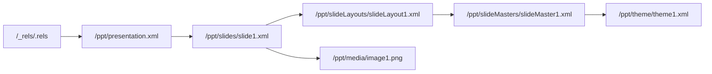

# PPTX 双向编辑库实施进度

最后更新：2026-07-25

## WP0：基线与技术验证

状态：完成

### 本阶段 change

- 建立 pnpm/TypeScript strict/Vitest monorepo。
- 新增 `@pptx/lossless-xml`：保留源跨度、属性顺序、空白和未知节点；仅重写目标区间；拒绝 DTD/ENTITY。
- 新增 `@pptx/opc`：读取 content types、内部/外部 relationships、规范化 part URI、建立 package graph，并实施 ZIP 资源预算。
- 新增基础 validator diagnostic 模型。
- 新增 `@pptx/sdk` 首条竖切：从 Buffer、Uint8Array、ArrayBuffer、文件或 stream 打开，读取/修改第一页标题并保存。
- 无 mutation 时原字节返回；有 mutation 时未触及 part 的 payload SHA-256 保持一致。

### 新增功能演示

下面的文件由真实 PPTX 经过 `PptxDocument` 修改标题后，用 LibreOffice headless 打开并导出。页面可正常渲染，证明输出未触发结构修复。

### 验证结果

- TypeScript strict typecheck：通过。
- Vitest：3 个测试文件、8 个测试全部通过。
- 无修改 round-trip：字节级相同。
- 标题 mutation isolation：通过。
- 未知 XML 节点保留：通过。
- LibreOffice 打开/导出：通过。

### 相关设计记录

- [ADR 0001：无损 OOXML 内核](./architecture/0001-lossless-ooxml-kernel.md)
- [ADR 0002：Codec ownership](./architecture/0002-codec-ownership.md)
- [ADR 0003：兼容 profile](./architecture/0003-compatibility-profiles.md)
- [WP0 依赖评估](./architecture/wp0-dependency-evaluation.md)

## WP1：OPC 与 Lossless XML

状态：完成

### 本阶段 change

- package graph 新增 outgoing/incoming 双向引用视图、part URI 与 `rId` 分配器。
- relationship updater 支持新增、局部更新、删除、internal/external target 解析；删除 part 时同步清理内部入边和自身 `.rels`。
- content type updater 改为 source-span patch，新增/删除 override 时继续保留未知节点、命名空间和原始默认项。
- lossless XML 新增 element replace/remove/append、attribute patch 与仅供 diff/测试使用的 canonical 输出。
- validator 新增 root office document 基数、重复/非法 relationship id、悬空 target、external portability diagnostics。
- 安全测试覆盖 entry 数、单 part 大小、总解压预算、压缩比、ZIP traversal、DTD/ENTITY。

### Package graph 直观示意

新增或删除 `Media` 时，relationship 与 `[Content_Types].xml` 会作为同一次受控 mutation 同步更新；未知 content type 扩展节点不会被重建或删除。

### 验证结果

- TypeScript strict typecheck：通过。
- Vitest：4 个测试文件、13 个测试全部通过。
- package graph 入边/出边：通过。
- relationship/content type 同步：通过。
- unknown content-type node preservation：通过。
- ZIP/XML 安全预算：通过。
