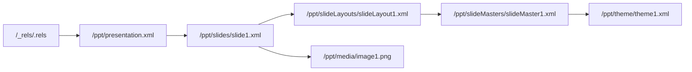

# PPTX 双向编辑库实施进度

最后更新：2026-08-02

## WP0：基线与技术验证

状态：完成

### 本阶段 change

- 建立 pnpm/TypeScript strict/Vitest monorepo。
- 新增 `@pptx/lossless-xml`：保留源跨度、属性顺序、空白和未知节点；仅重写目标区间；拒绝 DTD/ENTITY。
- 新增 `@pptx/opc`：读取 content types、内部/外部 relationships、规范化 part URI、建立 package graph，并实施 ZIP 资源预算。
- 新增基础 validator diagnostic 模型。
- 新增 `@pptx/sdk` 首条竖切：从 Buffer、Uint8Array、ArrayBuffer、文件或 stream 打开，读取/修改第一页标题并保存。
- 无 mutation 时原字节返回；有 mutation 时未触及 part 的 payload SHA-256 保持一致。

### 新增功能演示

下面的文件由真实 PPTX 经过 `PptxDocument` 修改标题后，用 LibreOffice headless 打开并导出。页面可正常渲染，证明输出未触发结构修复。


### 验证结果

- TypeScript strict typecheck：通过。
- Vitest：3 个测试文件、8 个测试全部通过。
- 无修改 round-trip：字节级相同。
- 标题 mutation isolation：通过。
- 未知 XML 节点保留：通过。
- LibreOffice 打开/导出：通过。

### 相关设计记录

- [ADR 0001：无损 OOXML 内核](./architecture/0001-lossless-ooxml-kernel.md)
- [ADR 0002：Codec ownership](./architecture/0002-codec-ownership.md)
- [ADR 0003：兼容 profile](./architecture/0003-compatibility-profiles.md)
- [WP0 依赖评估](./architecture/wp0-dependency-evaluation.md)

## WP1：OPC 与 Lossless XML

状态：完成

### 本阶段 change

- package graph 新增 outgoing/incoming 双向引用视图、part URI 与 `rId` 分配器。
- relationship updater 支持新增、局部更新、删除、internal/external target 解析；删除 part 时同步清理内部入边和自身 `.rels`。
- content type updater 改为 source-span patch，新增/删除 override 时继续保留未知节点、命名空间和原始默认项。
- lossless XML 新增 element replace/remove/append、attribute patch 与仅供 diff/测试使用的 canonical 输出。
- validator 新增 root office document 基数、重复/非法 relationship id、悬空 target、external portability diagnostics。
- 安全测试覆盖 entry 数、单 part 大小、总解压预算、压缩比、ZIP traversal、DTD/ENTITY。

### Package graph 直观示意



新增或删除 `Media` 时，relationship 与 `[Content_Types].xml` 会作为同一次受控 mutation 同步更新；未知 content type 扩展节点不会被重建或删除。

### 验证结果

- TypeScript strict typecheck：通过。
- Vitest：4 个测试文件、13 个测试全部通过。
- package graph 入边/出边：通过。
- relationship/content type 同步：通过。
- unknown content-type node preservation：通过。
- ZIP/XML 安全预算：通过。

## WP2：基础语义模型

状态：完成

### 本阶段 change

- 新增独立 `@pptx/model`，SDK 不再直接承担 OOXML 解析职责。
- 按 `p:sldId/@r:id` 精确保持幻灯片顺序，修复数值 `id` 与 relationship id 混淆的多页隐患。
- 新增 Shape/Text/Image/Table/Chart 语义对象；每个对象保留源 part 与 shape id，可回到最小 XML 区间修改。
- 文本、表格单元格、shape transform、嵌入图片 payload 和 chart XML 可编辑；常规 chart series 可读取。
- 新增 `addSlide()`、`duplicateSlide()`、`moveSlide()`、`deleteSlide()`，同步维护 slide id、relationship、content type 和 `.rels`。
- 新增 EMU、point、inch、OOXML angle 单位转换，以及可保留来源的 color/inheritance 类型。
- 修正已存在 part 改变 content type 时 override 未同步的问题。

### 新增功能演示

下面是 PptxGenJS 4.0.1 生成的真实文件。新 model 同时识别文本、图片、表格和图表，修改标题、复制并排序幻灯片；LibreOffice 成功打开并导出 3 页 PDF。


### API 示例

```ts
const document = await PptxDocument.open('input.pptx');
document.slides[0].title.text = 'Updated';
document.slides[0].shapes[0].setTransform({ x: inches(2) });
document.duplicateSlide(0);
document.moveSlide(2, 1);
await document.writeFile('output.pptx');
```

### 验证结果

- TypeScript strict typecheck：通过。
- Vitest：5 个测试文件、15 个测试全部通过。
- 常规对象 decode/edit/save：通过。
- slide add/duplicate/move/delete 与引用同步：通过。
- 真实文本/图片/表格/图表文件：LibreOffice 无修复打开并导出 3 页。
- presentation 未知扩展节点保留：通过。

## WP3：PptxGenJS Adapter

状态：完成

### 本阶段 change

- 新增 `@pptx/pptxgenjs-adapter`，并把 `pptxgenjs:^4.0.1` 限定为该包的直接依赖。
- `importPptxGenJS()` 只调用公开 `write({ outputType: 'uint8array' })`，生成结果立即进入同一 OOXML 内核。
- adapter 支持透传资源预算和 AbortSignal；异常输出产生明确的 `PptxGenJSAdapterError`。
- conformance test 使用 PptxGenJS 4.0.1 真实生成文件，导入后修改标题、复制 slide、保存并重新读取。
- 新增依赖边界回归测试，确保 core/model/opc/sdk/validator 不会意外引入 PptxGenJS。
- 新增迁移指南，区分“PptxGenJS 新建后加工”和“直接编辑已有 PPTX”两条路径。

### 新增功能演示

下面的标题先由 PptxGenJS 创建，再通过 adapter 导入并由 OOXML 内核改写；保存后由 LibreOffice 打开和导出。整个流程不读取 PptxGenJS 私有字段。


### 验证结果

- TypeScript strict typecheck：通过。
- Vitest：6 个测试文件、17 个测试全部通过。
- PptxGenJS 4.0.1 public output conformance：通过。
- adapter 导入→编辑→复制→重新打开：通过。
- 非 adapter 包依赖边界：通过。
- 迁移指南：[docs/migration/pptxgenjs.md](./migration/pptxgenjs.md)。

## WP4：v1 高价值 Codec

状态：完成

### 本阶段 change

- 新增 `@pptx/codecs` 与 ownership registry；同优先级 codec 声明相同元素/关系/part 时明确报冲突。
- Master/Layout/Theme codec 可读取、创建、复制、删除和重新关联三类 part，解析 placeholder 的 `type + idx` 继承链，并提供 `materializeInheritedStyle()`。
- Theme 保留 scheme color 表达，支持局部修改 color scheme；读取 major/minor font scheme，不因修改其他字段固化主题色。
- Gradient/Transparency codec 支持 linear/path、任意 stop、角度、scaled、rotate-with-shape、flip、fill rectangle，以及 srgb/scrgb/scheme/system/preset color。
- `alpha`、`alphaMod`、`alphaOff`、`alphaModFix` 和其他 color transforms 按原顺序 round-trip；`SlideModel.background` 与 shape `gradientFill` 可直接编辑。
- Media codec 支持文件、Buffer、ArrayBuffer、stream、外链 URL、poster、内容哈希去重、Audio/Video 关系、复制引用和删除引用计数。
- 媒体 click action 使用 Office 原生表达；autoplay/loop/hide/volume 偏好通过 opaque extension round-trip。当前 `addAudio()` / `addVideo()` 不自动生成原生 timing tree，相关对接保留到后续 media lifecycle/timing 小项。
- SDK 写入时汇总渐变、媒体和 external relationship 的 compatibility diagnostics。

### 新增功能演示

下面的三 stop 渐变由 `SlideModel.background` 写成原生 OOXML：中间 stop 使用 theme color，末端带独立 alpha。PptxGenJS 原有 master/layout/theme 关系保持不变，LibreOffice 可直接渲染。


### API 示例

```ts
document.slides[0].background = {
  kind: 'linear-gradient',
  angle: 35,
  stops: [
    { offset: 0, color: '#1D4ED8' },
    { offset: 0.52, color: { source: { kind: 'scheme', value: 'accent2' }, alpha: 0.82, transforms: [] } },
    { offset: 1, color: '#7C3AED', alpha: 0.68 },
  ],
};

await document.addAudio(0, audioBuffer, { contentType: 'audio/mpeg', play: 'click' });
```

### 验证结果

- TypeScript strict typecheck：通过。
- Vitest：7 个测试文件、22 个测试全部通过。
- real master/layout/theme chain：1 / 1 / 1，读取通过。
- gradient/color/alpha round-trip：通过。
- master/layout/theme create/copy/delete/relink：通过。
- media embed/external/poster/dedup/ref-count：通过。
- ZIP integrity 与 LibreOffice 打开/导出：通过。
- 兼容矩阵：[docs/compatibility/v1-codecs.md](./compatibility/v1-codecs.md)。

## WP5：SDK、验证与 0.1.0 发布准备

状态：完成

### 本阶段 change

- SDK 公共 API、类型声明、错误与 compatibility diagnostics 汇总完成；全部 workspace package 统一为 `0.1.0`。
- 新增 `@pptx/testkit`：part fingerprint、package diff、mutation isolation 断言、fixture 与 LibreOffice render helper。
- 新增可全局运行的 `pptx-inspect`：doctor、package inspect/validate/diff、slides list/set-title、raw part read。
- CLI 使用稳定 JSON success/error envelope，离线且无需认证；写入要求显式 `--out`，支持 `--dry-run`，不提供 raw write/delete。
- 新增 repo companion skill `.codex/skills/pptx-inspect`，已通过 skill validator。
- 新增 250 轮 deterministic XML fuzz、20 轮 package round-trip fuzz 和 1,000-part 性能 smoke test。
- 新增 Node 20/22 × Linux/macOS/Windows 公共 CI、LibreOffice headless job、PowerPoint COM 与 Keynote AppleScript 私有 runner。
- 新增 API、安全、跨客户端、迁移、examples、CHANGELOG 和 0.1.0 release gate 文档。

### CLI 直观输出

```text
$ pptx-inspect --json doctor
{"ok":true,"command":"doctor","data":{"version":"0.1.0","node":{"supported":true},"auth":{"required":false},"mode":"offline","optional":{"libreoffice":true}}}

$ pptx-inspect --json package inspect output.pptx
{"ok":true,"command":"package.inspect","data":{"partCount":20,"relationshipCount":18,...}}
```

### 验证结果

- Full strict check：10 个测试文件通过，28 个测试通过，1 个 performance test 默认跳过。
- 独立 performance run：1,000-part package 在 606ms 完成 smoke test（预算 5s）。
- `pptx-inspect` 已链接到 `/usr/local/bin`，从 `/tmp` 执行 help、doctor 和真实 PPTX inspection：通过。
- LibreOffice CI 脚本生成、修改、打开并导出 PDF：通过。
- 0.1.0 release checklist：[docs/release/0.1.0.md](./release/0.1.0.md)。

## WP6：扩展插件

状态：完成

### 本阶段 change

- 新增四个独立 `0.1.0` 插件包；core/sdk 对插件保持零反向依赖，未安装时所有对应 XML/parts 继续无损透传。
- Transition：读写 effect/speed/duration/click/auto advance，管理 sound relationship；Morph 扩展 preserve + diagnostic，禁止生成不安全的伪 Morph XML。
- Animation/Timing：decode timing tree，新增 appear/fade/wipe/fly/motion，支持 trigger/delay/duration/repeat/text range，shape id retarget 与悬空 target 校验。
- Timing 插件安装时把 Media codec 的 autoplay/loop/volume 偏好转换为原生 `cMediaNode` 时间树。
- Advanced Charts：组合/现代图表识别、axis/series、trendline、error bar、data label、cache value、embedded workbook 一致性 diagnostic，以及显式 image fallback。
- SmartArt：解析 data/layout/quick-style/colors/drawing part set；支持文本替换、节点/连接增删，保留 style 与 fallback drawing，并在需要 PowerPoint 重新布局时诊断。
- Lossless XML writer 新增安全展开 self-closing element 的 child append，修复 SmartArt connection list 的真实边界用例。

### 新增功能演示

下面的真实文件同时安装四个插件，写入 fade transition、标题动画、媒体 timing 和 chart data labels；ZIP 完整性检查与 LibreOffice 打开/导出均通过。


### 验证结果

- TypeScript strict typecheck：通过。
- Vitest：14 个测试文件、34 个测试全部通过；1 个独立 performance test 默认跳过。
- plugin ownership registry：7 个内建/可选 codec 无冲突注册。
- 真实 slide XML 包含 `p:transition`、`p:timing`、`p:audio`、`p:animEffect`。
- ZIP integrity 与 LibreOffice headless open/export：通过，diagnostics 为空。
- 插件使用文档：[docs/plugins.md](./plugins.md)。

## PptxGenJS 全功能对等：Raster source loader

状态：完成

### 本阶段 change

- 新增 PNG/JPEG/GIF signature 与 raw pixel dimensions inspector；格式检测不信任扩展名、Blob/HTTP MIME 或文件名。
- 新增统一 raster source resolver，覆盖 Node path、HTTP/HTTPS URL、browser-relative URL、strict canonical base64 data URI、`Uint8Array`、`ArrayBuffer`、`Blob`/`File`、Web stream 与 async byte iterable，并支持 AbortSignal。
- 新增 `PptxDocument.addImage(slideIndex, source, options?)`，在所有异步加载、signature 检测与 MIME assertion 完成后才进入原有 atomic picture mutation。
- 保留 `SlideModel.addImage(bytes, options)` 作为 strict 同步底层 API，并保持 1-inch 默认 transform；intrinsic pixel dimensions 暂不自动决定布局尺寸。
- 新增 PptxGenJS 4.0.1 path/data 高层 loader 最终语义对等测试；contain/cover/crop 与 `srcRect` 进展见下一节。

### 验证结果

- Raster source resolver：78 项测试通过；SDK focused suites：216 项测试通过。
- Actual npm tarball 的 Node/browser/declaration/CLI smoke 通过，连续两次 dist build SHA 一致，browser bundle 无 static Node import。
- 4 页、32 shapes、12 images gallery 覆盖全部公开来源；原件和 LibreOffice round-trip 均为 PowerPoint 2010 validation 0 errors / 0 warnings，2400×1350 render 无 overflow，并已逐页视觉检查。
- LibreOffice 保留 12/12 payload SHA、content type、name、non-empty alt text、顺序与 internal relationship；把 12 个重复 payload targets 去重为 3 个，transform 最大量化 432 EMU，并重写 12/12 picture markup。

## PptxGenJS 全功能对等：Raster image sizing 与 `srcRect`

状态：完成

### 本阶段 change

- 新增 low-level `ImageSourceRectangle` 与 direct `a:srcRect` create/read/edit/repair/clear；percent unit 中 `1` 表示 1%，量化到 0.001%，支持 contain 所需负边，getter detached/deep-frozen，同值赋值 exact no-op，失败与外层 transaction 均完整回滚。
- 新增 pure `calculateRasterImageSizing()`，覆盖 intrinsic-aware `contain`、`cover` 与 source-pixel `crop`；frame 使用 EMU，结果和嵌套 rectangle frozen，不读取 source、不修改 package。
- 新增 `PptxDocument.addImage(..., { sizing })`；`sizing` 与 top-level `width`/`height` 互斥，高层拒绝 direct `sourceRectangle`。Options/sizing 在异步 source I/O 前脱离 caller，placement 在 package mutation 前计算，invalid source/MIME/sizing 保持零变化。
- 锁定 PptxGenJS 4.0.1 的 contain/cover/equal-ratio/crop 6 个 public case，最终 transform 与 direct `srcRect` integer percentages 全部精确对等；native 对 ambiguous dimensions、truthy fallback、out-of-bounds crop 与 unsafe numeric state 保持严格拒绝。
- 后续 SVG lifecycle 已在下一节完成；rounding/transparency、alt-text 编辑、hyperlink/shadow/advanced placeholder style、单图片删除与 media GC 继续保留在后续列表。Picture placeholder population 已在 master/layout 专项完成。

### 验证结果

- PptxGenJS adapter：55/55 测试通过，其中 sizing conformance 为 6/6。
- Actual npm tarball 的 Node/browser/declaration/CLI smoke 通过；连续两次 clean build 的 38 个 dist 文件 SHA-256 manifest 完全一致，consumer 无 workspace 路径或 PptxGenJS runtime 依赖。
- 4 页、40 shapes、12 images sizing gallery 覆盖 landscape/portrait/square PNG/JPEG/GIF、contain/cover/equal ratio、full/center/edge/fractional crop、direct edit/clear、rotation/flips、special-character name 与 non-empty alt text。
- 原件和 LibreOffice round-trip 均可 strict reopen，PowerPoint 2010 validation 为 0 errors / 0 warnings，overflow 为 0，并已逐页视觉检查。LibreOffice 保留 12/12 payload SHA、content type、name、alt text、顺序与 internal relationship；重复媒体去重为 3 个并重写 12/12 picture markup。
- LibreOffice 最大 transform 量化为 360 EMU，最大 `srcRect` 量化为 0.007%，双 flip 等价规范化为 rotation +180°。原件 180 DPI 输出为 2400×1350；回存件规范化 slide width 后 direct raster 为 2401×1350，逐页检查使用 proportional 2400×1350 raster。

## PptxGenJS 全功能对等：SVG image lifecycle

状态：完成

### 本阶段 change

- 新增 strict `SvgImageContentType`、`AddSvgImageOptions` 与 `SlideModel.addSvgImage(svgBytes, fallbackPngBytes, options?)`，原子创建 canonical PNG fallback + Office SVG extension 双 part、双 internal relationship picture；六种 presentation format 均可 create/write/reopen。
- 新增 namespace-aware `ImageModel.isSvg`、`fallbackPartUri`、`svgPartUri` 与 paired `replaceSvgData()`；arbitrary prefix、LibreOffice `image/svg` normalization、duplicate/shared/noncanonical target 的双侧 clone-on-write、malformed state 与 outer transaction rollback 均已覆盖。SVG picture 的 `sourcePartUri` 明确指向 fallback，普通 `replaceData()` 明确拒绝 SVG extension candidate。
- 统一 `ImageSource` / `ImageContentType` / `ImageInfo` 与 `inspectImage()`、`inspectSvgImage()`、`calculateImageSizing()`；高层 `PptxDocument.addImage()` 覆盖 path、HTTP/HTTPS、browser-relative URL、strict data URI、bytes/ArrayBuffer、Blob/File、Web stream 与 async iterable 的 SVG，支持 optional MIME assertion、AbortSignal、contain/cover/crop 和 source-rectangle edit。
- 高层 fallback 优先级固定为 explicit signature-valid PNG、browser Canvas rasterization、built-in transparent PNG；release evidence 中所有 `.png` part 都有真实 PNG signature。同步底层 API 只复制 non-empty bytes，由调用方保证 payload 正确。需要 fallback-only client 保持完整视觉时，调用方必须显式提供高质量 PNG。
- PptxGenJS 4.0.1 data-contain、path-cover、data-crop 3/3 public conformance case 已匹配 picture order、transform、direct `srcRect`、extension URI/namespace、relationship roles、SVG payload 与 metadata；native 不复制其 path SVG 把 SVG bytes 写入 `.png` fallback 的缺陷。
- external SVG relationship、SVG DOM 局部编辑、script execution、external-resource fetching、任意 SVG rasterization fidelity、image rounding/transparency、alt-text 编辑、hyperlink/shadow/advanced placeholder style、单图片删除与 media GC 保留在后续列表；picture placeholder population 与 strict embedded media creation 已完成。

### 验证结果

- 全量 Vitest：49 个测试文件通过、1 个 performance 文件默认跳过；866 项测试通过、1 项默认跳过。独立 1,000-part performance gate 通过；TypeScript strict typecheck、全仓 build 与 `@jiayunxie/pptx` Node/browser/type build 通过。
- Actual npm tarball 的 Node/browser/declaration/CLI SVG smoke 通过；browser Blob/data URI 使用真实 Canvas PNG fallback，每图验证 2 个 internal targets。连续两次 clean build 的 38 个 dist 文件 SHA-256 manifest 完全一致。
- 5 页 gallery 为 13 shapes、8 SVG pictures、7 SVG parts、7 PNG fallbacks、16 image relationships，覆盖全部 source forms、explicit/default fallback、contain/cover/crop、live source-rectangle edit、rotation/flips、duplicate/replacement、特殊名称和 non-empty alt text。原件 strict reopen，PowerPoint 2010 validation 0 errors / 0 warnings，180 DPI overflow 0，已逐页视觉检查。
- LibreOffice save/reopen 保留 shape order、names、alt text、SVG payload hashes、relationship roles、extension URI/namespace 与 7+7 targets，没有新增 dedup；将 `image/svg+xml` 规范化为 `image/svg`。最大 position/size delta 360 EMU，最大 `srcRect` delta 0.003%，raw rotation delta 10,800,000 来自 flip/rotation 等价规范化；PowerPoint 2010 validation 仍为 0 errors / 0 warnings。
- LibreOffice 回存后可能选择 PNG fallback 渲染，而不是 retained SVG；结构与 SVG payload 未丢失，但 fallback-only 视觉质量由 PNG 决定。这一 client behavior 已写入公开文档，不误报为 SVG 视觉等同。

## PptxGenJS 全功能对等：Embedded media creation and stable lifecycle

状态：完成（创建、公开有效用例与 stable live lifecycle）；媒体专项 9/9

### 本阶段 change

- 新增 strict `PptxDocument.addAudio()` / `addVideo()` 创建链，覆盖 Node path、canonical base64 data URI、`Uint8Array`、`ArrayBuffer`、Blob/File、Web `ReadableStream`、async byte iterable 与 HTTP/HTTPS external relationship；HTTP/HTTPS 内容不抓取，poster URL 拒绝。
- 支持 `audio/mpeg`、`audio/mp4`、`audio/wav`、`audio/ogg`，`video/mp4`、`video/quicktime`、`video/webm`，以及 PNG/JPEG/GIF poster；省略 poster 时使用 built-in PNG。MIME 决策固定为 explicit assertion → data URI declaration → known `fileName`/path/`File.name` extension → domain default，并严格拒绝 assertion/declaration/known-extension 冲突。
- Data URI 只接受 supported MIME 与 canonical standard base64；Blob MIME 不作为事实。Options、in-memory byte sources 与 transcode input/result descriptor-safe、getter-free 并脱离 caller，所有异步 I/O、transcode、poster、MIME/extension、hash 与 XML definition 均在一个同步 package transaction 之前完成。
- 创建 canonical `a:audioFile` / `a:videoFile` picture、standard kind relationship、Microsoft media relationship、poster image relationship、click action、name/alt text、EMU transform 与 private playback extension。Live `MediaModel` 在创建结果、`document.media()`、`slide.media` 与 `slide.shapes` 中保持同一 identity，getter 始终读取当前 OOXML。
- 已支持 `name`、`altText`、detached frozen playback settings 与 transform 编辑；source 支持 embedded↔external replacement，poster 支持 PNG/JPEG/GIF replacement 与 built-in PNG reset。Duplicate 初始共享 targets，replacement 使用 SHA-256+MIME dedup 或 clone-on-write；共享 rId、对象/幻灯片删除、move、GC 与 rollback 均引用安全。
- PptxGenJS 4.0.1 public valid media conformance 为 4/4，覆盖 data/path、audio/video、cover、`extn`、`objectName`、transform 与重复路径。Import 兼容其 `a:videoFile` audio、`audio/mp3` 与 duplicate-audio relationship 缺陷；非 source 编辑保留 legacy roles，source replacement 才 canonicalize 当前 picture。
- Data URI、cover/poster、MIME/extension mapping、object name、alt-text 创建、strict embedded audio/video creation、stable live identity/editing 与完整 duplicate/move/delete isolation 已移入支持项。后续 native timing tree 已在下一节完成。

### 验证结果

- Focused media/codecs/model/SDK/PptxGenJS adapter/package suites 通过；全量 Vitest 为 914 项通过、1 项 performance 默认跳过，独立 performance gate、TypeScript strict typecheck、全仓 build 与 `@jiayunxie/pptx` build 通过。
- Actual npm tarball 的 Node/browser/declaration/installed-CLI lifecycle smoke 通过，覆盖 identity、metadata/settings/transform、embedded↔external、poster replacement/reset、duplicate COW、对象/幻灯片删除、move、GC 与 reopen。连续两次 clean build 的 44 个 dist 文件 SHA-256 manifest 完全一致。
- 4 页全格式 lifecycle gallery 含 6 audio、4 video、7 unique media payload、4 poster payload、11 个 `/ppt/media` parts、30 条 media-role relationships 与零 orphan；覆盖 MP3/M4A/WAV/OGG、MP4/MOV/WebM、PNG/JPEG/GIF/default poster、dedup/COW/move/delete。
- Gallery 原件 strict reopen，180 DPI render、overflow 与逐页视觉检查通过。PowerPoint 2010 全格式 profile 为 0 errors，只有 OGG 与 WebM 两条预期 warning；8-object 可移植子集为 0 errors / 0 warnings。External deck 产生 4 条预期 portability warnings。
- LibreOffice 26.8 save/reopen 保留 4 页顺序与 wide canvas，但删除全部 10 个 media pictures、30 条 media-role relationships 与 11 个 media/poster parts，回存四页为空白。文件仍可 strict reopen，validator 为 0 errors / 0 warnings，overflow 为零；该结果明确记录为 client degradation。

## PptxGenJS 全功能对等：Native PowerPoint media timing

状态：完成；实施与证据 7/7

### 本阶段 change

- Core `MediaCodec` 直接创建、读取、同步和清除 native `p:timing`，无需动画插件。支持 `play: click|auto`、`loop`、`hideWhenStopped` 与 `volume`；`px:playback` 保存精确偏好和 media/play/optional-pause timing ownership ID，native graph 表达 PowerPoint 播放行为。
- Read order 固定为合法 private preference → private 缺失时唯一/直接/完整的 native graph → empty settings。Native-only import 可 strict read/adopt；stale ownership 可修复；unsupported/ambiguous timing 保持 bytes 并拒绝危险编辑。
- Create、settings whole-replace、clear、legacy materialization、duplicate、delete 与 target cleanup 使用同一 OPC transaction。Media 与 ordinary animations 共用全页 timing ID allocator；普通动画、未知 timing branches、peer media 和非目标 shape 保持不变。
- Animation plugin 改为复用 `MediaCodec.materializePlayback()`，只幂等升级 legacy preference-only 文件；healthy、native-only 与 unsafe imports 不被重复生成。
- 新增 `MEDIA_TIMING_MISSING`、`MEDIA_TIMING_STALE`、`MEDIA_TIMING_UNSUPPORTED`、`MEDIA_TIMING_AMBIGUOUS`、`MEDIA_TIMING_DANGLING_TARGET`、`MEDIA_TIMING_KIND_MISMATCH` 精确诊断。

### 验证结果

- Public SDK、六种 presentation format、PptxGenJS 4.0.1 import/adoption 与 animation coexistence 专项已覆盖 create/read/edit/clear/materialize/duplicate/delete/reopen、唯一 ID、target isolation、ordinary-animation preservation 和 rollback。
- Actual 45-file npm tarball 的 Node、real-Chrome browser、declaration 与 installed CLI smoke 通过，`nativeMediaTiming: true`；打包声明包含 public API 依赖的 `media-timing-state.internal.d.ts`。连续两次 clean build 的 42 个 dist 文件 SHA-256 manifest 完全一致。
- 9 页真实媒体 gallery 由安装后的 tarball 创建，包含 12 个媒体对象、MP3/M4A/WAV/OGG、MP4/MOV/WebM、PNG/JPEG/GIF poster、10 个去重 `/ppt/media` parts 和零 orphan；覆盖 click/auto、loop、hideWhenStopped、volume 0/0.25/0.5/1、同页双媒体、普通动画共存、legacy materialization、native-only adoption 与 duplicate/edit/clear/delete。
- Gallery strict reopen 与 `pptx-inspect` doctor/inspect/validate/part-read/diff 均通过；PowerPoint 2010 profile 为 0 errors，仅 OGG/WebM 两条预期 warning。180 DPI 全页 render、overflow 与逐页视觉检查通过。
- LibreOffice 26.8 save/reopen 保留 9 页顺序与文案，但删除全部 media、poster、media relationships 与 timing；回存件仍可 strict reopen，0 errors / 0 warnings。该结果记录为 client degradation。
- 本机 PowerPoint 16.112 自动打开对 gallery、LibreOffice 回存件与最小控制文件均返回 `-9074`；没有将该环境的结果记为 PowerPoint 往返通过。

### 剩余媒体与全功能路线

- 媒体后续：online video、remote-fetch embedding、trim/bookmarks、有限重复、narration/cross-slide audio、captions/subtitles、crop/rounding/shadow/hyperlink/advanced placeholder styles、内建转码引擎与更广泛 PowerPoint/Keynote/Google Slides 客户端认证；media placeholder population 已完成。
- Native timing、标准 native chart、direct slide/layout/master background、slide number、default text color 与 named master/layout/placeholder 专项均已完成。PptxGenJS 全功能对等仍未完成，后续路线从 advanced text 开始。

## PptxGenJS 全功能对等：Native chart creation and semantic editing

状态：完成；实施与证据 9/9

### 本阶段 change

- 新增 frozen `CHART_TYPES` 与 strict chart definition，覆盖 `area`、`bar`、`bar3D`、`bubble`、`doughnut`、`line`、`pie`、`radar`、`scatter`，以及兼容的 bar/area/line 主轴/次轴组合。
- `SlideModel.addChart()` / `PptxDocument.addChart()` 原子创建 chart part、internal relationship 和 deterministic embedded XLSX；同一 workbook plan 驱动 worksheet cells、A1 formulas 与 string/numeric caches，六种 presentation format 使用同一路径。
- `ChartModel.definition` 返回 detached deep-frozen 语义快照；`replaceDefinition()` 支持类型、组合、数据和 options 的整体替换，`replaceSeries()` 更新单组数据，`remove()` / `slide.deleteChart()` 按引用回收 chart/workbook/style/color 子图。
- 语义编辑同步更新 chart-owned XML、formulas、caches 与 workbook；option-only edit 保持 workbook bytes，等值 recognized state 为 exact no-op。共享 targets 在首次编辑时 relationship-aware clone-on-write，raw `setXml()` 继续作为显式 escape hatch。
- 支持 title、legend、chart/plot area、主/次轴、gridlines、data labels、data table、series fill/line/marker、colors，以及 grouping/gap/overlap/hole/angle/radar/scatter/bubble/3D 等类型选项。Diagnostics 覆盖 relationship、structure、cache、axis、workbook 缺失/分歧和 modern chart。
- PptxGenJS 4.0.1 public-output conformance 覆盖九种标准类型、bar+line 组合、数据 vectors、formula/cache/XLSX relationships 和代表性 options。Modern `cx:*`、external workbook 和 chart animation 保留原始 bytes，不宣称语义编辑。

### 验证结果

- Focused chart state/workbook/diagnostic/model/SDK/adapter/root-package/plugin suites、TypeScript strict typecheck、全量 Vitest、performance、全仓 build 与 package build 均通过。
- Actual npm tarball 的 Node、real-Chrome、declaration 与 installed CLI smoke 通过，顶层 `nativeCharts: true`。
- 11 页 gallery 包含 10 个 chart parts、10 个 XLSX、唯一 shape IDs 与零 orphan；strict reopen、`pptx-inspect` inspect/validate/slides/part-read、PowerPoint 2010 profile 0 errors / 0 warnings、180 DPI overflow 0 和逐页视觉检查全部通过。
- LibreOffice 26.8 显示八种 2D 类型与组合图；`bar3D` 只显示标题，独立 PptxGenJS 4.0.1 控制文件表现相同。回存后全部十个图表对象的 group types 与 cache 数据保留，内嵌 XLSX 被移除，公式改为客户端占位符；library 以 cache-only 状态重开，报告十条 `CHART_WORKBOOK_MISSING` warning，首次语义替换为目标图表重新生成 canonical XLSX。
- 本机 PowerPoint 16.112 对 native gallery 和独立 PptxGenJS control 均返回同一 `-9074`；本轮不声明 PowerPoint 往返通过。

### 剩余图表与全功能路线

- 图表后续：Office 2016 `cx:*` modern chart 创建/语义编辑、external workbook 编辑、chart animations、内建 trendline/error-bar 创建，以及更广泛 PowerPoint/Keynote/Google Slides 客户端认证。
- Slide number、default text color 与 master/layout/placeholder 已完成；后续顺序为 advanced text、advanced table/`tableToSlides`、output/runtime helpers 与 peer-range full-suite audit。

## PptxGenJS 全功能对等：Direct slide backgrounds

状态：完成；实施与证据 9/9

### 本阶段 change

- 新增 public `SimpleFill`、`SlideBackgroundImage` 与 `SlideBackground`，支持 direct inherited clear、legal noFill、sRGB/theme solid+transparency、linear/path gradient 和 PNG/JPEG/GIF image。
- `SlideModel.background` 只读取唯一 namespace-correct `p:sld/p:cSld/p:bg/p:bgPr`；unsupported/ambiguous `p:bgRef`、pattern/group fill、wrong namespace、multiple choice 或 unsafe image relationship 返回 `undefined` 且不修复 bytes。Equal value 和 absent clear 是 exact no-op。
- Non-image replacement 局部 patch owned fill choice；opaque direct background 由 explicit supported assignment canonicalize。`undefined` 删除 direct `p:bg` 恢复继承，`{ kind: 'none' }` 写合法 `a:noFill`。
- Image background 原子管理 fill、internal relationship 与 PNG/JPEG/GIF part。Duplicate 初始共享 target，首次不同写入 clone-on-write；shared relationship id/target isolation、replacement、clear、slide delete 与 rollback 都按 graph incoming 安全回收。
- 新增 `PptxDocument.setSlideBackgroundImage()`，复用 Node/browser raster source loader 与 signature-first MIME assertion；全部 async I/O 完成后才进入同步 transaction。六种 presentation format 均覆盖 create/read/edit/clear/duplicate/delete/reopen。
- PptxGenJS 4.0.1 合法 solid/transparency/PNG final state 达到语义与结构对等。其 `{ type: 'none' }` 实际继承，`{ type: 'none', color }` 会写空 `p:bgPr`；native explicit none 始终写合法 `a:noFill`，不复制无效输出。

### 验证结果

- Focused model/lifecycle 226/226、SDK six-format/source 296/296、PptxGenJS/validator/root 393/393；最终全量 Vitest 1156 passed、1 performance 默认 skipped，独立 performance 1/1、TypeScript typecheck 与全仓 build 通过。
- Packed Node、real-Chrome、declaration 与 installed CLI smoke 均报告 `slideBackgrounds: true`。Browser 覆盖 Blob/data URI、solid/gradient、writeBlob/reopen，得到 kinds `image,image,solid,linear-gradient`、relationship counts `1,1,0,0`、两个相同 PNG SHA-256 和 0 diagnostics/console/page/network errors。
- 两次 clean build 的 48 个 dist 文件 manifest 完全一致，SHA-256 为 `e42633dfd50e9f8731e780f6b911f691845c530f5c1a0b9e5f356f93a1a0f423`；第二构建 tarball 在无 workspace link 的全新 consumer 中完成 Node/types/browser/CLI 验证。
- 11 页 native gallery 覆盖 inherited/noFill/sRGB/scheme+transparency/linear/path/PNG/JPEG/GIF/duplicate/clear，含 41 parts、39 relationships 和 3 个 background media parts；7 页 PptxGenJS control 含 47 parts、51 relationships。两者 PowerPoint 2010 profile 均为 0 errors / 0 warnings，18 页逐页 render 与 overflow 0 全部通过。
- LibreOffice 26.8 回存保留 11 页顺序、solid/gradient/image kinds 和全部 image payload hashes；explicit noFill 被规范化为 inherited，linear/path `rotateWithShape` 变为 false，path gradient 新增 full fill rectangle。回存件 38 parts、36 relationships，validation 0/0。
- 本机 PowerPoint 16.112 自动打开返回 `-9074` 且未加载 presentation；进程已清理，本轮不声明 PowerPoint 往返通过。

### 剩余背景与全功能路线

- Background 后续：`p:bgRef` semantic editing、pattern/group fill、image crop/tile/effects 与更广泛客户端认证；direct layout/master background 编辑已完成。
- Slide number、default text color 与 master/layout/placeholder 已完成；后续顺序为 advanced text、advanced table/`tableToSlides`、output/runtime helpers 与 peer-range full-suite audit。

## PptxGenJS 全功能对等：Slide number

状态：完成；实施与证据 9/9

### 本阶段 change

- 新增 public `SlideNumber` / `SlideNumberOptions` / color/margin/text-style 类型。x/y/width/height 使用 EMU，margin/font size 使用 point，transparency 使用 percent；strict descriptor-safe input 在 package access 前完成完整校验，getter 返回 detached deep-frozen snapshot。
- `SlideModel.slideNumber`、`LayoutModel.slideNumber` 与 `MasterModel.slideNumber` 分别只投影和编辑 owner part 的唯一 direct `p:ph type="sldNum"`；master 同时管理 direct `p:hf@sldNum`。Equal assignment、absent clear 与 same start 是 parts/relationships/graph/journal exact no-op。
- 新增 `CreatePresentationOptions.firstSlideNumber` 与 live `PresentationModel.firstSlideNumber`，只接受 signed Int32 safe integer；`undefined` 删除 direct attribute 并恢复 OOXML 默认 1。Direct slide cache 为 start + zero-based index，layout/master cache 为 `‹#›`。
- Duplicate/move/delete 与 start edit 在 lifecycle transaction 内同步安全识别的 direct slide caches；unsupported/ambiguous state 保持原 bytes，任一失败完整 rollback。Slide-number placeholder 已从 title fallback 排除。
- 新增 shape-id collision、master disabled 与 noncanonical cache 三类 compatibility diagnostics。PptxGenJS 4.0.1 public default/full style、sRGB/scheme、alignment/justify、valign、margin、font/lang/bold/italic/transparency、named-master output 与 fixed-id collision 均有永久 conformance evidence；native 不复制其 fixed id 25、zero-size fallback、丢失 RTL/transparency、random cache 或 disabled master 缺陷。
- Create/read/edit/clear/no-op/canonicalize/rollback、stable identity、copy/relink、duplicate/move/delete、write/reopen、所有五种 compatibility profile 和 `pptx/pptm/potx/potm/ppsx/ppsm` 均已覆盖。

### 验证结果

- Focused suite 为 448/448；最终全量 Vitest 为 1194 passed、1 performance 默认 skipped；独立 performance 1/1、TypeScript strict typecheck 与全仓 build 通过。
- Actual 54-file tarball 含 51 个 `dist` 文件，installed Node、real-Chrome、browser conditional export、declaration 与 CLI 均报告 `slideNumbers: true`。Browser 覆盖 create/style/layout/master/duplicate/move/writeBlob/reopen，cache 为 `-2,-1`，owner counts `1,1,1,1`，0 diagnostics/console/page/network errors。
- 两次 package build 的 51-file manifest 完全一致，SHA-256 为 `3d77e6f56b8f299f2d580112fd0ebe77d0a98c38c07764259a3735064d5f9bea`；monorepo 两次 clean build 的 727-file dist manifest 也完全一致。
- 16 页 native gallery 覆盖 start/style/四种 alignment/三种 valign/scalar+TRBL margin/sRGB/theme+transparency/RTL/font/lang/layout/master/lifecycle/clear，含 48 parts、45 relationships，PowerPoint 2010 profile 0/0。16 页 PptxGenJS control 含 82 parts、95 relationships、0 errors 与 4 条预期 warning。
- 32 页均以 180 DPI 渲染、逐页视觉检查；native/control minimum ink margin 为 50px/81px，无 clipping/overflow。Native custom start 的 package cache 为 5..19，LibreOffice 26.8 视觉按自身页序显示 1..16。
- LibreOffice 回存保留 16 页标题顺序、15 个 direct owners、clear 状态、field type、alignment 与主要显式样式；移除 `firstSlideNum`，重写 direct cache、default font/language 与 layout/master placeholder。回存件 45 parts、42 relationships、0 errors 和 15 条 cache-normalization warning，可由 library 严格重开。
- 本机 PowerPoint 16.112 自动化启动应用，但没有形成 active presentation、PDF 或回存 PPTX；进程已清理，本轮不声明 PowerPoint 往返通过。

### 剩余页码与全功能路线

- Slide number direct owner 与 declarative named-layout integration 已完成；percentage position 与更广泛 PowerPoint/Keynote/Google Slides 认证并入 advanced/client 阶段。
- Default text color 与 master/layout/placeholder 已完成；后续顺序为 advanced text、advanced table/`tableToSlides`、output/runtime helpers 与 peer-range full-suite audit。

## PptxGenJS 全功能对等：Slide default text color

状态：完成；实施与证据 7/7

### 本阶段 change

- 新增 public `SlideModel.color: Readonly<RichTextColor> | undefined` transient state，strict 归一化六位 sRGB/theme color，input detached，getter frozen，equal assignment 是 package/journal exact no-op，`undefined` 清除。
- `addText()` / `addRichText()` 在 run 创建时捕获当前 default；local run color 优先，transparency-only run 继承 default。变更 default 不扫描或重染已有 shape/table，table/master/layout/placeholder 不继承。
- Transient default 不写入 OOXML，颜色在创建时物化到标准 run-level `a:solidFill`；reopen 后 run 颜色保持且 `slide.color === undefined`。
- Presentation lifecycle 明确处理 duplicate copy、move retain、delete cleanup、rollback 和 part-URI reuse，不泄漏 sibling 或已删除页面的 transient state。
- PptxGenJS 4.0.1 public-output conformance 覆盖 sRGB/theme、plain/rich inherited、override、transparency、temporal clear 和 table isolation；native 保留 strict setter 与 theme-aware `tx1` zero-input default，不复制非法字符串 delayed fallback。

### 验证结果

- 定向运行为 10 passed / 409 skipped；最终全量 Vitest 为 1205 passed / 1 skipped，独立 performance 1/1 为 998ms，TypeScript strict typecheck 与全仓 build 通过。
- Actual npm tarball 为 54 files / 51 dist files，installed Node、真实 Chrome、browser conditional export、declaration 与 CLI 均返回 `slideDefaultColor: true`。Dist manifest SHA-256 为 `467d87ffea6994355c357dbad3b1ea18afa8538b1bacb85b6de43de90ad16829`，tarball SHA-256 为 `6812000a83247fdf2d63eddf81ec6ffb43c721d478e4cdcbbf4c4a3ce2b65ad1`。
- Real-Chrome live default、override、transparency、duplicate identity、materialized state 与 reopen `undefined` 结果完全匹配，validation/console/page/network errors 为 0。
- Native gallery 为 11 slides、38 parts、35 relationships；PptxGenJS control 为 9 slides、52 parts、58 relationships。两者 PowerPoint 2010 profile 均为 0 errors / 0 warnings。20 页全部以 180 DPI 逐页检查，overflow 0，minimum margin 均为 106px。
- LibreOffice 26.8 回存保留页数、文字顺序、custom sRGB/theme/override/40% transparency，仅把 native `tx1` 规范化为等价 `dk1`；回存件仍为 0 errors / 0 warnings。
- 本机 PowerPoint 16.112 对 native/control 均返回 `-9074`，未加载 presentation 或产生 PPTX/PDF；本轮不声明 PowerPoint 往返通过。

### 剩余文本与全功能路线

- Slide default text color direct transient 语义与 master/layout/placeholder 已完成；table 默认颜色与完整 theme text cascade 并入 advanced text/table 专项。
- Advanced text 的 text shape fill、simple line 与 arrows 已在后续专项完成；下一小项为 text-shape simple shadow creation，之后进入其余 advanced text、advanced table/`tableToSlides`、output/runtime helpers 与 peer-range full-suite audit。

## PptxGenJS 全功能对等：Named master/layout/placeholder

状态：完成；实施与证据 15/15

### 本阶段 change

- `addSlide({ masterName })` 现在严格选择 presentation 中唯一 attached layout name；默认选择、section 创建、duplicate/move/delete、六格式与 unknown/duplicate 拒绝共用同一标准 layout 关系链。PptxGenJS 的 `masterName` 拼写保留，但文档明确它选择 layout。
- 新增 stable live `SlideMasterModel` / `SlideLayoutModel`；`document.masters` / `layouts` 可读写 direct background 和 slide number，列出 shapes/placeholders，并添加 placeholder、text/rich text、shape、raster/SVG image 和 chart。Raw `masterLayoutTheme` create/copy/delete/relink 与 semantic wrapper cache 保持同步，deleted handle 与 URI reuse 不泄漏旧 identity。
- Layout/master background 共用 owner-aware direct read/edit/image lifecycle；none、sRGB/theme solid+transparency、linear/path gradient、PNG/JPEG/GIF image 支持 exact no-op、relationship isolation、clone-on-write、GC 和 rollback。`p:bgRef`、pattern/group fill 与 image crop/tile/effects 继续无损保留。
- `PLACEHOLDER_TYPES` / `PlaceholderType` / `PlaceholderIdentity` / `PlaceholderSelector` / `AddPlaceholderOptions` 公开 title、body、pic、chart、tbl、media 六个 domain。Named slide 创建仅物化 empty owner，layout prompt 与普通对象保留在继承层；name 或 type+index 可填充 text/shape、image/SVG、chart、table 与 audio/video，并严格检查 domain、歧义、重复 owner 和 geometry ownership。
- `defineSlideMaster()` 在真实 parent master 下异步创建 named layout，支持 direct background、transient scalar/TRBL margin、slide number，以及 ordered rect/line/plain-rich text/placeholder/image/chart objects。全部 source 与 chart workbook 先 prepare，再在一个同步 OPC transaction 中 commit，任一失败都不留部分 parts、relationships、XML、cache 或 transient state。
- `replaceSlideMaster()` 保留 target part URI、wrapper identity、master layout ID 和 incoming slide relationships，整体替换 owned background/content/relationships/slide number/margin，并支持 parent relink 与 canonical exact no-op。`deleteSlideMaster()` 对已使用 layout 要求 same-document replacement，retarget 后再按 graph incoming 回收 owned dependencies。
- PptxGenJS 4.0.1 public-output conformance 覆盖 default/multiple names、backgrounds、margins、slide number、六 object kinds、九 chart types/combo、六 placeholder types、empty owner 与六 domain population。新增 duplicate-layout、invalid relationship、ambiguous identity、missing owner 与 domain mismatch diagnostics；native 不复制 PptxGenJS fixed ID、truthy-zero、random cache、disabled master 或 delayed write mutation 缺陷。

### 验证结果

- Focused master/layout/placeholder suite 为 45 passed / 434 skipped；最终全量 Vitest 为 1256 passed / 1 skipped，独立 performance 为 1/1（578ms），TypeScript strict typecheck、全仓 build 与 package build 通过。
- Actual npm tarball 为 57 files / 54 dist files，installed Node、TypeScript consumer、CLI 与真实 Chrome 均返回 `masterLayouts: true`。两次 clean build 的 sorted dist-hash manifest 与 tarball byte-identical，SHA-256 分别为 `0a8e958ccde379ae071a7388dc4c29278ac5033a8641976324fcd5820339ad27` 和 `8362a3af38a4a7e8316a7e49e8cb3f4fb405753bd20cc935db609441819ca5e8`。
- Real Chrome 精确返回 stable wrapper identity、`DEFAULT` / `BROWSER-MASTER-LAYOUT` names、master solid/layout image background、TRBL margin、六 layout/slide placeholder names+identities+kinds、两个 selected layout targets、background/image/media payload hashes、bar chart definition、reopen margin `null` 和 0 validation/console/page/network errors。
- Native gallery 为 2 slides / 32 parts / 29 relationships / 2 layouts / 1 master，含 3 PNG、2 charts、2 workbooks、1 audio 且零 orphan，PowerPoint 2010 profile 为 0 errors / 0 warnings。PptxGenJS control 为 2 slides / 36 parts / 34 relationships。CLI inspect/validate/slides/part-read/diff 均完成，native 两页 shape counts 为 7/0。
- Native/control source 与 LibreOffice 回存件共 8 页均以 2400×1350、180 DPI 渲染并逐页检查；全幅背景的 minimum non-white margin 按预期为 0px。Fixture 的 background/image 为 1×1 黑色 PNG，native 第二页按测试意图重定向 blank default layout，因此黑/空白视觉不是继承丢失。
- LibreOffice 26.8 保留 2 slides / 2 layouts / 1 master，但改写 placeholder identities 和 slide-number caches，移除 audio 与两个 embedded workbooks，并重建 chart styles/colors；native 回存件为 28 parts / 25 relationships，实际 diagnostics 为 1 error / 3 warnings。这是 client degradation 记录，不声明完整 round-trip。
- 本机 PowerPoint 16.112 对 native/control 均返回同一 `-9074`，未产生 saved PPTX 或 PDF；本轮不声明 PowerPoint 往返通过。

### 剩余 master/layout 与全功能路线

- Named selection、semantic wrapper、direct background、slide-number integration、declarative definition、六类 placeholder population 和 replace/delete lifecycle 已完成。仍未完成完整 theme text cascade、percentage coordinates、advanced text/table/media/chart styles 与更广泛客户端认证。
- Advanced text 已完成 text shape fill、simple line 与 arrows；下一小项是 text-shape simple shadow，后续总体顺序仍是 advanced text → advanced table/`tableToSlides` → output/runtime helpers → peer-range full-suite audit。

## PptxGenJS 全功能对等：Text shape fill creation

### 本阶段 change

- `AddTextOptions.fill` 复用既有 strict `ShapeFill` 与 simple-fill codec，支持 direct none 或 solid sRGB/theme color，以及量化到 `0.001%` 的 `0..100` transparency；omitted、runtime `undefined` 与 explicit none 保持 canonical direct `a:noFill`，explicit zero 保留 direct alpha `100000`。
- Plain/rich text、`addPlaceholder()`、title/body placeholder population、slide/layout/master wrappers 与 declarative `defineSlideMaster()` text/placeholder objects 共用同一 normalizer/renderer；fill 固定输出在 geometry 之后、line 之前。
- 创建结果立即通过 live `ShapeModel.fill` read/edit/clear；caller detachment、same-value exact no-op、stable identity、duplicate/move、outer transaction rollback、六格式 write/reopen、sibling isolation 与 layout-placeholder source isolation 已覆盖。Invalid nested object/color/range/accessor/symbol/unknown key 在 parts、relationships、XML、journal、shape order 与 runtime cache 变化前拒绝。
- PptxGenJS 4.0.1 public output 对 omitted text fill 写 direct no-fill，对 `{ type: 'none' }` 省略 direct fill，对 explicit zero transparency 省略 alpha。Native 保留 explicit none/zero direct intent；合法 sRGB/theme solid 与非零 transparency 的 final semantics 对等，不复制 permissive fallback 或 falsy collapse。

### 验证结果

- SDK/root public 与 lifecycle suites 为 188/188，PptxGenJS adapter 为 76/76，跨 package text-fill focused gate 为 5/5；plain/rich/placeholder/layout/master/declarative、duplicate/rollback/reopen 与六格式均通过。
- Actual npm tarball 为 57 files / 54 dist files；installed Node、TypeScript declarations、browser conditional export、真实 Chrome 与 installed CLI smoke 均返回 `textShapeFills: true`。Chrome immediate/reopen 的 plain/rich/placeholder state、layout 100% transparency 与 detached caller state 完全匹配，validation/console/page/network errors 均为 0。PowerPoint 2010 profile 为 0 errors / 0 warnings，raw slide part 包含预期的 sRGB/theme、alpha `75000`、alpha `100000` 与 direct no-fill。
- 最终全量 Vitest 为 67 passed / 1 skipped test files、1262 passed / 1 skipped tests；独立 performance 为 1/1（560ms）。TypeScript `--pretty false` typecheck、普通 project build、两套 package tsup build 与 declaration build 全部通过。

### 剩余文本与全功能路线

- Text outer fill 已从缺口移入支持项。Gradient/pattern/picture/group text-fill creation 仍待后续；outer simple line 与 arrows 已在后续阶段完成，shadow/hyperlink、`shape` / `rectRadius` / `isTextBox`、breakLine 组合语义与其余 shape-level styles 仍待逐项完成。
- 下一小项固定为 text-shape simple shadow creation：复用现有 simple-shadow codec 和同一 text renderer boundary；之后继续 advanced text，再进入 advanced table/`tableToSlides`、output/runtime helpers 与 peer-range full-suite audit。

## PptxGenJS 全功能对等：Text shape simple line creation

状态：完成；实施与证据 7/7

### 本阶段 change

- `AddTextOptions.line` 复用 strict `ShapeLine` 与 simple-line codec，仅接受 direct none 或带 required sRGB/theme color、可选 transparency/width/dash 的 solid line。Transparency 为 finite `0..100` 并量化到 `0.001%`；width 为 finite `0..1584pt` 并量化到 1 EMU；dash 为八种 preset token。Omitted width/dash 物化为 1pt/solid，zero width 与 explicit-zero transparency 保留 direct state，omitted/runtime `undefined`/explicit none 创建保持 canonical direct no-fill。
- Plain/rich text、`addPlaceholder()`、placeholder population、slide/layout/master wrappers 与 declarative `defineSlideMaster()` text/placeholder objects 共用同一 normalizer/renderer；line 固定输出在 geometry 与 shape fill 之后、text body 之前。
- 创建结果立即通过 live `ShapeModel.line` read/whole-replace/clear；caller detachment、same-value exact bytes/journal no-op、stable identity、duplicate/move、outer transaction rollback、六格式 write/reopen、sibling isolation 与 layout-placeholder source isolation 已覆盖。Invalid color/range/dash、PptxGenJS aliases、accessor/symbol/unknown key/class input 在任何 package mutation 前拒绝。
- PptxGenJS 4.0.1 public output 对 omitted/none/empty/missing-color text line 写 empty `a:ln`，依赖隐式 default width/dash，折叠 zero width/transparency，接受 nested deprecated `alpha` 并忽略 `lineDash`。Native 保留 explicit reversible no-fill、1pt/solid defaults 与 zero direct state；合法 sRGB/theme、非零 transparency、正 width 和八种 dash 的 final semantics 对等。

### 验证结果

- Model、SDK、root public/lifecycle 与 PptxGenJS adapter suites 分别为 189/189、182/182、9/9、77/77；跨 package text-line focused gate 为 5/5，plain/rich/placeholder/layout/master/declarative、duplicate/rollback/reopen 与六格式均通过。
- Actual npm tarball 为 57 files / 54 dist files；installed Node、TypeScript declarations、browser conditional export、真实 Chrome 与 installed CLI smoke 均返回 `textShapeLines: true`。Chrome immediate/detached/reopen state 完全匹配，console/page/network errors 均为 0；installed CLI PowerPoint 2010 profile 为 0 errors / 0 warnings。
- 最终全量 Vitest 为 1268 passed / 1 skipped tests；独立 performance 为 1/1（553ms）。两种 TypeScript build、两套 package tsup build 与 declaration build 全部通过。

### 剩余文本与全功能路线

- Text outer simple line 与 arrows 已从缺口移入支持项。Gradient/pattern/picture/group line fill、custom dash、cap/compound/alignment/join，以及 text shadow/hyperlink/geometry 仍待逐项完成。
- 下一小项固定为 text-shape simple shadow creation：复用 strict simple-shadow direct-state codec，保持 line/arrows/effects 独立 ownership；之后继续 hyperlink、geometry 等 advanced text，再进入 advanced table/`tableToSlides`、output/runtime helpers 与 peer-range full-suite audit。

## PptxGenJS 全功能对等：Text shape arrows creation

状态：完成；实施与证据 7/7

### 本阶段 change

- `AddTextOptions.arrows` 复用 strict `ShapeArrows` 与既有 endpoint codec，仅接受 optional `begin` / `end` 的 `none/arrow/diamond/oval/stealth/triangle`。Omitted、runtime `undefined` 与 empty arrows 不写 endpoints，explicit `none` 保留 direct endpoint；alias、empty/invalid token、unknown/inherited/accessor/symbol key 和非普通对象在 package mutation 前拒绝。
- Plain/rich text、`addPlaceholder()`、placeholder population、slide/layout/master wrappers 与 declarative `defineSlideMaster()` text/placeholder objects 共用同一 normalizer/renderer。Arrow-only native 创建保留 canonical direct no-fill；combined output 固定为 line fill/dash → `headEnd` → `tailEnd`。
- 创建结果立即通过 live `ShapeModel.arrows` read/whole-replace/clear；caller/snapshot detachment、same-value no-op、line/endpoint 独立 ownership、stable identity、duplicate/move、outer rollback、async declarative detachment、六格式 write/reopen、sibling 与 layout-placeholder source isolation 已覆盖。
- PptxGenJS 4.0.1 public output 对六种合法 begin/end、单端/双端、explicit none 与 solid line + arrows 达到相同 final endpoint semantics。其 omitted/arrow-only/`type:none` 不写 no-fill，empty 与 nested/top-level legacy aliases 被忽略，invalid token 可原样透传；native 保留 canonical no-fill 并严格拒绝 aliases 与非法 token。

### 验证结果

- Model、SDK、root public/lifecycle 与 PptxGenJS adapter suites 分别为 191/191、184/184、10/10、78/78；跨 package text-arrows focused gate 为 4/4，plain/rich/placeholder/layout/master/declarative、duplicate/rollback/reopen 与六格式均通过。
- Actual npm tarball 为 57 files / 54 dist files；installed Node、TypeScript declarations、browser conditional export、真实浏览器与 installed CLI smoke 均返回 `textShapeArrows: true`。浏览器 immediate/detached/reopen state 完全匹配且错误为 0；installed CLI PowerPoint 2010 profile 为 0 errors / 0 warnings，raw parts 包含 canonical no-fill、solid line、explicit endpoint none 与 line→head→tail 顺序。
- 最终全量 Vitest 为 67 passed / 1 skipped test files、1274 passed / 1 skipped tests；独立 performance 为 1/1（581ms）。两种 TypeScript build、两套 package tsup build 与 declaration build 全部通过。

### 剩余文本与全功能路线

- Text outer arrows 已从缺口移入支持项。Arrow size、advanced line fill/custom dash/cap/compound/alignment/join，以及 text shadow/hyperlink/geometry、`rectRadius` / `isTextBox` / `breakLine` 组合语义仍待逐项完成。
- 下一小项固定为 text-shape simple shadow creation：复用 strict simple-shadow codec，保持 fill/line/arrows/effect ownership 隔离；之后继续 advanced text，再进入 advanced table/`tableToSlides`、output/runtime helpers 与 peer-range full-suite audit。

## 0.1.0 初始验收

- `pnpm check`：TypeScript strict build 通过；14 个测试文件、34 项测试全部通过。
- 独立性能门禁：1,000-part package 在 596ms 打开，低于 5s 预算。
- LibreOffice：真实 PPTX 无头打开、另存并导出 PDF 通过。
- npm 制品：13 个可发布 package/plugin 均可打包，workspace 版本正确转换为 `0.1.0`，且不包含 `node_modules` 或测试构建产物。
- 依赖边界：只有 `@pptx/pptxgenjs-adapter` 直接依赖 `pptxgenjs:^4.0.1`；core、SDK 和插件保持边界。
- 计划审计：WP0–WP6 的代码、测试、文档、截图、CLI、CI 与可选插件交付物均已落库。

正式 npm 发布仍按 [0.1.0 release checklist](./release/0.1.0.md) 保持 gated：Windows PowerPoint corpus、macOS Keynote corpus 与受控 Google Slides 导入需要在专用环境完成。本机 PowerPoint 16.112 的统一 `-9074` 结果未被误记为通过。
